# MRMPROBS tutorial  

Edited in 2016/11/16  

## Introduction  
MRMPROBS is launched as a universal program for targeted metabolomics using not only multiple reaction monitoring (MRM)- or selected reaction monitoring (SRM) but also SCAN and data independent MS/MS acquisition (DIA) data. Originally, the previous MRMPROBS program was developed to deal with large scale MRM assay’s data sets monitoring 500-1000 small molecules in a single run simultaneously. The program provided 1) a user-friendly graphical user interface (GUI) for data curation and 2) an objective evaluation system of small molecule identifications. Here, it was expanded for DIA-MS data (like SWATH-MS) and for SCAN data (like GC/MS and LC/MS).  
&emsp;&emsp;&emsp;&emsp;All data-processing workflow from data import to statistical analysis is supported. This tutorial will introduce the workflow for 1) MRM data, 2) SWATH-MS (DIA) data, and 3) GC/MS data for targeted metabolomics. In this MRMPROBS project, your feedback would be appreciated to improve the identification and quantification systems as well as the user interface.   

  
Hiroshi Tsugawa 
RIKEN Center for Sustainable Resource Science 
hiroshi.tsugawa@riken.jp

  
 

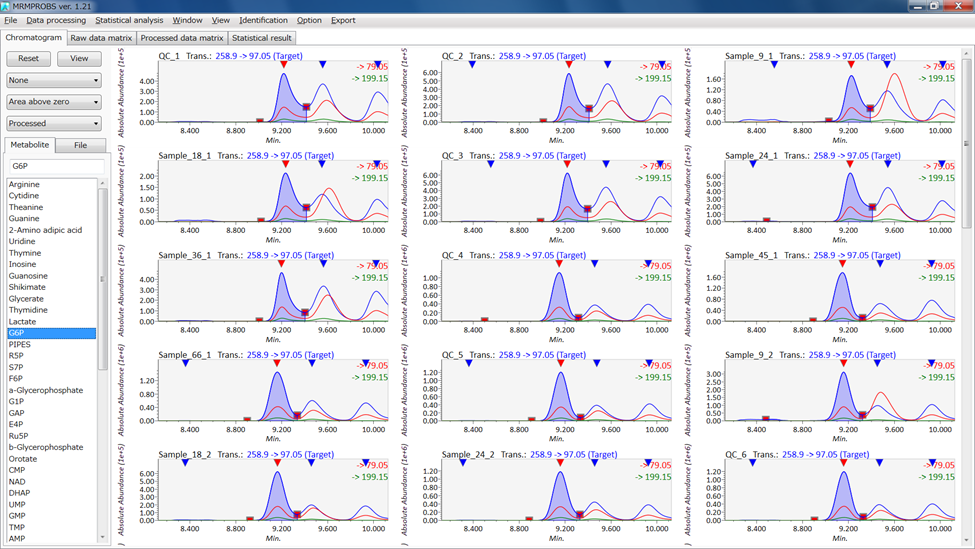  
MRMPROBS screenshot  
 

<h2 id="table-of-contents">Table of contents</h2>

<a href="#section-1">Section 1: Software environments</a> 
<a href="#section-2">Section 2: Required software programs and files</a> 
<a href="#section-3">Section 3: Project type and condition</a> 
<a href="#section-4">Section 4: ABF file conversion</a> 
&emsp;<a href="#section-4-1">Section 4-1: Downloading the ABF converter</a> 
&emsp;<a href="#section-4-2">Section 4-2: Check the conditions for file conversion</a> 
&emsp;<a href="#section-4-3">Section 4-3: File conversion</a> 
<a href="#section-5">Section 5: Reference file format</a> 
&emsp;<a href="#section-5-1">Section 5-1: Reference library for Project type 1: MRMPROBS key index = metabolite name (abf)</a> 
&emsp;<a href="#section-5-2">Section 5-2: Reference library for Project type 2: MRMPROBS key index = Function (mzML)</a> 
&emsp;<a href="#section-5-3">Section 5-3: Reference library for Project type 3: MRMPROBS key index = SCAN or DIA-MS (abf)</a> 
&emsp;&emsp;<a href="#section-5-3-1">Section 5-3-1: Reference format for DIA-MS data</a> 
&emsp;&emsp;<a href="#section-5-3-2">Section 5-3-2: Dictionary file for DIA-MS data processing</a> 
&emsp;&emsp;<a href="#section-5-3-3">Section 5-3-3: Reference format for GC/MS and LC/MS data</a> 
<a href="#section-6">Section 6: Starting MRMPROBS</a> 
&emsp;<a href="#section-6-1">Section 6-1: Summary for MRM demonstration data sets</a> 
&emsp;<a href="#section-6-2">Section 6-2: Starting up your project</a> 
&emsp;<a href="#section-6-3">Section 6-3: Importing Abf files</a> 
&emsp;<a href="#section-6-4">Section 6-4: Parameter</a> 
<a href="#section-7">Section 7: MRMPROBS viewer</a> 
&emsp;<a href="#section-7-1">Section 7-1: Mouse operation in the chromatogram viewer</a> 
&emsp;<a href="#section-7-2">Section 7-2: Library editor (optional)</a> 
&emsp;<a href="#section-7-3">Section 7-3: Tool button</a> 
&emsp;<a href="#section-7-4">Section 7-4: Tab</a> 
&emsp;<a href="#section-7-5">Section 7-5: Button</a> 
&emsp;<a href="#section-7-6">Section 7-6: List Box</a> 
&emsp;<a href="#section-7-7">Section 7-7: Details on the MRMPROBS function</a> 
&emsp;&emsp;<a href="#section-7-7-1">Section 7-7-1: File menu</a> 
&emsp;&emsp;<a href="#section-7-7-2">Section 7-7-2: Data reprocessing</a> 
&emsp;&emsp;<a href="#section-7-7-3">Section 7-7-3: Statistical analysis</a> 
&emsp;&emsp;<a href="#section-7-7-4">Section 7-7-4: Missing value methods</a> 
&emsp;&emsp;<a href="#section-7-7-5">Section 7-7-5: Normalization</a> 
&emsp;&emsp;<a href="#section-7-7-6">Section 7-7-6: Window menu</a> 
&emsp;&emsp;<a href="#section-7-7-7">Section 7-7-7: View menu</a> 
&emsp;&emsp;<a href="#section-7-7-8">Section 7-7-8: Option menu</a> 
&emsp;&emsp;<a href="#section-7-7-9">Section 7-7-9: Export menu</a> 
<a href="#appendix-a">Appendix A: How to obtain appropriate file conversion of the Shimadzu .lcd file</a> 
<a href="#appendix-b">Appendix B: Third option of MRMPROBS: via mzML file</a>

 

## Section 1   
## Software environments  
* Microsoft Windows 7 or later  
* .NET Framework 4.0 or later  

## Section 2   
## Required software programs and files  
* Reifycs Analysis Base File Converter (ABF file converter)  
Download link: <http://www.reifycs.com/AbfConverter/index.html>  

* MRMPROBS  
Download link: <http://prime.psc.riken.jp/Metabolomics_Software/MRMPROBS/index.html>  

* Demo files and the reference library (tab-delimited text file)  
Example: <http://prime.psc.riken.jp/Metabolomics_Software/MRMPROBS/index.html>  

MRMPROBS can import Analysis Base Framework (ABF) format data. MRMPROBS extracts chromatogram data together with the reference library including the name of the target metabolite, its retention-time and amplitude information, and precursor *m/z* and product *m/z*. The supported formats for ABF conversion are Shimadzu Inc. (.LCD), Agilent Technologies (.D), AB Sciex (.WIFF), Waters (.RAW), and Thermo Fisher Scientific (.RAW). MRMPROBS is also acceptable to a common data format mzML converted by an open source file translator ProteoWizard. The information is described in **Appendix B**.   

## Section 3   
## Project type and condition  

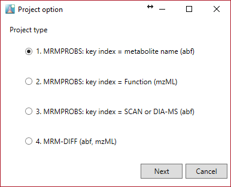    

1\. MRMPROBS key index = metabolite name (abf)
 * Use half-width alphanumeric symbols for compound names in MRM method setting.  
 * Do not use the same compound name at different transition (precursor-product) sets.  

2\. MRMPROBS key index = Function (mzML)  
 * ‘Function ID’ is utilized to extract the chromatogram data. Users should add the “function id” information to the reference library in addition to the normal library format. (see Appendix B)  

&#042; The above two projects are for MRM data sets.  

3\. MRMPROBS key index = SCAN or DIA-MS (abf)  
 * MRMPROBS can import GC/MS, LC/MS, and LC-DIA-MS (like SWATH) data sets.  
 * Prepare the reference library (see Appendix C) to extract the certain retention time range and *m/z* values.  
 * Use half-width alphanumeric symbols for compound names.  

4\. MRM-DIFF (abf, mzML)  
See <http://prime.psc.riken.jp/Metabolomics_Software/MRMPROBS/index.html>.  

## Section 4
## ABF file conversion  
### Section 4-1
### Downloading the ABF converter  
1. Go to <http://www.reifycs.com/AbfConverter/index.html>.  
2. Check the requirements and license terms, and download the converter.  

&#042; File converter is freely available.  

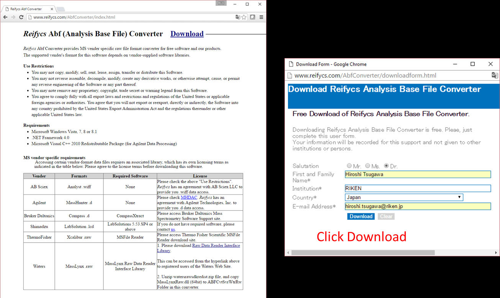   

### Section 4-2
### Check the conditions for file conversion  
To convert files of some MS vendors including Bruker, LECO, Shimadzu, Thermo, and Waters, the specific data access library needs to be installed on your PC  

Also see FAQ for ABF converter  
<http://prime.psc.riken.jp/Metabolomics_Software/MS-DIAL/index3.html>  

**Summary of PC condition required for file conversion**

|Vendo|Formats|Required|  
|:-:|:-:|:-:|
|Agilent|.D|None, but the files from Chemstation should be converted to netCDF|  
|Bruker|.D|CompassXtract|  
|LECO|.PEG|All PEG files should be first converted to netCDF (AIA).|  
|Sciex|.WIFF|None|   
|Shimadzu for GC/MS|.QGD|GCMS solution|  
|Shimadzu for LC/MS|.LCD|LCMS solutions|  
|Thermo|.RAW|MSFileReader|  
|Waters|.RAW|MassLynx Raw Data Reader Interface Library|  
|netCDF|.CDF|Microsoft Visual J# 2.0|  

**FAQ**  
* Agilent: Almost all of Agilent’s raw data (.D) can readily be converted without any additional steps. However, the only exception is GCMS data sets obtained from ChemStation, which cannot be directly converted to ABF. Therefore, you have to convert your files into netCDF (AIA) in ChemStation. Then, convert your AIA files into ABF using our file converter.  
* Bruker: Go to <https://www.bruker.com/service/support-upgrades/software-downloads/mass-spectrometry.html>. You have to register first and obtain the installer. Finally, download and install the version compatible with your operating system environment (32-bit or 64-bit).  
* LECO: All of your data has to be converted to netCDF (AIA) first. Then, convert them into ABF using our file converter.  
* Shimadzu: The compound table of the .lcd file must include the MRM conditions of the “.lcm” file. How to set this is described in **Appendix A**. In case that you had a direct conversion of raw data, please convert your data into the common data format (netCDF or mzML). For GC/MS, convert your data into netCDF using GCMS solution. For LC-ITTOF/MS, convert your data into mzML using ProteoWizard (<http://proteowizard.sourceforge.net/index.shtml>). Then, convert them into ABF.   
* Thermo: The following link explains how to install MSFileReader. <http://fields.scripps.edu/rawconv/>. For GC/MS data, you may have to convert your data into netCDF. Then, convert them into ABF using our converter. We validated the direct conversion of GC-QExactive raw data to ABF, but some GC/MS data (DSQ etc) had to be converted to netCDF first.  
* Waters: 1. Download MassLyncs Raw Data Reader Interface Library (<http://www.waters.com/waters/home.htm?locale=en_US>). 2. Unzip the archive file 'watersrawsdkredist.zip' and copy 'MassLynxRaw.dll' (64-bit) to 'ABFCvtSvrWtrRw' folder in the ABF converter. Note that 32–bit environments are not supported yet for file conversion.   
* NetCDF: When you get an error about the J# dependency problem, download and install the Microsoft Visual J# 2.0 library at <https://www.microsoft.com/en-us/download/details.aspx?id=15468>.   

 

### Section 4-3
### File conversion  
1. Start “AnalysisBaseFileConverter.exe”.   
2. Drag & drop MS vendor files into this program.  
3. Click “Convert”.  
4. The ABF files are generated in the same directory as the raw data files.  

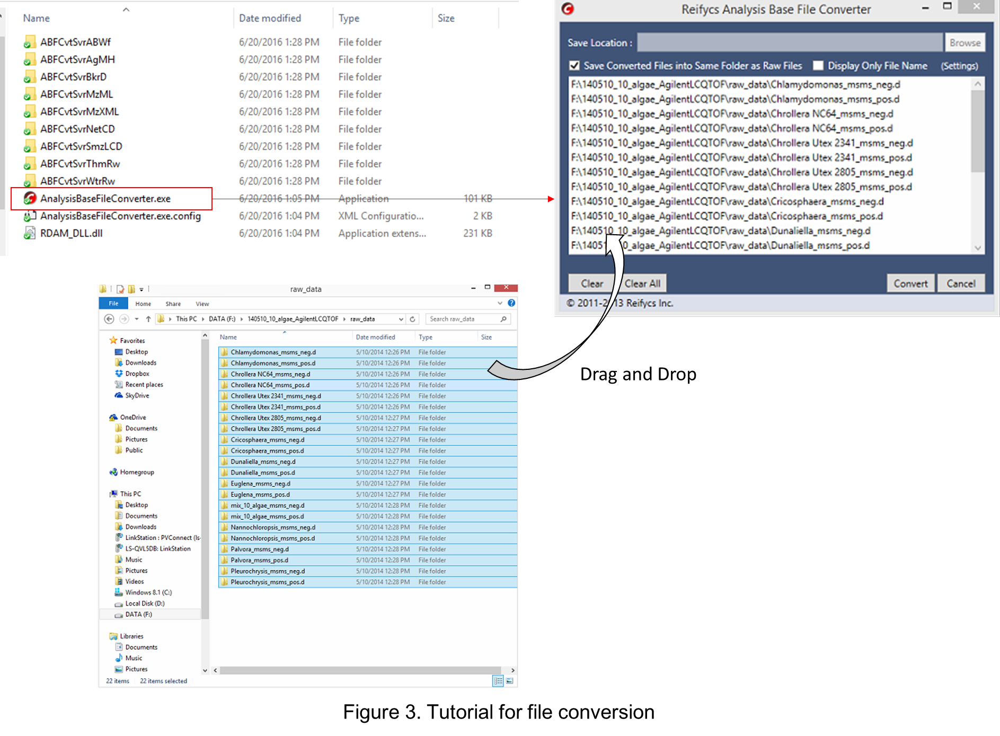

## Section 5
## Reference file format  
### Section 5-1
### Reference library for Project type 1: MRMPROBS key index = metabolite name (abf)  
Five items are required as tab-delimited format. The header names are flexible, but the item order should be kept.   

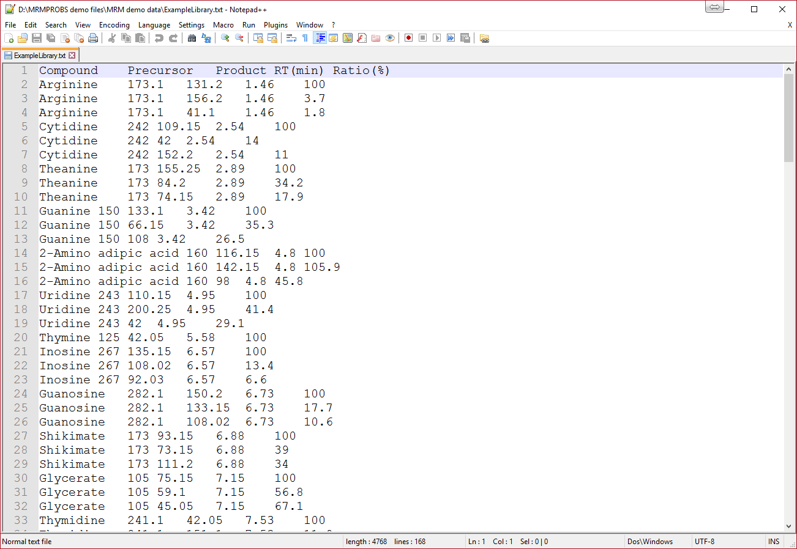  

1 column.&emsp;&emsp;&emsp;&emsp;Compound namea  
2 column.&emsp;&emsp;&emsp;&emsp;Precursor *m/z* (accurate *m/z* information is rounded into nominal *m/z* information)  
3 column.&emsp;&emsp;&emsp;&emsp;Product *m/z*  
4 column.&emsp;&emsp;&emsp;&emsp;Retention time [min]  
5 column.&emsp;&emsp;&emsp;&emsp;Amplitude ratios [%]b  

Notes  
a When you choose project 1 of MRMPROBS, the name must be identical to the compound name in the instrument setting window. The compound name MUST be written by half-width alphanumeric symbols.  

b About the amplitude ratio format  
* ‘100’ value is recognized as the quantitative ion for targeted compounds, and the other values are recognized as the diagnostic ions for identification of targeted compounds.  
* The quantitative ion must be set to each compound record, and the current program does not accept multiple quantitative ions for one compound: it means that ‘100’ value can be used only once. The below is the examples for reference records.  

&#10003; Example: only one transition for one metabolite  
&emsp;&emsp;Thymine&emsp;&emsp;125&emsp;	42.05&emsp;	5.58&emsp;	100  

&#10003; Example: multiple transitions for one metabolite  
&emsp;&emsp;G6P&emsp;&emsp;258.9&emsp;	97.05&emsp;	9.21&emsp;	100  
&emsp;&emsp;G6P&emsp;&emsp;258.9&emsp;	79.05&emsp;	9.21&emsp;	30.1  
&emsp;&emsp;G6P&emsp;&emsp;258.9&emsp;199.15&emsp;	9.21&emsp;	5.5  

* Again, MRMPROBS does not quantify the metabolite by the total ion chromatogram. Instead, one quantitative transition is used for peak quantification (we call it the “target” transition).  
* Enter the ratio [%] against 100 as the amplitude for the qualifier transition (or the confirmation transition). This information is used for peak identification (we call it the “qualifier” transition).  

***Note 1:*** You can edit the reference library and update its information in MRMPROBS. However, an empty value cannot be accepted when the library is imported. If you do not know the suitable retention time and amplitude information for the metabolites, enter arbitrary values for the metabolites.   

***Note 2:*** Users do not have to include all metabolite information you entered in the MS instrument.   

***Note 3:*** Sometimes the tab-delimited file exported from Microsoft Excel includes unexpected hidden trailing columns. These unexpected columns after the ‘Ratio’ column cannot be handled by MRMPROBS. You can inspect the exported file by selecting a few rows (see below). If there are selected characters after the last column (Ratio), edit the file in Excel to delete these columns and re-export it again.  

Good example (no unexpected column)  
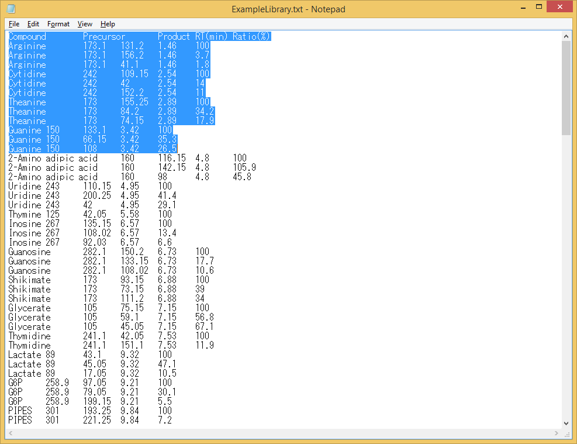  

Bad example (there are unexpected columns)  
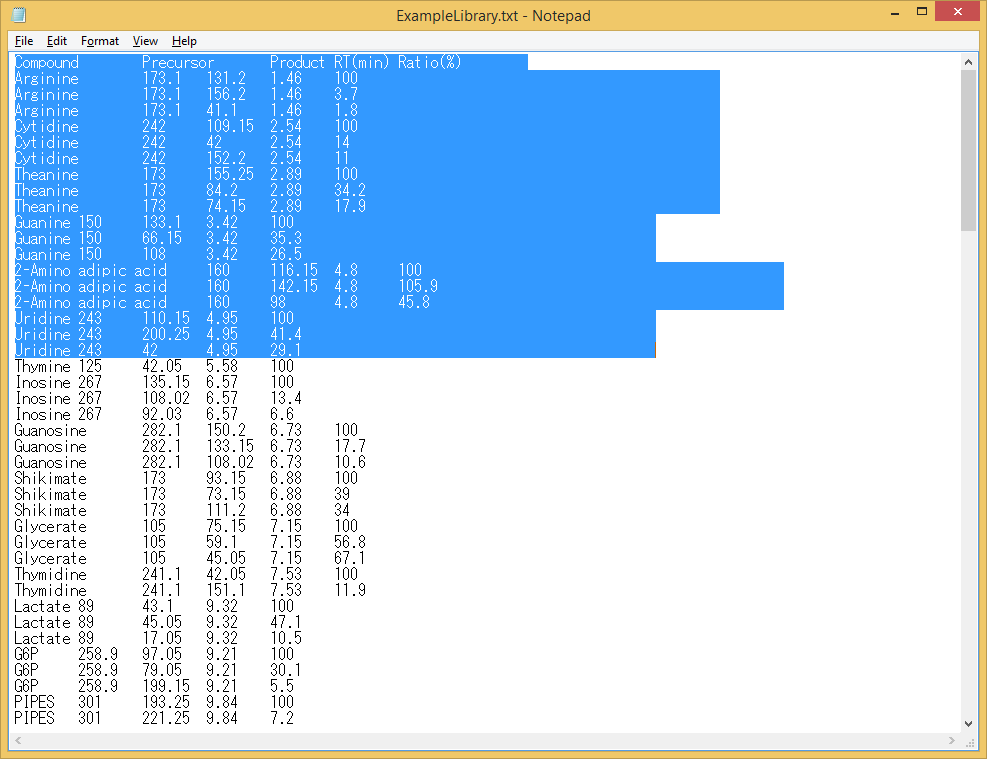  

### Section 5-2
### Reference library for Project type 2: MRMPROBS key index = Function (mzML)  
Six items are required as tab-delimited text format. The header names are flexible but the item order should be followed. (Here, in order easily to see the library, the reference was described in the Microsoft Excel.)  

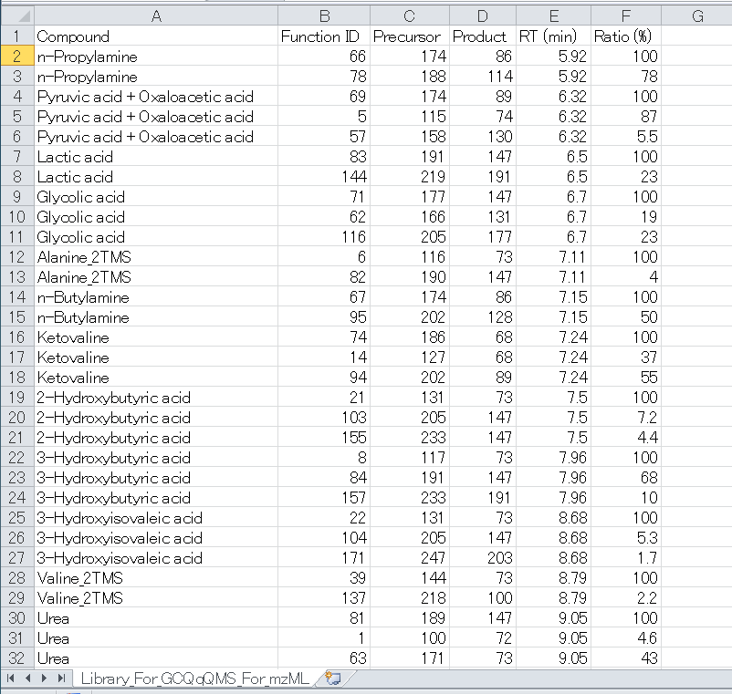

1 column.&emsp;&emsp;&emsp;&emsp;Compound namea  
2 column.&emsp;&emsp;&emsp;&emsp;Function IDb  
3 column.&emsp;&emsp;&emsp;&emsp;Precursor *m/z* (accurate *m/z* information is rounded into nominal *m/z* information)  
4 column.&emsp;&emsp;&emsp;&emsp;Product *m/z*  
5 column.&emsp;&emsp;&emsp;&emsp;Retention time [min]  
6 column.&emsp;&emsp;&emsp;&emsp;Amplitude ratios [%]c  

Notes  
a When you use project 2 of MRMPROBS, the name doesn’t have to be identical to the compound name in the instrument setting. The compound name MUST be written by half-width alphanumeric symbols.  

b The function ID is the most important ID to use this option. In the mzML data, there is a markup indicating a ‘Function ID’ which is unambiguous key to contact to the specific MRM chromatogram for the retention time range, the precursor ion, and product ion. In order to easily to see the relationship between the function ID and the MRM information, use the SeeMS program which can be downloaded at ProteoWizard webpage: <http://proteowizard.sourceforge.net/>.  
1. Open SeeMS.  
2. Select a mzML file.  

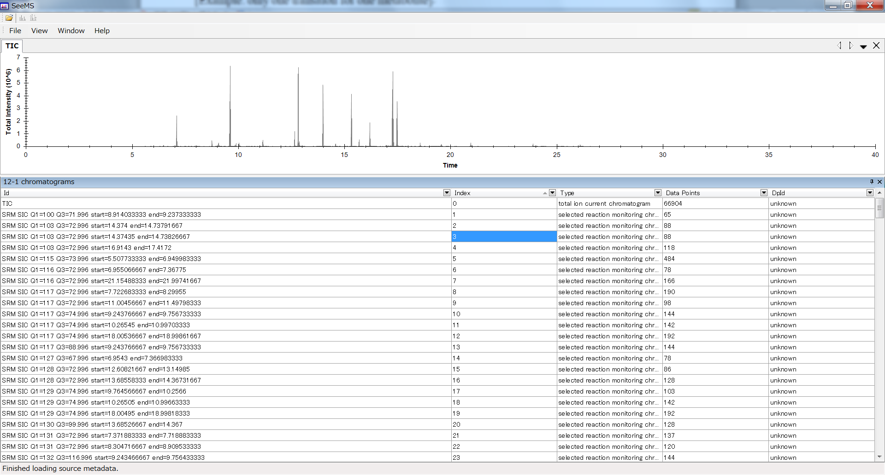  

To find the identical function ID in your data, use the Microsoft Excel sorting function and your experiment condition file. In the most of case, the proteowizard is sorting the functions following the order to 1. Precursor Ion, 2. Product Ion, 3. Retention time starting point.  

c About the amplitude ratio format  
See the section of Reference library for Project type 1: MRMPROBS key index = metabolite name (abf).  

### Section 5-3
### Reference library for Project type 3: MRMPROBS key index = SCAN or DIA-MS (abf)  
#### Section 5-3-1
#### Reference format for DIA-MS data  
Users can utilize MRMPROBS software for scan type data such as GC/MS, LC/MS, and LC-data independent MS/MS (DIA-MS). The below figure is the reference library for DIA-MS data. Here, our objective is to utilized DIA-MS data as MRM (what we call DIA-MRM, for example SWATH-MRM for SCIEX machine.). This library can be easily exported by MS-DIAL software: <http://prime.psc.riken.jp/Metabolomics_Software/MS-DIAL/>.  

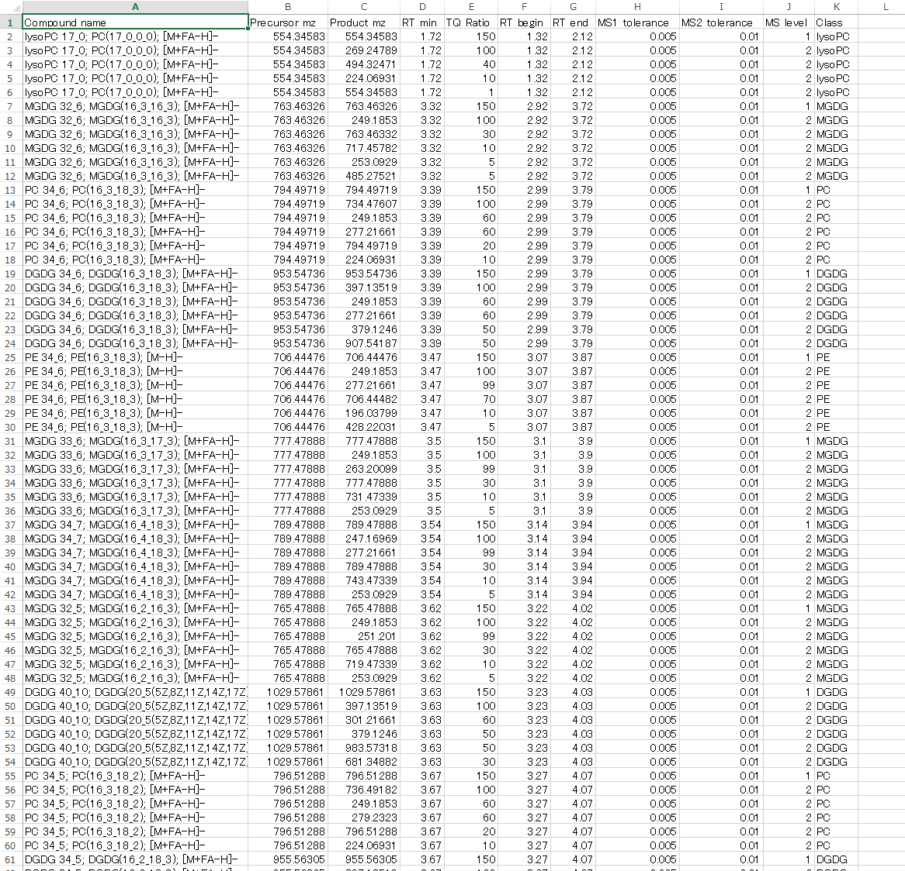

1 column.&emsp;&emsp;&emsp;&emsp;Compound name  
2 column.&emsp;&emsp;&emsp;&emsp;Precursor *m/z*  
3 column.&emsp;&emsp;&emsp;&emsp;Product *m/z*  
4 column.&emsp;&emsp;&emsp;&emsp;Retention time [min]  
5 column.&emsp;&emsp;&emsp;&emsp;Amplitude ratios [%]  
6 column.&emsp;&emsp;&emsp;&emsp;RT begin: start time to draw the chromatogram  
7 column.&emsp;&emsp;&emsp;&emsp;RT end: end time to draw the chromatogram  
8 column.&emsp;&emsp;&emsp;&emsp;MS1 tolerance: mass accuracy for survey scan MS data  
9 column.&emsp;&emsp;&emsp;&emsp;MS2 tolerance: mass accuracy for MS/MS spectra  
10 column.&emsp;&emsp;&emsp;&nbsp;MS level: put 1 for survey scan MS data (MS1), and put 2 for MS/MS.  
11 column.&emsp;&emsp;&emsp;&nbsp;Class: it’s used for the MRMPROBS viewer to filter out the chromatograms. Set ‘NA’ or something if not interest.  

**Below is the description of the ‘bridge’ from MS-DIAL to MRMPROBS**  
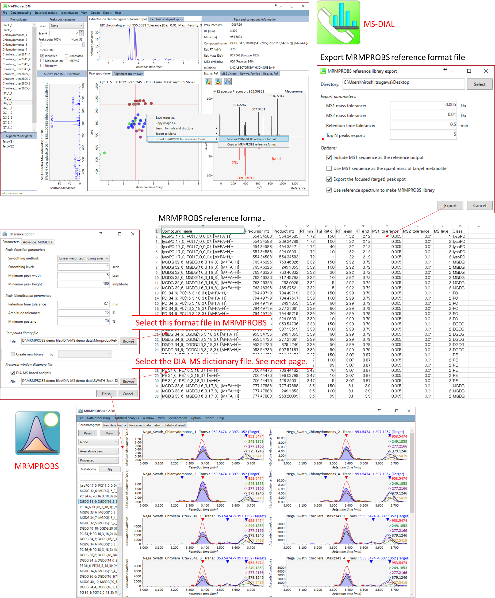

#### Section 5-3-2
#### Dictionary file for DIA-MS data processing  
The dictionary file should contain MS1 scan range and precursor window in combination with its experimental ID.  
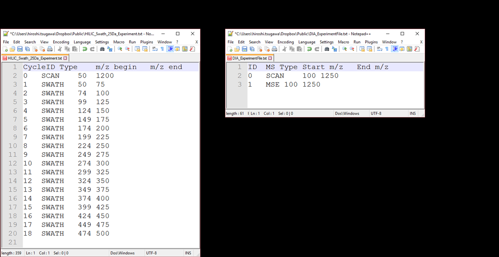

In the case of SWATH data-independent analysis, the experiment file can be made at PeakView (Show->sample information). Do not change the column orders. The word “SCAN” should be kept.  

#### Section 5-3-3
### Reference format for GC/MS and LC/MS data  
MRMPROBS is improved to utilize single MS data such as GC/MS and LC/MS, and the below figure is the reference library for GC/MS data. The trick to import the single MS data sets is 1) to assign the same values for product *m/z* and MS2 tolerance as precursor *m/z* and MS1 tolerance, respectively, and 2) to assign ‘1’ as MS level for all queries.  
This library can be easily exported by MS-DIAL software: <http://prime.psc.riken.jp/Metabolomics_Software/MS-DIAL/>.  

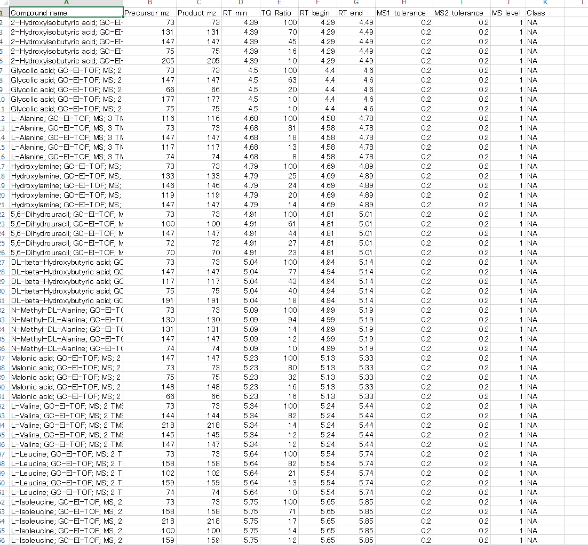

## Section 6
## Starting MRMPROBS  
### Section 6-1
### Summary for MRM demonstration data sets  
1. Starting up your project  
2. Importing Abf files  
3. Setting parameters  
4. Running the software (1-2 min / sample)  

&#042; The tutorial uses 40 demonstration files and the reference library which are downloadable from the above link. The common measurement conditions of the demonstration files were as follows.   

Liquid chromatography: total 25 min run per sample with CELI L-column2 ODC (150 mm×2.1 mm, 3 m).  
Mass spectrometer: MRM method with negative ion mode.  
Target metabolite number: 60  
Total transitions: 166  

The detail of experimental conditions is downloadable at the MRM Database section (Ion-pair LC-QqQ/MS).  

<http://prime.psc.riken.jp/Metabolomics_Software/MrmDatabase/index.html>  

### Section 6-2
### Starting up your project  

1. File &rarr; New project.  

2. Chose a project type (select the top one for this demonstration).  

### Section 6-3
### Importing Abf files  
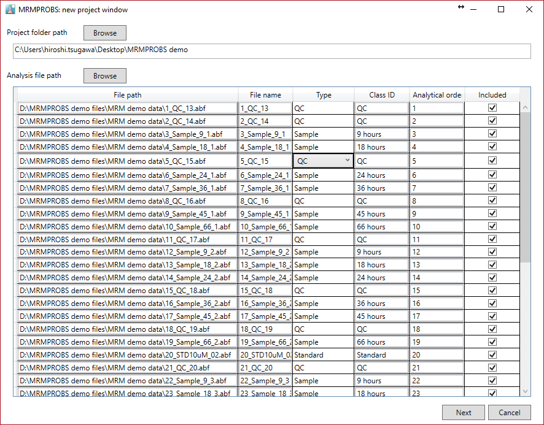  

Note:
* We recommend that the project folder be made for each batch experiment. In the MRMPROBS project, two folders (raw, processed) and one file (&#042;.mth) are generated. They should be included in the same directory.  
* The file name should be entered in half-width alphanumeric symbols.  
* Select the file type of each file from “Sample”, “Standard”, “Blank” and QC”. QC is required for the LOESS-based normalization method.  
* Class ID is used for the color labels.   
* Analytical order and class ID can be changed after data processing.  

### Section 6-4
### Parameter  
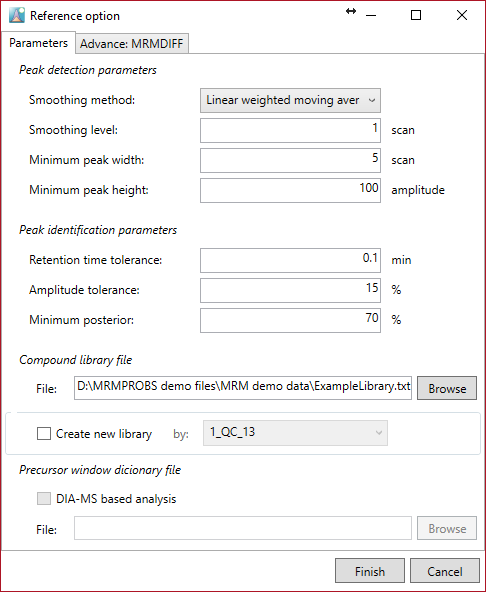  

Select ‘ExampleLibrary.txt’ and set the above parameters for this demonstration.  

***Note:***  
* If you want to edit or update the retention time and amplitudes of metabolites in your reference library from an example file such as a QC or standard mixture, check “create new library" and choose the file name to which you want to refer. In this demonstration, ‘20_STD10uM_02’ is selected.  

**[Recommended]**  
*Peak detection*  
Smoothing method: linear weighted moving average.  
Smoothing level: 1-2  
Minimum peak width: 3-5  
Minimum peak height: 50-100  

*Peak identification*  
Retention time tolerance: As long as the reverse phase or hydrophilic interaction chromatography LC are used, 0.1-0.2 min is recommended.  
Amplitude tolerance: 15  
Minimum posterior: Decide the minimum probability for peak identification. MRMPROBS calculates a probability for a peak, i.e. “probability of true target metabolite given the calculated scores”. The detected peak less than this criterion is recognized as a false peak. The recommended value is 50-70.  

Note: The first data processing including file import, peak detection, and peak identification requires 5-20 seconds (depending on machine specifications) per file.  

## Section 7
## MRMPROBS viewer  
### Section 7-1
### Mouse operation in the chromatogram viewer  
Main window  

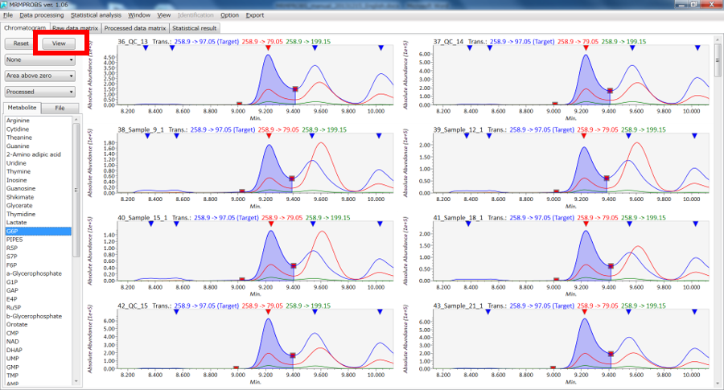  

  

*View mode*  
1. Chromatogram window: drag holding left click &rarr; chromatogram scroll, drag holding right click &rarr; chromatogram zoom.  
2. Detected window: left double-click the reverse triangle &rarr; change the true peak, right double-click anywhere &rarr; un-checked detected peaks.  
3. Retention time window: drag holding right click &rarr; warping on retention time range.  
4. Intensity window: drag holding right click &rarr; warping on intensity range.  

*Edit mode*
1. Left click and drag on the peak edge [red square] &rarr; change the location of the peak edge.  
2. Right click and drag &rarr; detect new peak.  

### Section 7-2
### Library editor (optional)  
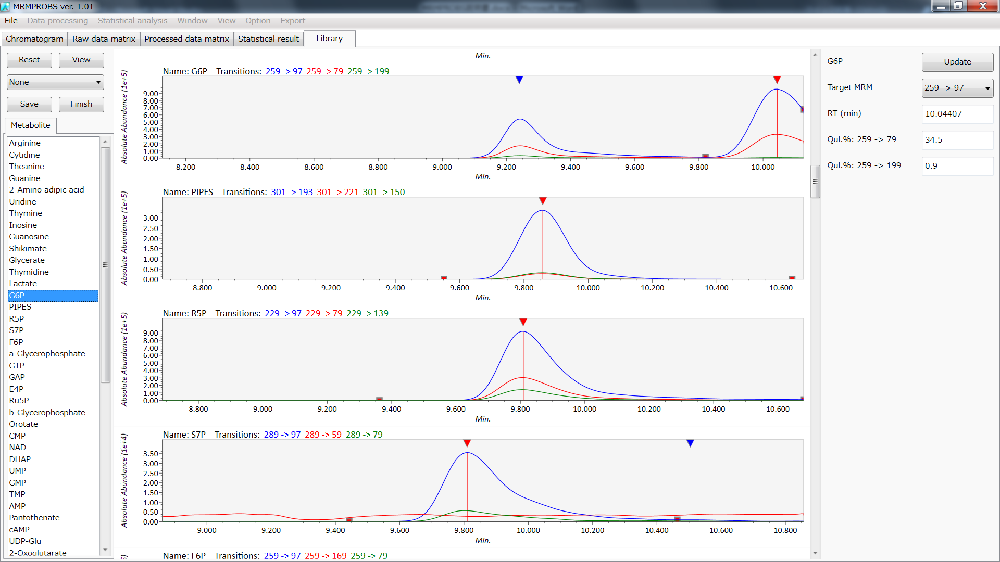  
* You can update the retention time and amplitude ratio of each metabolite by means of the QC sample file or the standard mixture file. You can also change the target transition for peak quantification.  
* The default identification is based on the highest peak in the EIC chromatogram. If you need to change the true peak, double click the reverse triangle.  
* If you change the target transition, select the target MRM transition from the “Target MRM” combo box.  
* The right-column information including the compound name, target MRM, RT, and amplitude ratios are generated by double-clicking the compound name in the list box on the left or by re-selecting the true peak in the EIC chromatogram viewer.  
* If the object metabolite is not detected, click the “View” button at the top left and switch to “Edit” mode. In the “Edit” mode, hold the right mouse click and drag the peak area you want to detect.  
* If you want to change the retention time or amplitude information manually, just type what you want in the textbox and click the “Update” button on the top right.  
* If you want to save the updated library, click the “Save” button on the top left side.  
* Lastly, after editing the reference library, click the “Finish” button on the top left side.  

Note: The details and the operation method for chromatogram viewer are described later.  

### Section 7-3
### Tool button  
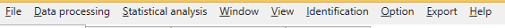
* File: start new project, open existing project, save as a project, and save the project.  
* Data processing: for data re-processing per file, per metabolite, or in all data sets.  
* Statistical analysis: data normalization and statistical analysis.  
* Window: tile setting of chromatogram viewer.  
* View: sorting of chromatogram viewer.  
* Option: re-define class ID and analytical order, choose the internal standard, decide “include” or “exclude” data for statistical analysis.  
* Identification: non-meaningful in MRMPROBS project  
* Export: The result is exported in tab-delimited text format.  
* Help: show version information.  

### Section 7-4
### Tab  
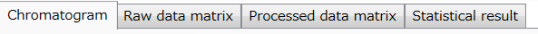

* Chromatogram: All data manipulation tasks are performed here.  
* Raw data matrix: The peak quantification value of each file and each metabolite is shown here.  
* Processed data matrix: The normalized value of each file and each metabolite is shown here.  
* Statistical result: The result of statistical analysis is shown here.  

Raw data matrix  
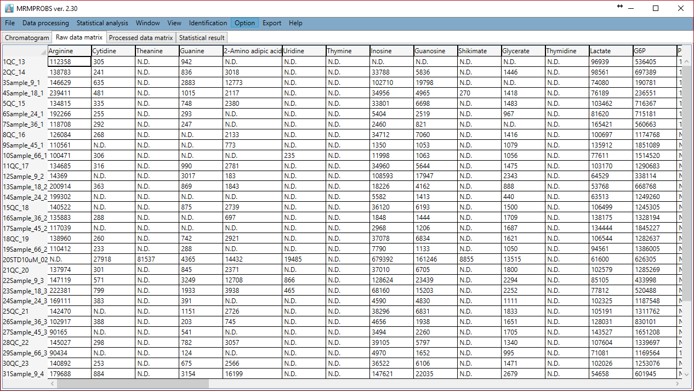

### Section 7-5
### Button  
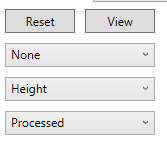

* Reset: Reset the display range of chromatograms.  
* View: If you push this “View” button, the chromatogram viewer is changed to “Edit” mode. In the “Edit” mode you can modify the peak edge and detect new peaks manually  
* None: The properties of detected peaks are shown in this ComboBox. You can confirm the total score (probability), rt similarity, area value, and reference RT in the chromatogram viewer.  
* Height: You can set the quantification mode. The default is set by peak height. Instead, you can change it to area mode. By using the “All” option, the quantification mode is reflected = implemented in all files and all metabolites.  
* Processed: You can see raw chromatograms as well as smoothed chromatograms.  

### Section 7-6
### List Box  
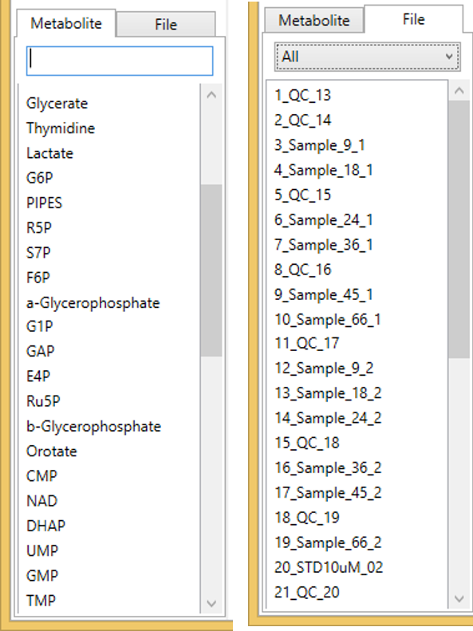  

If you double-click a metabolite name or a file name, the chromatograms are generated in the chromatogram viewer.  

### Section 7-7
### Details on the MRMPROBS function  
#### Section 7-7-1
#### File menu  
* New project: used for creating a new project.  
* Open project: used for opening an existing project. Make sure that &#042;.mth file, raw folder, and processed folder are included in the same directory.  
* Save as: use to save as a new file.  
* Save: use to overwrite an existing project.  

#### Section 7-7-2
#### Data reprocessing  
Data re-processing can be done by newly optimized parameters in this option. Re-processing is also performed per metabolite or per file. The target MRM can also be changed. The parameters are set per metabolite and per file. The required time for data re-processing is very short because file import has been performed already.  

  

#### Section 7-7-3
#### Statistical analysis  
The current program can apply two types of missing value approaches and can normalize a quantification value by the internal standard and loess/cubic spline with the analytical order information. If you want to use the internal standard, you must set the optimal setting in the “Option menu”. The current program can also do principal component analysis.  

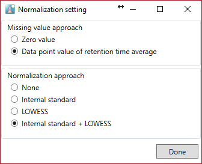  

#### Section 7-7-4
#### Missing value methods  
* Zero value: This option gives zero (0) for “N.D.” in the raw data matrix.  
* Data point value of retention time average: This option gives the value described below for “N.D.” in the raw data matrix.  

1. The process is performed per column, i.e. per metabolite.  
2. If the value of a metabolite is “N.D.” in all files, a zero (0) value is assigned.  
3. The retention time values except for “N.D.” files are stored and the average value is calculated.  
4. For each “N.D.”, the intensity of “data point” consistency with the average retention time of the processed EIC chromatogram (after smoothing) is assigned as the quantification value.  

#### Section 7-7-5
#### Normalization  
* None: after implementation of the missing value approach, the values of the raw data matrix are stored in the processed data matrix.  
* Internal standard: after implementation of the missing value approach, the value divided by the internal standard value set in the “Option menu” is stored in the processed data matrix.  
* LOESS: after implementation of the missing value approach, the signal intensities of each metabolite are normalized with the QC samples information by means of loess/cubic spline.  
* Internal standard + LOESS: After internal standard normalization, loess/cubic spline based normalization is performed.  

After clicking the “Done” button, the “Statistical analysis setting” button is activated.  
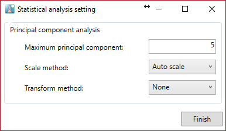  

You can do principal component analysis. Add the calculated number of the principal components and choose the scale and transform method.  

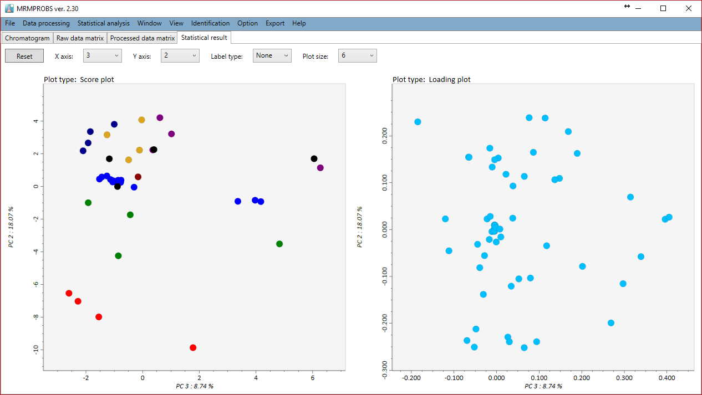  

Zooming in and out can be done with the mouse wheel. Each principal component is shown by selecting the X axis or the Y axis combobox.  

#### Section 7-7-6
#### Window menu  
The tile setting is possible depending on your computer's resolution. Please select your preference.  

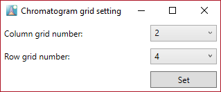  

#### Section 7-7-7
#### View menu  
In this menu the chromatograms in the chromatogram viewer are sorted by file id, analytical order, class id, and file type.  

#### Section 7-7-8
#### Option menu  
Here it is possible to set the properties of metabolites and files. In particular, this option menu is used to create a data matrix for statistical analysis.  
&emsp;&emsp;&emsp;&emsp;In the file properties you can re-set the file type, class ID, and analytical order except for the file name. If you clear the check box of the included property it is no longer included in the processed data matrix.  
&emsp;&emsp;&emsp;&emsp;In the metabolite properties you can set the internal standard. It can be set independently for each metabolite. However, please make sure that the metabolite name of the internal standard is completely consistent with the metabolite name in the “internal standard” column. Therefore, we recommend that you use copy and paste for the internal standard setting. In this window, although copy and paste can be performed just by using the keyboard, you can do “multi” copy. For example, copy a metabolite name by pushing Ctrl + C. Select the rows you want to add in the internal standard column by dragging and paste the clipboard contents by pushing Ctrl + V.  

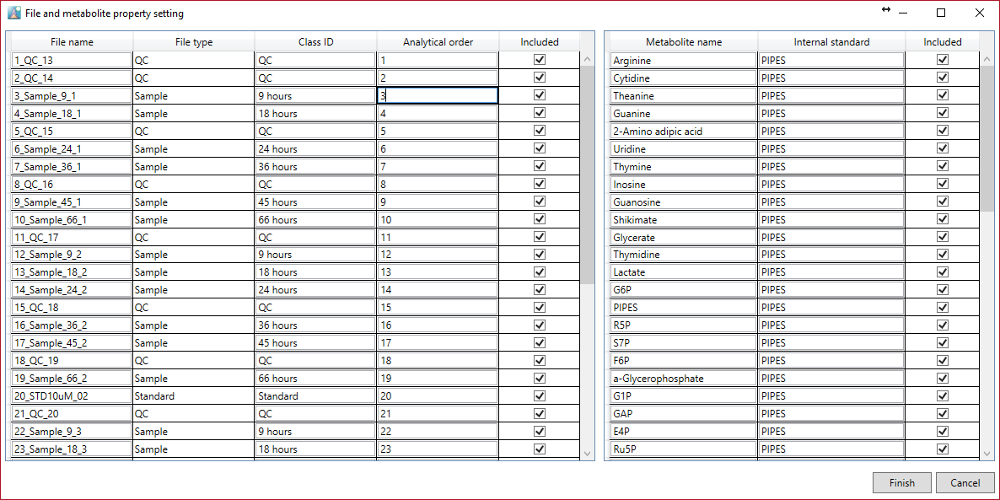  

#### Section 7-7-9
#### Export menu  
A tab-delimited text file can be exported for a raw data matrix, a processed data matrix, the updated library, detected peak information detail, and PCA results. Moreover, the PCA result can be exported by some image formats.  

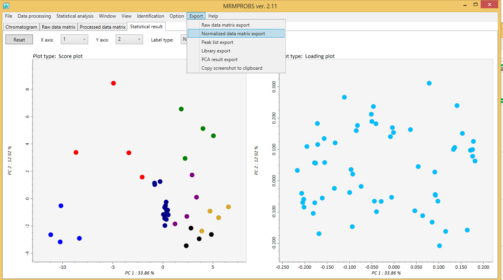  

## Appendix A
## How to obtain appropriate file conversion of the Shimadzu .lcd file.  
Although you can do a content change of the .lcd file after LC-QqQ/MS (MRM) analysis, it is very useful to construct a suitable method file (.lcm format file) for the successful file convert of the MRMPROBS software.  

1\. Event name and channel (MRM transitions) rule.  

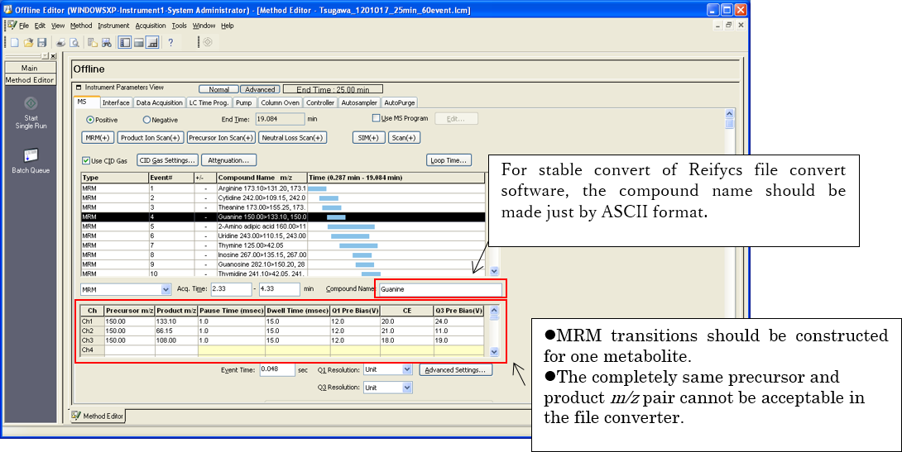  

2\. Update compound table  
After the method construction of MRM transitions, you should update the compound table *m/z* by the MRM event. If you can analyze the samples by using the updated method file, you do not have to perform any other tasks for the stable file convert.  

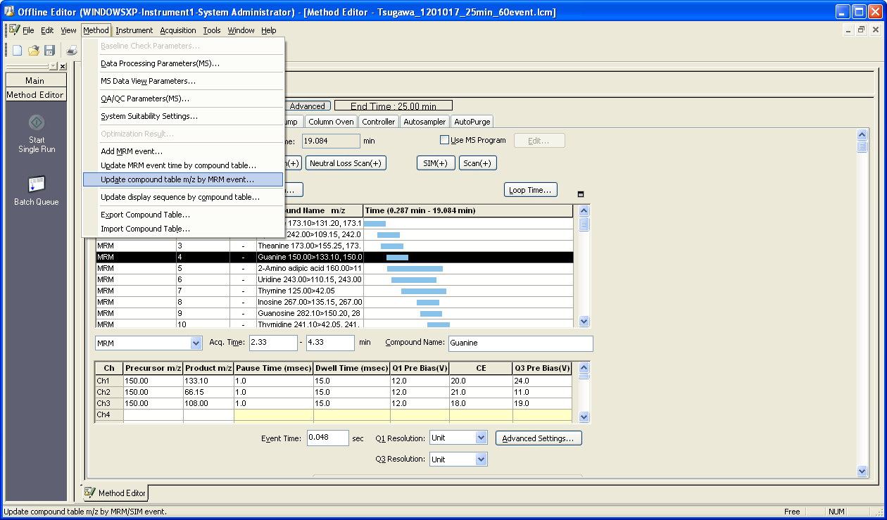  

You can check the updated table by Method->Data Processing Parameters->Compound tab.  

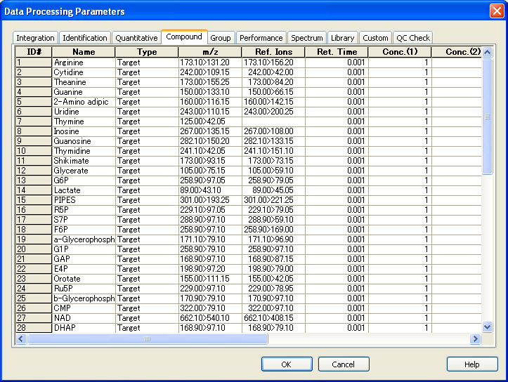  

3\. If your data (.lcd) were not collected by a suitable method described above, you can improve the .lcd file by using the method file modified in the above way. After the construction of the modified method file, please open “Postrun Analysis” of LabSolutions.  

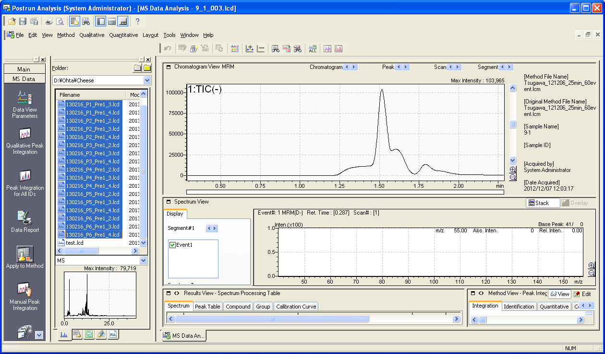   

After selecting the analysis files (.lcd) push the “Apply to Method” button.  

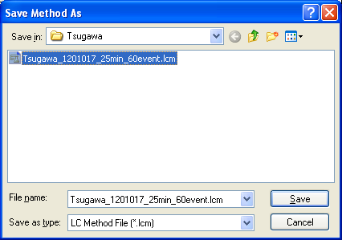   

Select the modified method file and improve your .lcd file including the compound table *m/z*. If you can do this, the file (.lcd) is successfully converted by Reifycs Inc. software.  

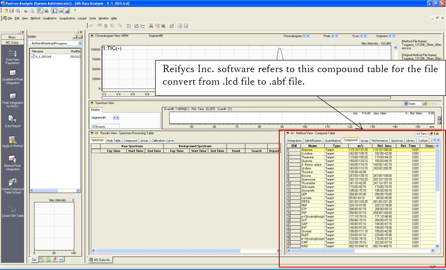   

4\. File convert  
Conditions: You can convert from .lcd files to .abf files on your computer by installing LabSolutions software. “TTFLDataExportVer5.dll” of LabSolutions ver. 5.53 SP4 or later is required for the file convert. Check the “TTFLDataExportVer5.dll” (Program Files (or &#042;86)>LabSolutions) file property. If the file size is less than 577,536 bytes, contact Shimadzu Inc. for a file change.  
After “AnalysisBaseFileConverter.exe” is opened, drag and drop the .lcd files to this converter.  

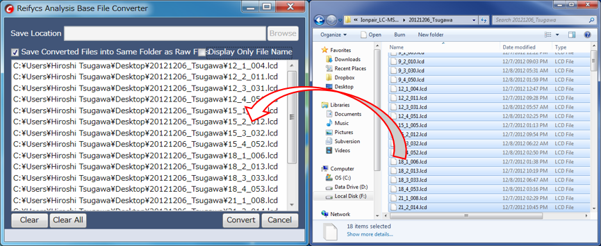   

Push the “Convert” button. The ABF format files will be generated in the same folder as the .lcd files.  

## Appendix B
## Third option of MRMPROBS: via mzML file.  

**Required software and file**  
* MSConvert  
Download link: <http://proteowizard.sourceforge.net/>  
* MRMPROBS  
Download link: <http://prime.psc.riken.jp/Metabolomics_Software/MRMPROBS/index.html>  
* Reference library for compound identification (tab-delimited text file)  

MRMPROBS can import the mzML format file. In the third option of MRMPROBS, the “function id” is utilized to extract the chromatogram data. The users should add the “function id” information to the reference library in addition to the normal library format.   

**Download ProteoWizard**  
1. Select download type: Windows installer (includes vendor reader support) is recommended.  
2. Read license agreements and download the proteowizard.  

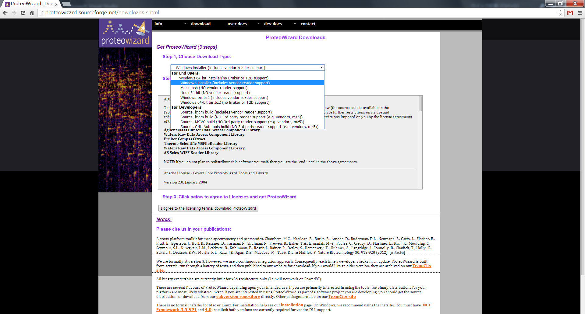   

(<http://proteowizard.sourceforge.net/downloads.shtml>)  

**Setup ProteoWizard**  
1. Follow the wizard windows. (Maybe you don’t miss it.)  
2. “SeeMS” should be also imported.  

**Convert the vendor’s MS file to mzML via ProteoWizard**  
1. Open the MSConvertGUI.exe.  
2. Select “List of Files”.  
3. Select the vendor’s file via “Browse” button.  
4. In the “Options”, never check any additional compression including “Use numpress linear compression”, “Use numpress short logged float compression”, and “Use numpress short positive integer compression”. Each of binary encoding precision is available.  
5. Click “Start” button.  

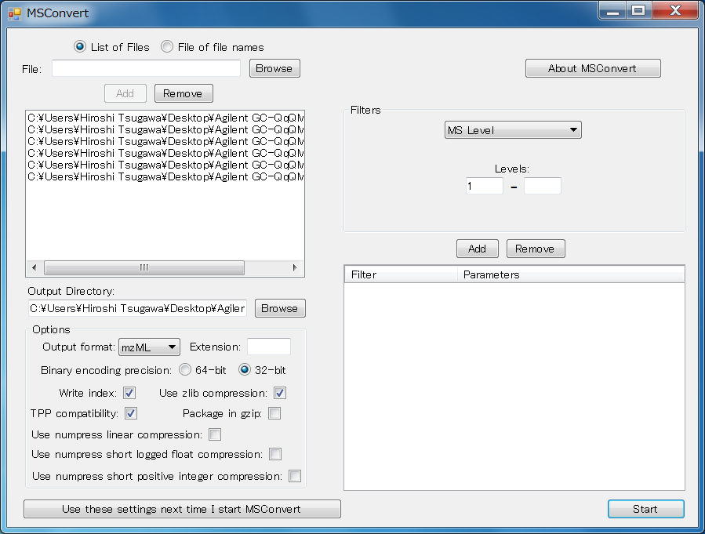   

Note! ProteoWizard does’nt support Shimadzu MS format. If you want to use them, please use the abf converter.  
