

# MS-DIAL tutorial #

Last edited in Sep. 14, 2018

## ABSTRACT ##
MS-DIAL was launched as a universal program for untargeted metabolomics that supports multiple instruments (GC/MS, GC/MS/MS, LC/MS, and LC/MS/MS) and MS vendors (Agilent, Bruker, LECO, Sciex, Shimadzu, Thermo, and Waters). Common data formats such as netCDF (AIA) and mzML, can also be managed in our project. In addition, we released several MSP files including both EI- and MS/MS spectra as a ‘start-up kit’. Moreover, MS-DIAL internally has a version of Fiehn lab’s GC/MS database (oriented by FAME RI index), and in silico retention time- and MS/MS database for LC/MS/MS based lipidomics. The isotope labeled tracking can also be executed in LC/MS project.  
&emsp;&emsp;&emsp;It features (1) spectral deconvolution for both GC/MS and data-independent MS/MS, (2) streamlined criteria for peak identification, (3) support of all data processing steps from raw data import to statistical analysis, and (4) user-friendly graphic user interface.  
&emsp;&emsp;&emsp;MS-DIAL has been developed as the collaborative work between Prof. Masanori Arita team (RIKEN) and Prof. Oliver Fiehn team (UC Davis) supported by the JST/NSF SICORP “Metabolomics for the low carbon society” project.  

Hiroshi Tsugawa  
RIKEN Center for Sustainable Resource Science  
<hiroshi.tsugawa@riken.jp>

Lead developer: Hiroshi Tsugawa (RIKEN)   
Main contributors: Diego Pedrosa (UC Davis), Tomas Cajka (Institute of Physiology CAS), Ipputa Tada (NIG), Haruki Uchino (Keio)  

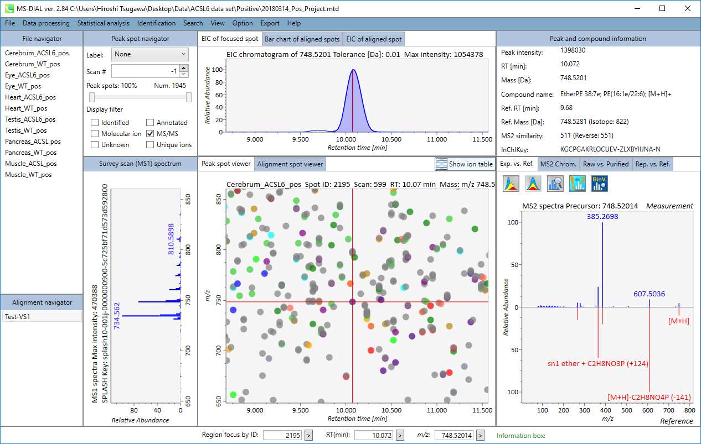

MS-DIAL screenshot  

## Table of contents ##

[Chapter 1: General introduction of MS-DIAL](#chapter-1-general-introduction-of-ms-dial)  
&emsp;[Section 1: Downloading file converter to convert a vendor’s format into ABF](#section-1-downloading-file-converter-to-convert-a-vendors-format-into-abf)  
&emsp;[Section 2: Check the conditions for file conversion](#section-2-check-the-conditions-for-file-conversion)  
&emsp;[Section 3: File conversion](#section-3-file-conversion)  
&emsp;[Section 4: Start up a project of MS-DIAL](#section-4-start-up-a-project-of-ms-dial)  
&emsp;[Section 5: Centroid or Profile? The content of ABF data](#section-5-centroid-or-profile-the-content-of-abf-data)  
&emsp;[Section 6: Database (MSP or Text) for compound identification](#section-6-database-msp-or-text-for-compound-identification)  
&emsp;&emsp;[Section 6-1: MSP format for precursor- and MS/MS library](#section-6-1-msp-format-for-precursor--and-msms-library)  
&emsp;&emsp;[Section 6-2: Adduct ion format](#section-6-2-adduct-ion-format)  
&emsp;&emsp;[Section 6-3: Text format library for retention time and accurate mass search (post identification)](#section-6-3-text-format-library-for-retention-time-and-accurate-mass-search-post-identification)  
&emsp;&emsp;Section 6-4: MSP format as GC/MS library	17  
&emsp;&emsp;Section 6-5: Alkane- or FAME retention time dictionary for the calculation of retention index	18  
Chapter 2: LC/MS/MS (data independent MS/MS) project with MS-DIAL’s LipidBlast database (in silico retention time and MS/MS library for lipids)	20  
&emsp;Section 1: Starting up your project	21  
&emsp;Section 2: Importing ABF files	22  
&emsp;Section 3: Setting parameters	23  
&emsp;&emsp;Section 3-1: Data collection tab	23  
&emsp;&emsp;Section 3-2: Peak detection tab	24  
&emsp;&emsp;Section 3-3: MS2Dec tab	29  
&emsp;&emsp;Section 3-4: Identification tab	30  
&emsp;&emsp;Section 3-5: Adduct tab	32  
&emsp;&emsp;Section 3-6: Alignment tab	33  
&emsp;Section 4: Data curation for the reduction of false positive identifications	34  
Chapter 3: LC/MS or LC/MS/MS (data dependent MS/MS) project with user-defined MS/MS database (MSP format) in MS-DIAL	35  
&emsp;Section 1: Starting up your project	36  
&emsp;Section 2: Importing ABF files	37  
&emsp;Section 3: Setting parameters	38  
&emsp;&emsp;Section 3-1: Data collection tab	38  
&emsp;&emsp;Section 3-2: Peak detection tab	39  
&emsp;&emsp;Section 3-3: MS2Dec tab	40  
&emsp;&emsp;Section 3-4: Identification tab	41  
&emsp;&emsp;Section 3-5: Adduct tab	43  
&emsp;&emsp;Section 3-6: Alignment tab	44  
&emsp;Section 4: Data curation to reduce false positive identifications	45  
Chapter 4: Nominal and accurate GC/MS based metabolic profiling in MS-DIAL	46  
&emsp;Section 1: Starting up your project	47  
&emsp;Section 2: Importing ABF files	48  
&emsp;Section 3: Setting parameters	49  
&emsp;&emsp;Section 3-1: Data collection tab	49  
&emsp;&emsp;Section 3-2: Peak detection tab	50  
&emsp;&emsp;Section 3-3: MS1Dec tab	51  
&emsp;&emsp;Section 3-4: Identification tab	52  
&emsp;&emsp;Section 3-5: Alignment tab	54  
&emsp;Section 4: Data curation for the reduction of false positive identifications	55  
Chapter 5: Graphical user interface of MS-DIAL	56  
&emsp;Section 1: Mouse function	56  
&emsp;Section 2: Overview of the MS-DIAL main window in LC/MS (precursor oriented) project	57  
&emsp;Section 3: Overview of the MS-DIAL main window in GC/MS project	59  
&emsp;Section 4: Compound search for the result curation of peak identification	61  
&emsp;Section 5: Normalization and statistical analysis in MS-DIAL	62  
&emsp;Section 6: Export	64  
&emsp;Section 7: Save	65  
&emsp;Section 8: Open	66  
&emsp;Section 9: Option	67  
&emsp;Section 10: Manual annotation on Identification menu	68  
&emsp;Section 11: Chromatogram viewers	69  
&emsp;Section 12: Explanation of buttons and tabs of MS-DIAL	70  
&emsp;&emsp;Section 12-1: Display filters	70  
&emsp;&emsp;Section 12-2: Tabs of MS-DIAL	72  
&emsp;Section 13. Search	75  
&emsp;&emsp;MS/MS fragment searcher	75  
&emsp;&emsp;Amalgamation of different polarity peak list	76  
Chapter 6: Other utilities of MS-DIAL	78  
&emsp;Section 1: Link to MS-FINDER for searching unknowns	78  
&emsp;Section 2: Bridge to MRMPROBS for DIA-MS or GC/MS data sets	79  
&emsp;Section 3: Molecular spectrum networking for metabolite annotations	81  
Chapter 7: MS-DIAL isotope tracking function	84  
&emsp;Section 1: Starting up your project	85  
&emsp;Section 2: Importing ABF files	86  
&emsp;Section 3: Setting parameters	87  
&emsp;&emsp;Section 3-1: Data collection tab	87  
&emsp;&emsp;Section 3-2: Peak detection tab and MS2Dec tab	88  
&emsp;&emsp;Section 3-3: Identification tab	89  
&emsp;&emsp;Section 3-5: Adduct tab	90  
&emsp;&emsp;Section 3-6: Alignment tab	91  
&emsp;&emsp;Section 3-7: Isotope tracking tab	92  
&emsp;Section 4: Data curation for isotope tracking result	93  
Chapter 8: Project for all ion fragmentation with multiple collision energies	95  
&emsp;Section 1: Starting up your project	97  
&emsp;Section 2: Importing ABF files	99  
&emsp;Section 3: Setting parameters	100  
&emsp;&emsp;Section 3-1: Data collection tab	100  
&emsp;&emsp;Section 3-2: Peak detection tab	101  
&emsp;&emsp;Section 3-4: Identification tab	103  
&emsp;&emsp;Section 3-5: Adduct tab	104  
&emsp;&emsp;Section 3-6: Alignment tab	105  
&emsp;Section 4: Result checking	106  
Chapter 9: Graphical user interface of MS-DIAL in AIF mode	107  
&emsp;Section 1: Mass spectrum viewers in peak spot and alignment viewer	108  
&emsp;Section 2: MS/MS chromatogram viewer in peak viewer	108  
&emsp;Section 3: Compound search for the curation of peak identification	109  
&emsp;Section 4: Aligned sample table viewer for checking each sample	110  

## Chapter 1: General introduction of MS-DIAL
The current MS-DIAL program provides a stream pipeline for untargeted metabolomics. Figure 1 shows the overview of the workflow. (1) The first step of MS-DIAL based metabolomics is to convert your vendor’s format into ABF (analysis base file) format or mzML format by means of the Reifycs file converter or ProteoWizard msconvert, respectively; we describe this in the first section of this chapter. (2) The second step is to choose your project: the current MS-DIAL program supports the pipelines for GC/MS, LC/MS, LC/MS/MS (DDA: data dependent acquisition), and LC/MS/MS (DIA: data independent acquisition (SWATH or All ions)) data sets. After data processing which includes peak picking, deconvolution, compound identification, and peak alignment, MS-DIAL provides several normalization methods (including LOWESS) and a multivariate analysis by principal component analysis (PCA). (3) Finally, for further analysis by other programs, this program can export your result as table format (for SIMCA-P, MetaboAnalyst, and MetFamily etc.), and as several spectral formats including NIST, MassBank, and Mascot formats for compound identifications by MS-FINDER, CSI:FingerID, CFM-ID, MetFrag, and MetFamily etc. For the parameter explanations including the description of MS-DIAL algorithms, see also ‘MS-DIAL mathematics’ which can be downloaded at <http://prime.psc.riken.jp/Metabolomics_Software/MS-DIAL/MS-DIAL%20FAQ-vs2.pdf>.    

  

### Section 1: Downloading file converter to convert a vendor’s format into ABF
1. Go to <http://www.reifycs.com/AbfConverter/index.html>  
2. Check the requirements and license terms, and download the converter. (Figure 2)  

&#042; File converter is freely available.  

  
   
### Section 2: Check the conditions for file conversion

To convert files of some MS vendors including Bruker, LECO, Shimadzu, Thermo, and Waters, the specific data access library needs to be installed on your PC (Table 1).   

**Table 1: Summary of PC condition required for file conversion**

|Vendor|Formats|Required|
|:-:|:-:|:-:|
|Agilent|	.D|	None, but the files from Chemstation should be converted to netCDF|
|Bruker|.D|CompassXtract|  
|LECO|.PEG|All PEG files should be first converted to netCDF (AIA).|
|Sciex|.WIFF|None|
|Shimadzu for GC/MS|.QGD|GCMS solution|
|Shimadzu for LC/MS|.LCD|LCMS solutions|
|Thermo|.RAW|MSFileReader|
|Waters|.RAW|MassLynx Raw Data Reader Interface Library|
|netCDF|.CDF|Microsoft Visual J# 2.0|

**FAQ (see the latest at <http://prime.psc.riken.jp/Metabolomics_Software/MS-DIAL/index3.html>)**  
*	Agilent: Almost all of Agilent’s raw data (.D) can readily be converted without any additional steps. However, the only exception is GCMS data sets obtained from ChemStation, which cannot be directly converted to ABF. Therefore, you have to convert your files into netCDF (AIA) in ChemStation. Then, convert your AIA files into ABF using our file converter.  
*	Bruker: Go to <https://www.bruker.com/service/support-upgrades/software-downloads/mass-spectrometry.html>. You have to register first and obtain the installer. Finally, download and install the version compatible with your operating system environment (32-bit or 64-bit).  
* LECO: All of your data has to be converted to netCDF (AIA) first. Then, convert them into ABF using our file converter.  
*	Shimadzu: In case that you had a direct conversion of raw data, please convert your data into the common data format (netCDF or mzML). For GC/MS, convert your data into netCDF using GCMS solution. For LC-ITTOF/MS, convert your data into mzML using ProteoWizard (<http://proteowizard.sourceforge.net/index.shtml>). Then, convert them into ABF.  
*	Thermo: The following link explains how to install MSFileReader. <http://fields.scripps.edu/rawconv/>. For GC/MS data, you may have to convert your data into netCDF. Then, convert them into ABF using our converter. We validated the direct conversion of GC-QExactive raw data to ABF, but some GC/MS data (DSQ etc) had to be converted to netCDF first.  

*	Waters: 1. Download MassLyncs Raw Data Reader Interface Library (<http://www.waters.com/waters/supportList.htm?cid=511442&filter=documenttype|DWNL&locale=en_US>). 2. Unzip the archive file `watersrawsdkredist.zip` and copy `MassLynxRaw.dll` (64-bit) to `ABFCvtSvrWtrRw` folder in the ABF converter. Note that 32–bit environments are not supported yet for file conversion.   
*	NetCDF: When you get an error about the J# dependency problem, download and install the Microsoft Visual J# 2.0 library at <https://www.microsoft.com/en-us/download/details.aspx?id=15468>.   

### Section 3: File conversion
1.	Start “AnalysisBaseFileConverter.exe”.   
2.	Drag & drop MS vendor files into this program.  
3.	Click “Convert”.  
4.	The ABF files are generated in the same directory as the raw data files. (Figure 3)  

  

### Section 4: Start up a project of MS-DIAL
This tutorial demonstrates three projects, (1) GC/MS, (2) LC/MS or LC/MS/MS (DDA: data dependent acquisition), and (3) LC/MS/MS (data independent acquisition) for the explanation of parameters and required files. In this section, three projects are summarized and you will find a minimum requirement for these processes. The details for LC/MS/MS (DIA), LC/MS/MS (DDA), and GC/MS processing are described in Chapter 2, Chapter 3, and Chapter 4, respectively.   

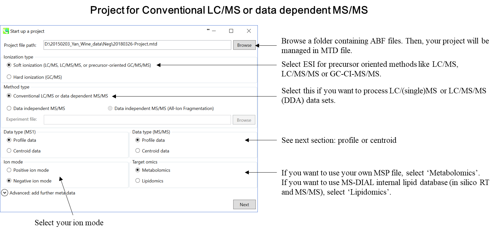
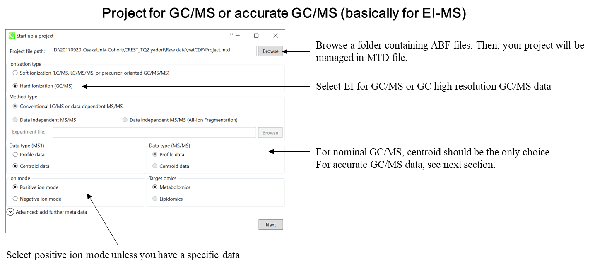
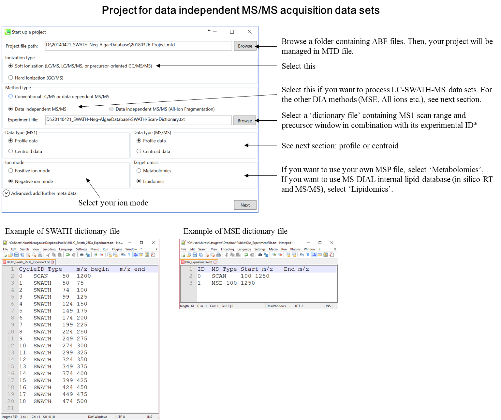

&#042; Prepare the above dictionary file as tab-delimited text.  
&#042; In the case of SWATH data-independent analysis, the experiment file can be made at PeakView (Show->sample information). Do not change the column orders. The word “SCAN” should be kept.   

   
### Section 5: Centroid or Profile? The content of ABF data
One of the problems of ABF file is that we have to determine the data type, i.e. centroid or profile, by ourselves. If your data type is ‘centroid’, the MS-DIAL program does not have to execute the process of spectral centroiding. On the other hand, MS-DIAL should perform the centroiding process for ‘profile’ mode data. We have validated the types for several instruments as follows.  
(what is the difference between centroid and profile? <http://blog.acdlabs.com/elucidation/2008/03/what-is-the-dif.html>)  

&#10003; SCIEX QTOF: Profile  
&#10003;	Thermo Q-Exactive: Profile  
&#10003;	Thermo LTQ-Orbitrap: Profile for MS1 and Centroid for MS/MS  
&#10003;	All nominal GC/MS data: Centroid  

For the other instruments, the data type of ABF depends on your MS settings.  

&#10003;	Agilent: The ABF converter will recognize your data type as ‘centroid’ if you set the export type as ‘centroid’ or ‘both’ in your MassHunter software. Otherwise, ‘profile’ is assumed.  

The data types of Bruker LC-QTOF and FT-ICR, and Waters LC-Xevo QTOF and Synapt G2 were mostly centroid: you have to select ‘centroid’ as data type in the MS-DIAL program. However, there is no guarantee yet.   

&#10003;	mzML: it depends on the export method by the ProteoWizard program etc.  

 &#042;  It's much better to check your data type in MS-DIAL as follows before you start your real project:  

1.	Start MS-DIAL project as 'Centroid' mode by a representative file.  
2.	See the MS1 and MS2 spectrum in ‘Peak spot viewer’ and check the 'shape' of the spectra.  
3.	If the shape appears to require centroiding, restart the project in 'Profile' mode.  

### Section 6: Database (MSP or Text) for compound identification  
The database formats for GC/MS or LC/MS datasets are described in this section. The main difference between GC/MS (EI-MS) and LC/MS (ESI-MS/MS) is the availability of precursor ion and its MS/MS. While a precursor *m/z* and its MS/MS are mostly available in ESI (or the other soft ionization)-MS/MS, the molecular ion in EI-MS is difficult to detect owning to the hard ionization. Several MSP files are downloadable as a starter kit for MS-DIAL at <http://prime.psc.riken.jp/Metabolomics_Software/MS-DIAL/index.html>.  

#### Section 6-1: MSP format for precursor- and MS/MS library  
MS-DIAL supports the MSP (<http://www.nist.gov/srd/upload/NIST1a11Ver2-0Man.pdf>) format in ASCII text (below Figure). In addition, the software can utilize “RETENTIONTIME: ”, “PRECURSORTYPE: ”, and “FORMULA:” information for metabolite identification (cases are ignored).  Retention time information must be specified in minutes [min] scale when possible. The adduct ion information, i.e. here ‘Precursor type’, will be used for the adduct ion search algorithm (see section 7).  

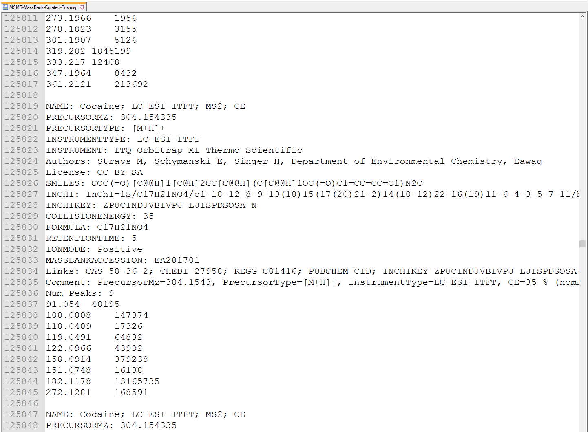
Figure: an example of MSP format library  
   
#### Section 6-2: Adduct ion format  
Adduct ion information should be formatted as described in this section: [M+Na]+, [M+2H]2+, [M-2H2O+H]+, [2M+FA-H]-, etc.  
1.	The parentheses ‘[’ and ‘]’ must be used to bracket the ion information.  
2.	The char + and - are required after ']' and the number must be written before + or -.  
3.	When you want to define the organic formula like C6H12O5, you have to write it without any replicate elements or parentheses like [M+C2H5COOH-H] or [M+H+(CH3)3SiOH].  
4.	The beginning figure of organic formula like '2'H2O is recognized as the H2O × 2. Again, do not use 2(H2O) to specify this.  
5.	Sequential equations are acceptable: [2M+H-C6H12O5+Na]2+ (very apt.)  
6.	MS-DIAL accepts some abbreviations or common organic formulas for adduct types as follows.  
&emsp;&emsp;For Acetonitrile: ACN, CH3CN  
&emsp;&emsp;For Methanol: CH3OH  
&emsp;&emsp;For Isopropanol: IsoProp, C3H7OH  
&emsp;&emsp;For Dimethyl sulfoxide: DMSO  
&emsp;&emsp;For Formic acid: FA, HCOOH  
&emsp;&emsp;For Acetic acid: Hac, CH3COOH  
&emsp;&emsp;For Trifluoroacetic acid: TFA, CFCOOH  

   
#### Section 6-3: Text format library for retention time and accurate mass search (post identification)  
MS-DIAL also supports tab-delimited text format library for peak identification by means of retention time and MS1 accurate mass information. The identification process is performed after completing peak identification based on MSP format library. This is why we call this identification processing “post identification”. The first row should include header information. The first, second, third, and fourth columns should contain the metabolite name, accurate mass [Da], retention time [min], and adduct ion, respectively. This library can be easily created in Microsoft Excel. Save the spreadsheet in “Tab delimited text format”. This option is useful for internal standard identifications etc. (Even if you don’t have MS/MS libraries, the peak identification based on retention time and accurate mass is available from this option.)   

&#042; The minimum requirement for this text library is just ‘metabolite name’ and ‘*m/z*’ information; i.e. the first two columns are required. Retention time and adduct ion fields provide additional information for MS-DIAL in peak identification and adduct ion picking, respectively.  

  
Figure: an example of text library  
   
#### Section 6-4: MSP format as GC/MS library  
MS-DIAL supports the MSP format (<http://www.nist.gov/srd/upload/NIST1a11Ver2-0Man.pdf>) in ASCII text, same as in section 6-1. MS-DIAL accepts two fields for ‘retention’ information as the reference: “RETENTIONTIME: ” or “RT”, and “RETENTIONINDEX” or “RI”. Retention time information must be specified in minute [min] scale when possible.   

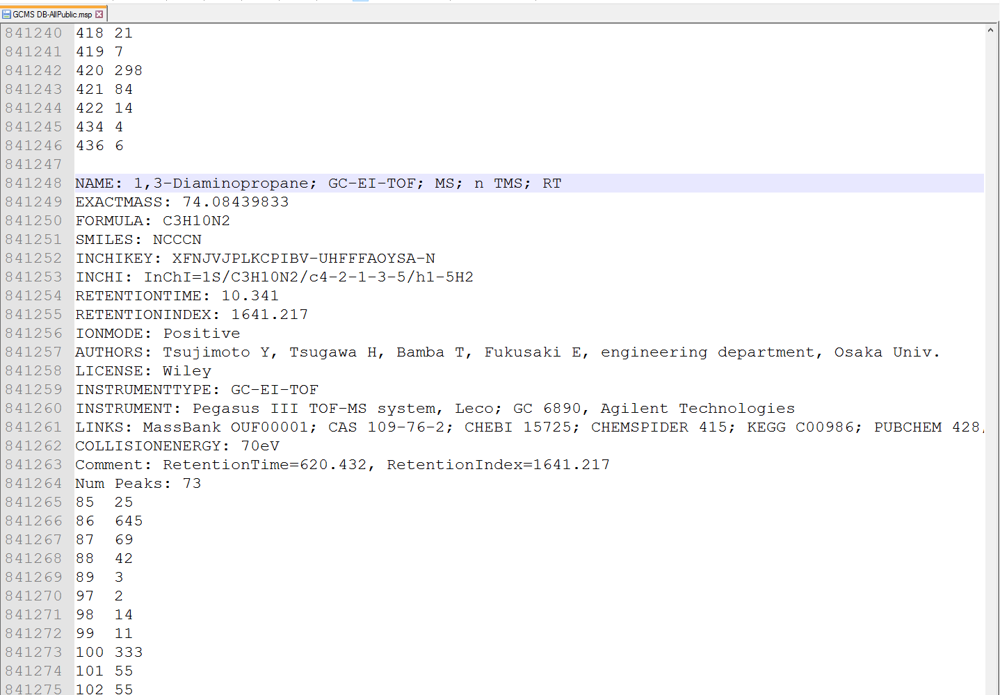  
Figure: an example of MSP format library for GC/MS  

   
#### Section 6-5: Alkane- or FAME retention time dictionary for the calculation of retention index  
Retention time and retention index are used for routine identification of metabolites in GC/MS based metabolomics. The current MS-DIAL program has three options for the use of retention information: 1) retention time, 2) alkane mix based retention index, and 3) FAME (fatty acid methyl ester) mix based retention index.  

See the experimental details of alkane and FAME mixtures.  
Alkanes: <http://www.sciencedirect.com/science/article/pii/S1389172311001848>  
Alkanes: <https://en.wikipedia.org/wiki/Kovats_retention_index>  
FAMEs: <http://www.ncbi.nlm.nih.gov/pmc/articles/PMC2805091/>  

In order to calculate the retention indexes of detected peaks, users have to prepare a dictionary including the pairs of the carbon number and its retention time as tab-delimited text (see next page).   

**FAQ**  
*	By alkane mixture, the calculation of retention index is based on Kovats’s method (temperature programmed chromatography).  
*	By FAME mixture, the calculation is based on Fiehn’s method. Importantly, FAMEs of carbon number C8, C9, C10, C12, C14, C16, C18, C20, C22, C24, C26, C28, and C30 (total 13 FAMEs) must be included in this dictionary to calculate Fiehn’s index. A polynomial regression of fifth order is applied to chromatographic peaks between C9 and C28. The peaks between C8 (and its earlier) and C9 and between C28 and C30 (and its later) are interpolated by a linear regression. The original indexes are based on the retention time (sec) * 1000 of authentic standards.  

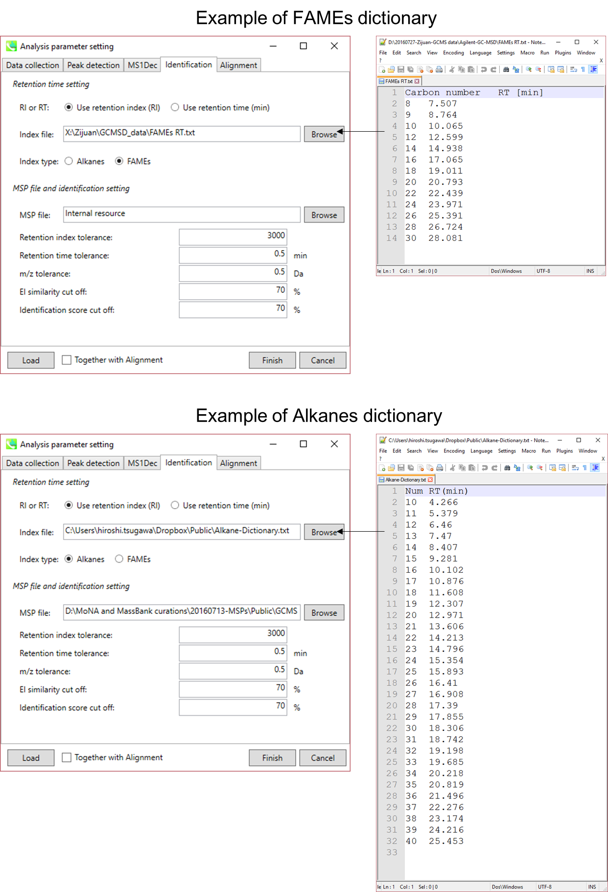  
Figure: examples of Alkanes or Fames dictionaries  

   
## Chapter 2: LC/MS/MS (data independent MS/MS) project with MS-DIAL’s LipidBlast database (in silico retention time and MS/MS library for lipids)  

A project dealing with data independent MS/MS acquisition in combination with the in silico retention time and MS/MS databases for lipids (MS-DIAL’s LipidBlast) is demonstrated. The experimental protocol is described in previous research: <http://www.nature.com/nmeth/journal/v12/n6/abs/nmeth.3393.html>.   

This tutorial uses 23 demonstration files which are downloadable from the below link.   
<http://prime.psc.riken.jp/?action=drop_index>  

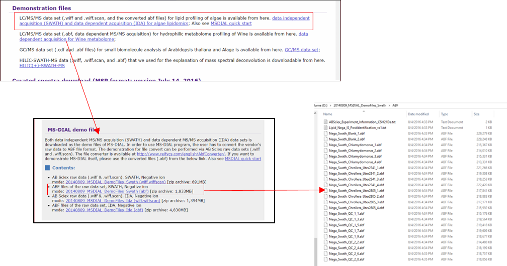

**Experiment summary:**   
Liquid chromatography: total 15 min run per sample with Waters Acquity UPLC CSH C18 column (100×2.1 mm; 1.7 μm).  
Mass spectrometer: SWATH method with negative ion mode.  
&emsp;&emsp;&emsp;MS1 accumulation time, 100 ms  
&emsp;&emsp;&emsp;MS2 accumulation time, 10 ms  
&emsp;&emsp;&emsp;Collision energy, 45 V  
&emsp;&emsp;&emsp;Collision energy spread, 15 V  
&emsp;&emsp;&emsp;Cycle time, 731 ms  
&emsp;&emsp;&emsp;Q1 window, 21 Da  
&emsp;&emsp;&emsp;Mass range, *m/z* 100-1250  

### Section 1: Starting up your project  
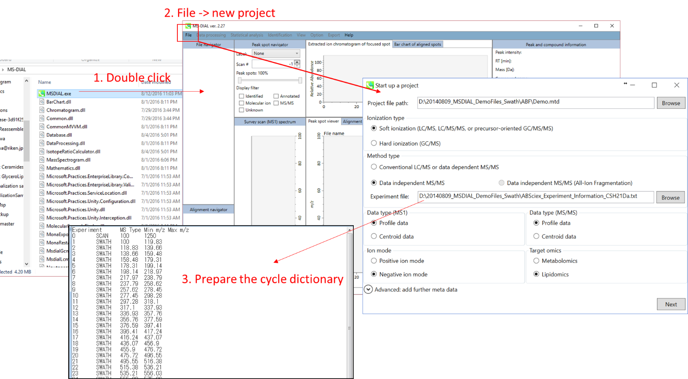

1. File -> new project  
2. Set your project file path to the directory of your ABF files  
3. Select your method type as ‘Data independent MS/MS’  
4. Select the experimental file: ABSciex_Experiment_Information_CSH21Da.txt.  
5. Choose data type profile data for both MS1 and MS/MS  
6. Choose negative ion mode  
7. Choose target omics as lipidomics  
If you select ‘lipidomics’ project, you do not have to prepare NIST MSP format library since MS-DIAL internally contains an enriched LipidBlast for QTOFMS. Instead, you should select compounds needed by your data sets. On the other hand, when you select ‘metabolomics’ project, your own MSP file will be required for compound identification.  
**&#042; see section 4 of chapter 1 as well for more detail**  

### Section 2: Importing ABF files  
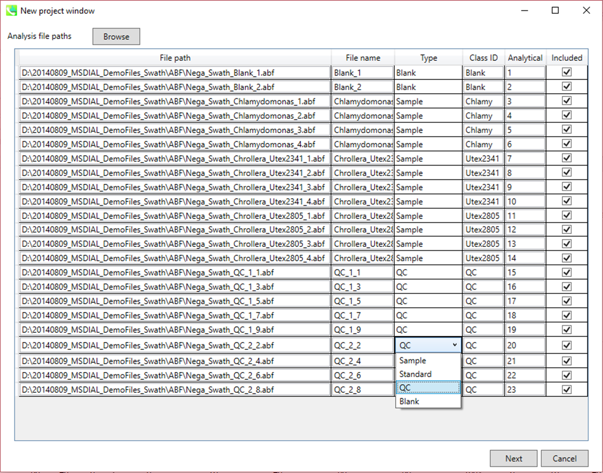

1.	Select ABF files  
2.	If the file is a “quality control” sample for peak alignment, then set the type as such.  

Note: Please finalize your file name here, because you cannot change it later.  

   
### Section 3: Setting parameters  
#### Section 3-1: Data collection tab  

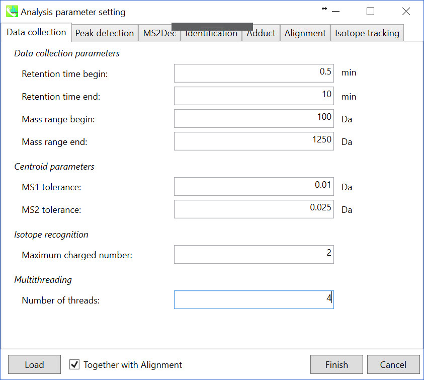  

*Data collection parameters*: You can set analysis ranges (RT and MS1 axis). In this demonstration, your expected data range is 0.5-10 min for 100-1250 Da.  

*Centroid parameters*: After the peak detection algorithm is applied along the MS axis with a very low threshold, MS-DIAL performs spectral centroiding. By default, mass spectrum of ±0.01 and ±0.025 Da range from each peak top is integrated in MS1 and MS2, respectively. Importantly, this MS2 tolerance value is also used to build the MS/MS chromatogram for a certain *m/z* trace. The MS/MS chromatograms are dedicated to the MS2Dec deconvolution program.  

*Isotope recognition*: As long as you focus on small molecule researches (less than 2000 Da), the maximum charged number can be set to 2. On the other hand, the parameter can be changed to 8 or more to process proteome or snRNA research data.  

*Multithreading*: Please set the count of threads that you want to use. You can check the maximum thread counts in resource monitor. (open task manager->open resource monitor)   

#### Section 3-2: Peak detection tab  

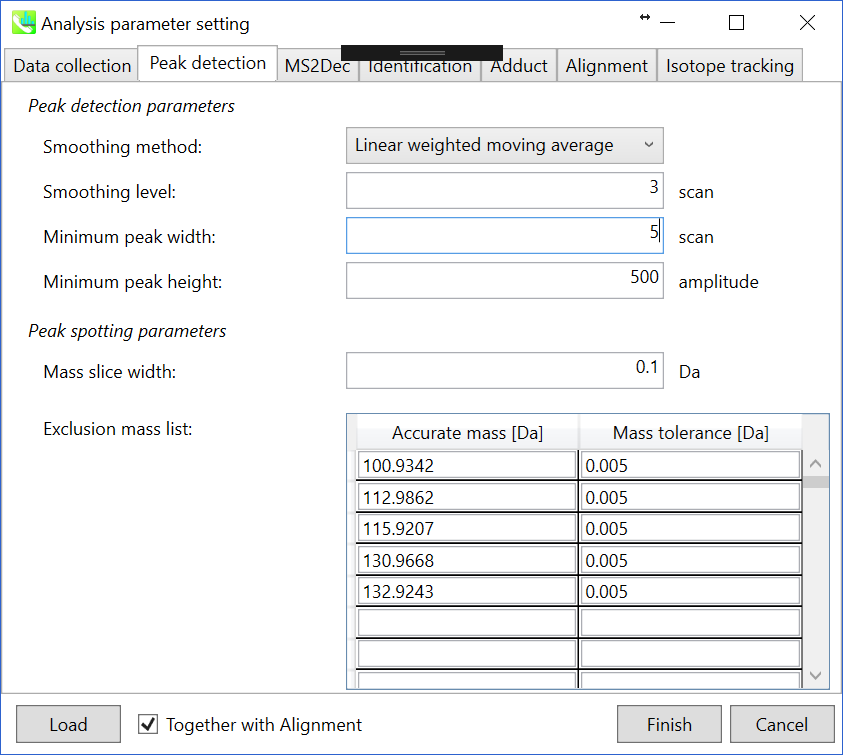  

*Peak detection parameters*: Linear-weighted moving average is used for the peak detection by default to accurately determine the peak left- and right edges. The recommended smoothing level is 1-3. MS-DIAL provides two simple thresholds: minimum values for peak width and height. Peaks below these thresholds are ignored (see also MS-DIAL mathematics: <http://prime.psc.riken.jp/Metabolomics_Software/MS-DIAL/MS-DIAL%20FAQ-vs2.pdf>). For FT-ICR or Orbirap data, the minimum peak height may be 50,000 or more.  

*Peak spotting parameters*: The width of mass slice is set here. From our experience, 0.1 or 0.05 is suitable for Agilent Q-TOF, AB Sciex TripleTOF, and Thermo Q-Exactive. If you already know unwanted *m/z* peaks from columns or solvent, you can specify them in the “Exclusion mass list.”  

   
A part of <http://prime.psc.riken.jp/Metabolomics_Software/MS-DIAL/MS-DIAL%20FAQ-vs2.pdf>  

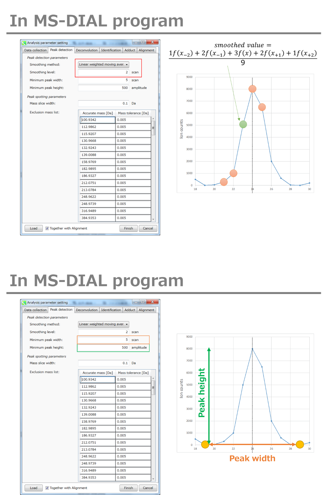  

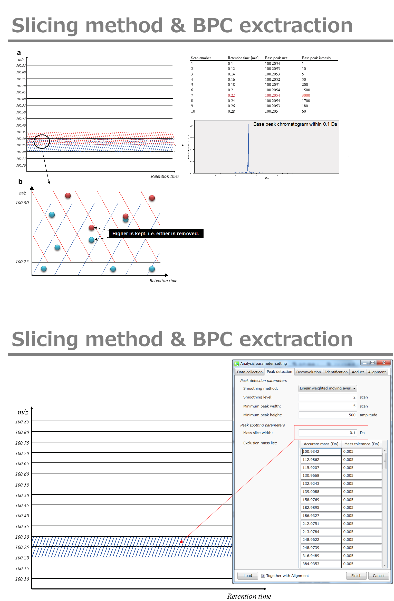
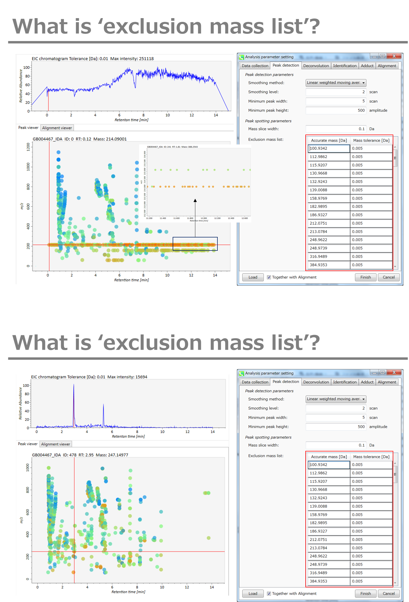

#### Section 3-3: MS2Dec tab  

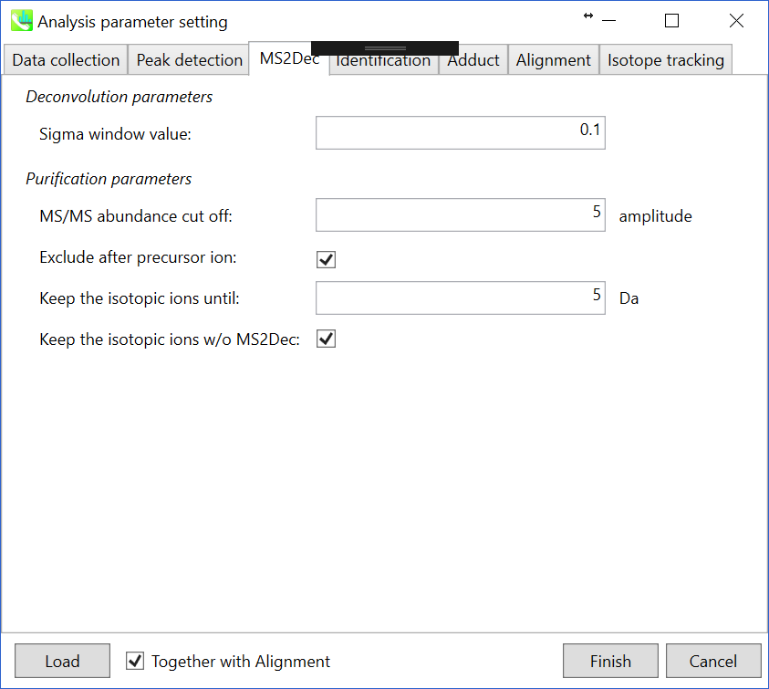  

The sigma window value is highly affected by the resolution of deconvolutions. A higher value (0.7-1.0) will reduce the peak top resolutions, i.e. the number of resolved peaks will be decreased. On the other hand, a lower value (0.1-0.3) may also recognize many noise chromatographic peaks.   

In addition, you may be able to set a cut off value to reduce the MS noises (see Section 3-3 of Chapter 3). Finally, if you want to remove the product ions after the focused precursor ion (recommended for metabolomics and lipidomics), check “Exclude after precursor.”  

*Keep the isotopic ions until*: in fact, the isotopic patterns in MS1 spectra are frequently disturbed. On the other hand, there are some cases that the isotopic patterns in MS/MS spectra are clearer than that of MS1 spectra, which can be used for the accurate annotation of molecular formula. If you set this parameter as 5, the ions until precursor + 5 Da are kept after MS2Dec algorithm is finished.   

*Keep the isotopic ions w/o MS2Dec*: sometimes, the MS2Dec algorithm may erase the precursor’s isotopic ions due to the mathematics issues. Therefore, you can keep the raw MS/MS spectra only for the precursor’s isotopic ions by this option.   
   
#### Section 3-4: Identification tab  
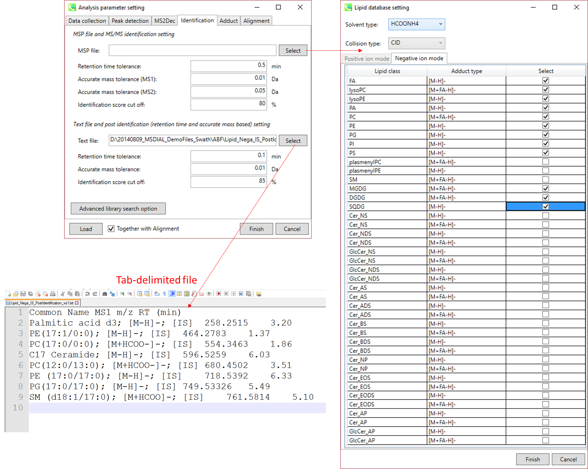

*MSP file*: In the case that you selected ‘lipidomics’ project, select what you want to find in your data sets for lipid profiling. Here, for algae lipidomics, tick the above figure’s lipids: FA, lysoPC, lysoPE, PA, PC, PE, PG, PI, PS, MGDG, DGDG, and SQDG.  

*Parameters*: If you put retention time (RT) information in your MSP file, set the RT tolerance value (default is 0.5). For example, our internal lipid DB includes the predicted RT information optimized for our 15 min LC method. If suitable RT information is unavailable, set the tolerance 100 or larger (larger than your LC time).  
The two mass tolerances for MS1 and MS2 are required for the compound search and they are dependent on your instrument performance.  
The cutoff of the identification score should be greater than 0.7 or 0.8.  

*Text file*: If you want to perform “post identification” processing, set your text file here. (Tutorial data: **Lipid_Nega_IS_PostIdentification_vs1.txt**)  

*Parameters*: The meanings of parameters are the same as MSP based identification.  

*Advanced library search option*: The options for your library search are defined here. In the current program (2014/11/30), there are two options for the library search.  

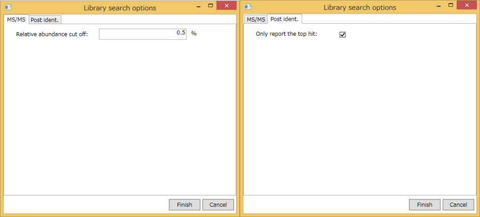  

MS/MS tab:  
1.	*Relative abundance cut off*: the mass spectrum peak less than the user-defined value will not be used for the MS/MS similarity calculation.  

Post ident. Tab:  
2.	*Only report the top hit*: Since some chromatogram peaks will be annotated as the same compound from the identification algorithm, this option allows us to determine only one candidate from such multiple results by means of the identification score.  

#### Section 3-5: Adduct tab  
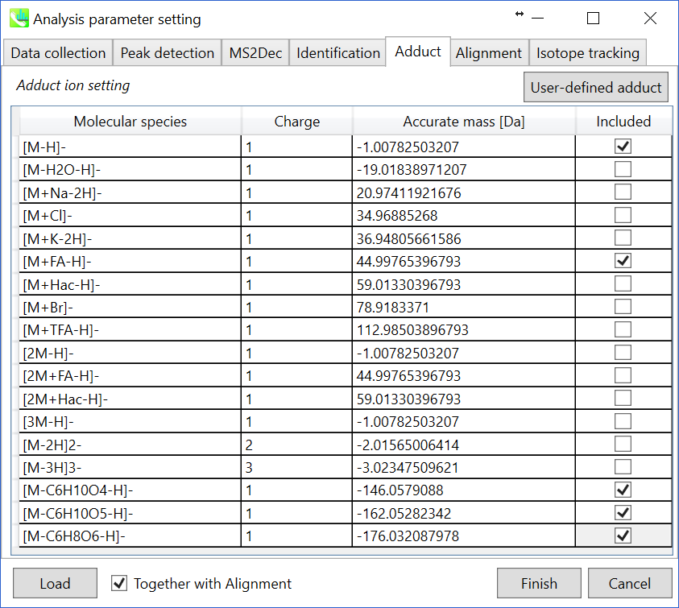  

Adduct ion setting: You can tick the adduct ions and charge values to be considered.  
&#042; see also the section 3-5 of Chapter 3 for the explanation of how to determine your own adduct ion.  

   
#### Section 3-6: Alignment tab  
  

*Parameters*: If you already have a suitable quality control (QC) data, typically a mixed sample data, then specify the QC file here. All sample data will be aligned to this QC file. The RT and MS1 tolerances for peak alignment depend on your chromatographic conditions (see MS-DIAL mathematics for details). If you want to remove specific peaks that are not fully detected in the alignment, specify the peak count filter. For example, the tutorial data include at least 4 biological replicates with the same peak information and the total number of data is 23. Then, you may set the peak count filter as (4/23)&lowast;100 = 17.4 %. This means peaks will be removed when they include missing values for more than 17.4%. Moreover, in ‘N% detected in at least one group’, the filtering is done within each sample group. If it is set to 100%, the peaks should be detected in all of samples of a class.  
If you can prepare many QC sample data, tick the “Detected in all QCs” box. Then a peak will be removed if it is missing in any of the QC samples.   

**Note:** When you execute the compound identification, the representative spectra with identification results are automatically determined from one of imported files which has the highest identification score. In the case that an alignment spot is not identified in any samples, the MS/MS spectrum of one sample which has the highest ion abundance in imported files is assigned as the representative spectrum.  

   
### Section 4: Data curation for the reduction of false positive identifications  
MS-DIAL can automatically identify the metabolite peaks by the similarity calculation of retention time, precursor *m/z*, isotopic ratios, and MS/MS spectrum with the reference databases. However, unfortunately, there are also false positive identifications in the result of peak identifications as well as true positives. Therefore, as an analytical chemist, the result should be manually checked and sometimes some of identified peaks should be curated and modified. Of course, the ultimate goal is the perfect identification without any false positive- and negative identifications.   
Practically, what to manually curate the identification result of your representative alignment file since the identification result of its alignment file will be reflected in the final output such as ‘peak height’ matrix etc. Using the GUI of MS-DIAL, you can check if an aligned spot is a false positive/negative identification or not. For further information about GUI of MS-DIAL, see Chapter 5.  

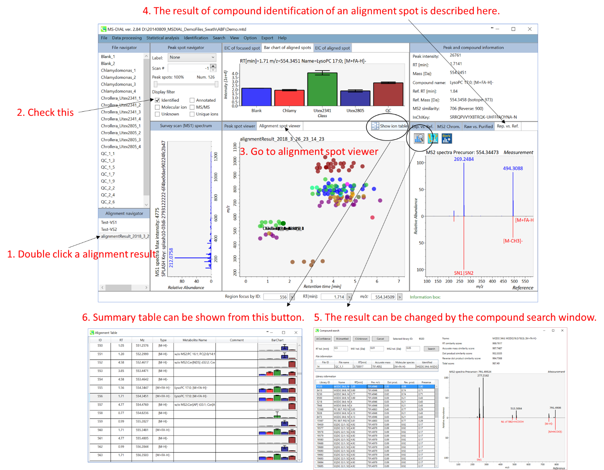
   
## Chapter 3: LC/MS or LC/MS/MS (data dependent MS/MS) project with user-defined MS/MS database (MSP format) in MS-DIAL  

Here, a project from data dependent MS/MS acquisition in combination with a user-defined MSP library (an integration library of MassBank, GNPS, and Respect) is demonstrated. The experimental protocol is described in the previous research: http://pubs.acs.org/doi/abs/10.1021/acs.jafc.5b04890. The ABF files for this demonstration can be downloaded from our website: http://prime.psc.riken.jp/Metabolomics_Software/MS-DIAL/index.html.   

This section uses total 6 files and the MSP file is contained in the same folder of this demonstration. Also, there is a parameter file (Param.med) in this folder to be used in MS-DIAL for the quick start.  

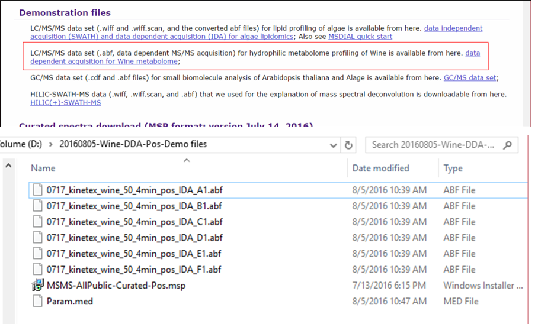

**Experiment summary:**  
Liquid chromatography: total 4 min run per sample with Kinetex C18 2.6 m (50×1.0 mm).  
Solvent A: water with 0.1% acetic acid  
Solvent B: acetonitrile with 0.1% acetic acid  
Mass spectrometer: data dependent method with positive ion mode.  
&emsp;&emsp;&emsp;Collision energy, 35 V  
&emsp;&emsp;&emsp;Collision energy spread, 15 V  
&emsp;&emsp;&emsp;Cycle time, 125 ms  
&emsp;&emsp;&emsp;Mass range, *m/z* 60-1250  
   
### Section 1: Starting up your project  

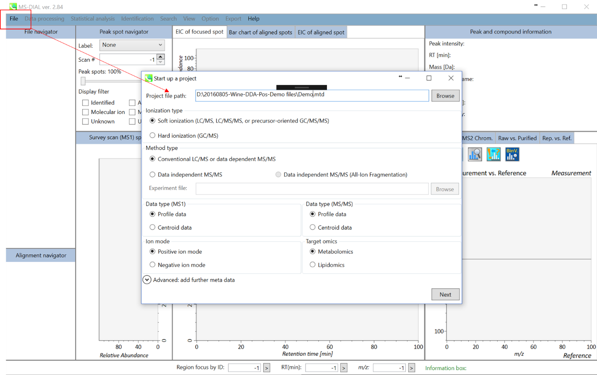

1. File -> new project  
2. Set your project file path to the directory of your ABF files  
3. Select your method type as conventional LC/MS or data dependent MS/MS  
4. Choose data type profile data for both MS1 and MS/MS  
5. Choose positive ion mode  
6. Choose target omics as metabolomics  
If you select ‘lipidomics’ project, you do not have to prepare NIST MSP format library. Instead, you should select compounds needed by your data sets (see **chapter 2**). On the other hand, when you select ‘metabolomics’ project, your own MSP file will be required for compound identification.  

&#042; see section 4 of chapter 1 as well  

   
### Section 2: Importing ABF files  
1.	Select ABF files  
2.	If the file is a “quality control” sample for peak alignment, then set the type as such. (in this example, you do not have to change this setting.)  

Note: Please finalize your file name here, because you cannot change it later.  

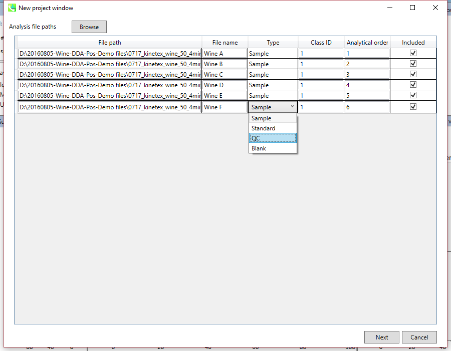

   
### Section 3: Setting parameters  
#### Section 3-1: Data collection tab  
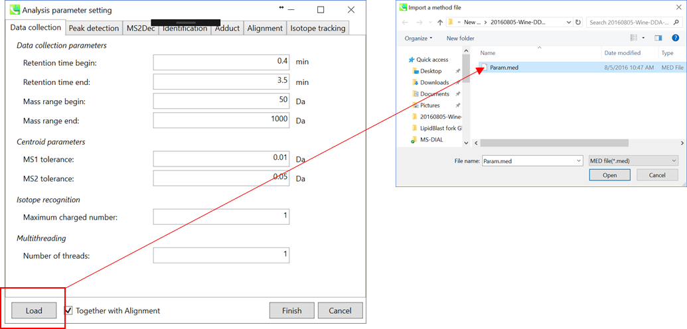  

&#042; For the quick start and its explanations, load ‘Param.med’ as shown above.  

*Data collection parameters*: You can set analysis ranges (RT and MS1 axis). Here, set 0.4-3.5 min and 50-1000 Da for the ranges.  

*Centroid parameters*: After the peak detection algorithm is applied along the MS axis with a very low threshold, MS-DIAL performs spectral centroiding if your files are profile data. By default, mass spectrum of ±0.01 and ±0.05 Da range from each peak top is integrated in MS1 and MS2, respectively.   

*Isotope recognition*: As long as you focus on small molecule researches (less than 2000 Da), the maximum charged number can be set to 2. On the other hand, the parameter can be changed to 8 or more to process proteome or snRNA research data.  

*Multithreading*: Please set the count of threads that you want to use. You can check the maximum thread counts in resource monitor. (open task manager->open resource monitor)  
   
#### Section 3-2: Peak detection tab  
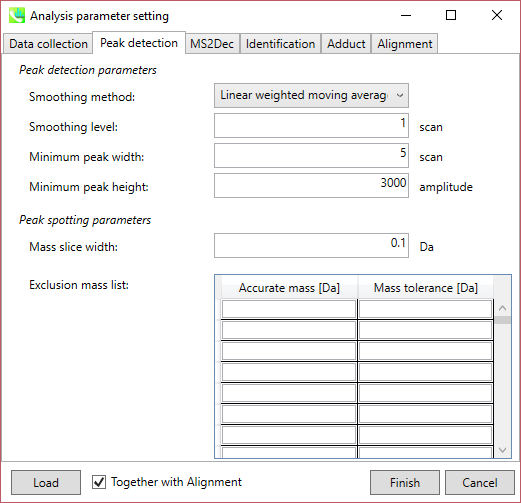  

*Peak detection parameters*: Linear-weighted moving average is used for the peak detection by default to accurately determine the peak left- and right edges. The recommended smoothing level is 1-3. MS-DIAL provides two simple thresholds: minimum values for peak width and height. Peaks below these thresholds are ignored (see also MS-DIAL mathematics: <http://prime.psc.riken.jp/Metabolomics_Software/MS-DIAL/MS-DIAL%20FAQ-vs2.pdf>). For FT-ICR or Orbirap data, the minimum peak height should be more than 20,000.  

*Peak spotting parameters*: The width of mass slice is set here. From our experience, 0.1 or 0.05 is suitable for Agilent Q-TOF, AB Sciex TripleTOF, and Thermo Q-Exactive. If you already know unwanted *m/z* peaks from columns or solvent, you can specify them in the “Exclusion mass list.”  
   
#### Section 3-3: MS2Dec tab  
Unless you have data independent MS/MS data sets, you can skip this part. However, as shown below, you may set a cutoff value to reduce the MS noises. Note that what is shown below is not the same as data sets described earlier, but we found that this parameter was very important to reduce the computational time and the underestimation of spectral similarities especially in Waters or Agilent instruments.  

  
Figure: Explanation about purification parameters  
   
#### Section 3-4: Identification tab  

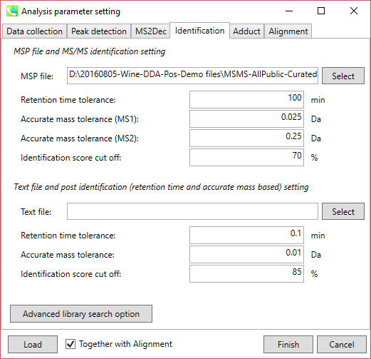  

*MSP file*: Set your MSP file here. (Tutorial data: MSMS-AllPublic-Curated-Pos.msp.) In the case that you selected ‘lipidomics’ project, please select what you want to find in your data sets for lipid profiling.  

*Parameters*: If you put retention time (RT) information in your MSP file, set the RT tolerance value (default is 0.5). However, since the retention times of this MSP file are not recorded by the method of this demonstration, set the tolerance to 100 or larger in order to ignore the effect of retention time tolerance. The two mass tolerances for MS1 and MS2 are required for the compound search. This demonstration’s MSP file has the theoretical value of precursor *m/z* for all of authentic compounds. Therefore, the MS1 tolerance for time-of-flight MS was set to 0.025 Da here. On the other hand, since this MSP file also includes low resolution (QqQ etc.) MS data, 0.2 or more should be suitable to widely utilize all of the queries. The cutoff of the identification score should be greater than 0.7 or 0.8 to avoid false positives.  

*Text file*: If you want to perform “post identification” processing, set your text file here. (There is no text DB for this demonstration.)  

*Advanced library search option*: The options for your library search are defined here. In the current program (2014/11/30), there are two options for the library search.  

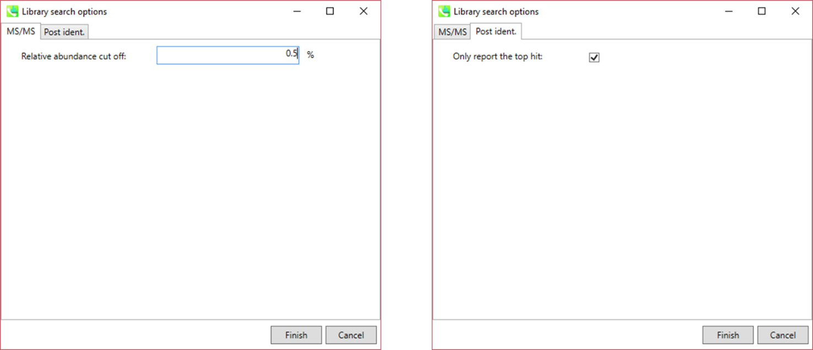  

MS/MS tab:  
3.	*Relative abundance cut off*: the mass spectrum peak less than the user-defined value will not be used for the MS/MS similarity calculation.  

Post ident. Tab:  
4.	*Only report the top hit*: Since some chromatogram peaks will be annotated as the same compound from the identification algorithm, this option allows us to determine only one candidate from such multiple results by means of the identification score.  

#### Section 3-5: Adduct tab  
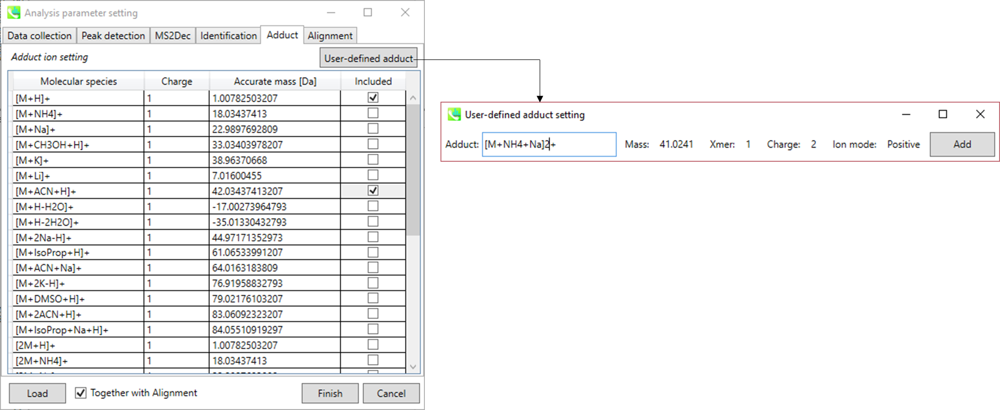  
You can tick the adduct ions and charge values to be considered.  
In addition, own definition for adduct ions can be set. (see the adduct format in Section 6-2 of Chapter 1)  

#### Section 3-6: Alignment tab  
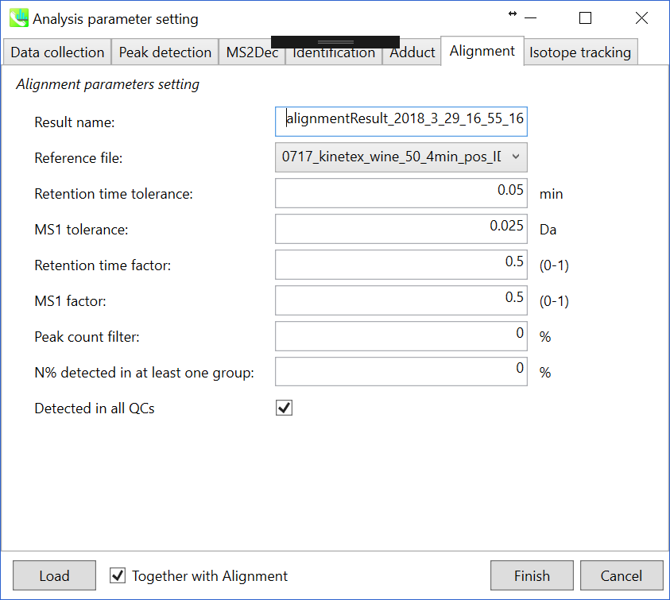  

*Parameters*: If you already have a suitable quality control (QC) data, typically a mixed sample data, then specify the QC file here. All sample data will be aligned to this QC file. When no QC file is available, select one of imported files (blank sample is not suitable). The metabolite peaks of a specific sample, which are not monitored in the representative file, can be automatically interpolated by the algorithm of MS-DIAL (gap-filling). In this demonstration, 0717_kinetex_wine_50_4min_pos_IDA_A1 is selected as the representative file. The RT and MS1 tolerances for peak alignment depend on your chromatographic conditions (here set 0.05 min and 0.025 Da.). If you want to remove specific peaks that are not fully detected in the alignment, specify the peak count filter. For example, the tutorial data include at least 4 biological replicates with the same peak information and the total number of data is 23. Then, you may set the peak count filter as (4/23)&lowast;100 = 17.4 %. This means peaks will be removed when they include missing values for more than 17.4%. Moreover, in ‘N% detected in at least one group’, the filtering is done within each sample group. If it is set to 100%, the peaks should be detected in all of samples of a class.  
If you can prepare many QC sample data, tick the “Detected in all QCs” box. Then a peak will be removed if it is missing in any of the QC samples.   

**Note:** When you execute the compound identification, the representative spectra with identification results are automatically determined from one of imported files which has the highest identification score. In the case that an alignment spot is not identified in any samples, the MS/MS spectrum of one sample which has the highest ion abundance in imported files is assigned as the representative spectrum.  

### Section 4: Data curation to reduce false positive identifications  
MS-DIAL can automatically identify the metabolite peaks by the similarity calculation of retention time, precursor *m/z*, isotopic ratios, and MS/MS spectrum with the reference databases. However, unfortunately, there are also false positive identifications in the result of peak identifications. Therefore, as an analytical chemist, the result should be manually checked and sometimes some of identified peaks should be curated and modified.   
Practically, what you have to do is to curate the identification result of an alignment file since the identification result of its alignment file will be reflected in the final output like ‘peak height’ data matrix. Using the GUI of MS-DIAL, you can check if an aligned spot is false positive/negative identification or not. For further information about GUI of MS-DIAL, see Chapter 5.  

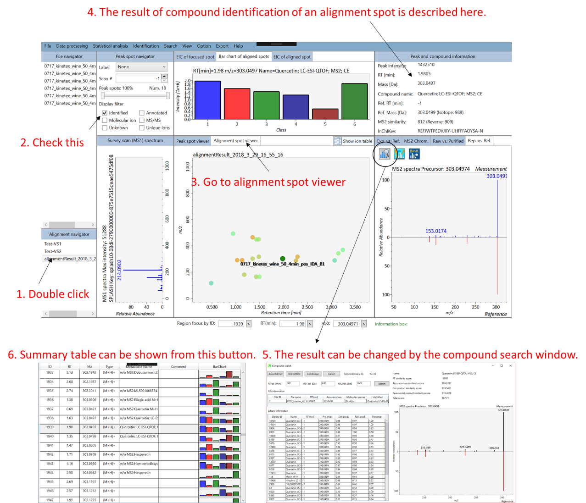  
   
### Chapter 4: Nominal and accurate GC/MS based metabolic profiling in MS-DIAL  
Gas chromatography coupled with mass spectrometry is a robust and stable technique for metabolic profiling. Practically, it should be the first choice for untargeted metabolome analyses in terms of easier operation and maintenance over LC/MS. Moreover, the compound identification of GC/MS is currently straightforward owing to huge amount of retention time (and retention index) and EI spectrum databases.  
Here, a project using GC/MS data sets of Arabidopsis knock out mutants (a part of this study) is demonstrated. The detail is shown in <http://prime.psc.riken.jp/meko/>. The alkane mixture based retention index (Kovats) is used. The other methods using FAME mixture based retention index (Fiehn) or retention times are also explained. The files used for this demonstration can be downloaded from <http://prime.psc.riken.jp/Metabolomics_Software/MS-DIAL/index.html>.   

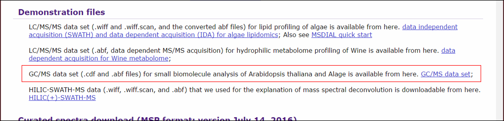  

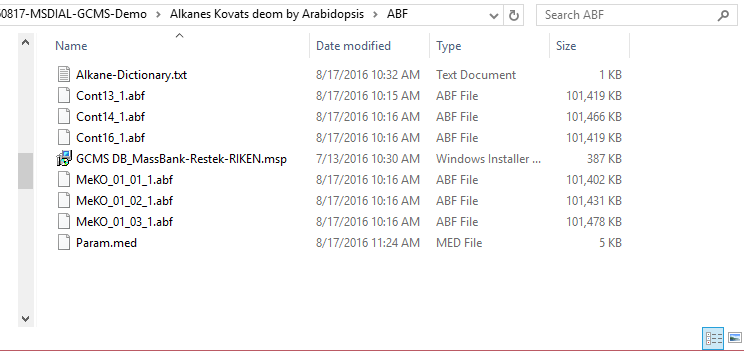  

### Section 1: Starting up your project  

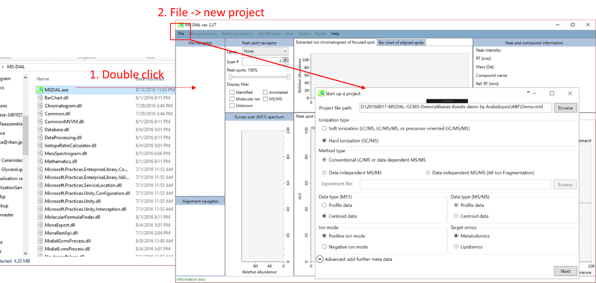  

1. File -> new project  
2. Set your project file path to the directory of your ABF files  
3. Select your ionization type as EI (GC/MS)  
4. Choose data type centroid data  
5. Choose positive ion mode  

&#042; see section 4 of chapter 1 as well for the explanation of ‘Data type’.  

**FAQ:**   
*	MS-DIAL can also process your LC/MS data like GC/MS.   
*	If you have accurate GC/MS data, a parameter to set its accuracy is given in the parameter setting section.  
* If your data is a kind of precursor oriented GC/MS/MS technique such as GC-CI- (chemical ionization), GC-FI- (field ionization), GC-PI- (photonic ionization), and GC-APCI-MS, it should be dedicated to ‘ESI (LC/MS, LC/MS/MS, or precursor-oriented GC/MS/MS’ part as ionization type. See chapter 3.  

### Section 2: Importing ABF files  
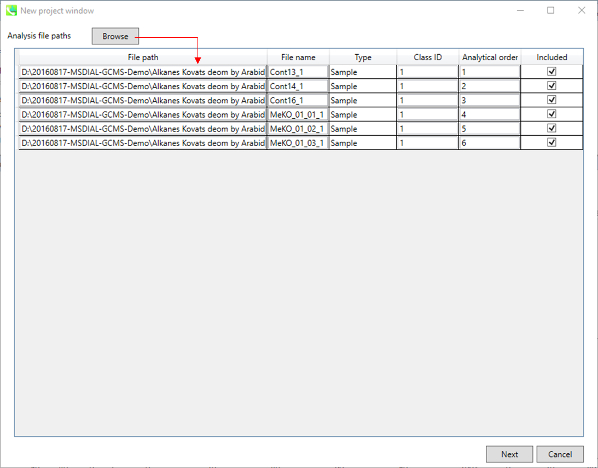  

1.	Select ABF files  
2.	If the file is a “quality control” sample for peak alignment, then set the type as such. (in this example, you do not have any QC sample.)  

Note: Please finalize your file name here, because you cannot change it later.  

### Section 3: Setting parameters  
#### Section 3-1: Data collection tab  
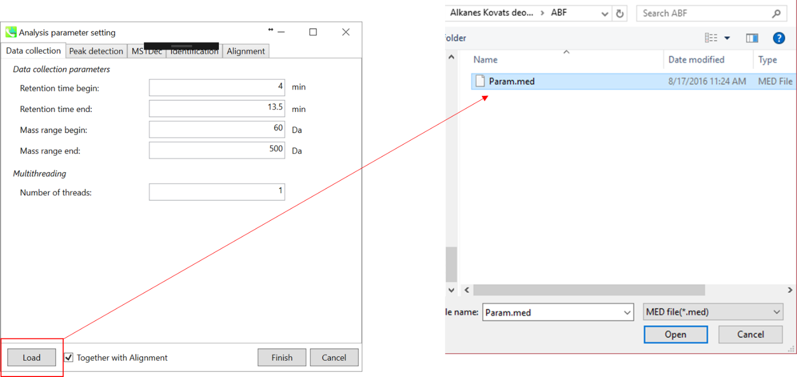  

&#042; For the quick start and its explanations, load ‘Param.med’ as shown above.  

*Data collection parameters*: You can set analysis ranges (RT and MS1 axis). For example, if your expected (meaningful) data range is 4-13.5 min for 60-500 Da (in this example), so set the parameters.  

*Multithreading*: Please set the count of threads that you want to use. You can check the maximum thread counts in resource monitor. (open task manager->open resource monitor)  
   
#### Section 3-2: Peak detection tab  
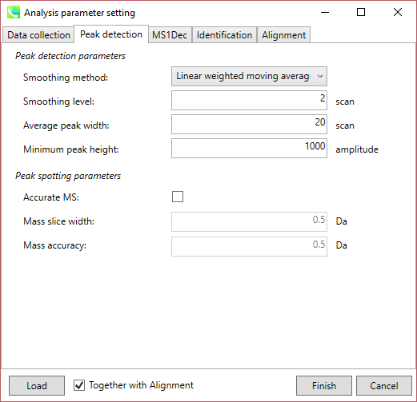  

*Peak detection parameters*: The workflow of GC/MS deconvolution is 1) peak picking in each *m/z* chromatogram, and 2) deconvolution on the basis of detected peak spots. The algorithm of this peak picking is the same as LC/MS parts except for exclusion mass list which was removed from the parameter list in GC/MS processing.   
Linear-weighted moving average is used for the peak detection by default to accurately determine the peak left- and right edges. The recommended smoothing level is 1-3. MS-DIAL provides two simple thresholds: minimum values for peak width and height. Peaks below these thresholds are ignored (see also MS-DIAL mathematics: <http://prime.psc.riken.jp/Metabolomics_Software/MS-DIAL/MS-DIAL%20FAQ-vs2.pdf>). For GC-Q-Exactive data, the minimum peak height should be 50,000 or more (at a first trial).  

*Peak spotting parameters*: If your data is obtained by high resolution GCMS such as Agilent GC-QTOFMS and GC-QExactive, check ‘accurate MS’. Then, set the width of mass slice. From our experience, 0.1 or 0.05 is suitable for accurate GCMS. In addition, put the mass accuracy which is used for the construction of EI-chromatograms followed by the deconvolution (MS1Dec) program.  

#### Section 3-3: MS1Dec tab  
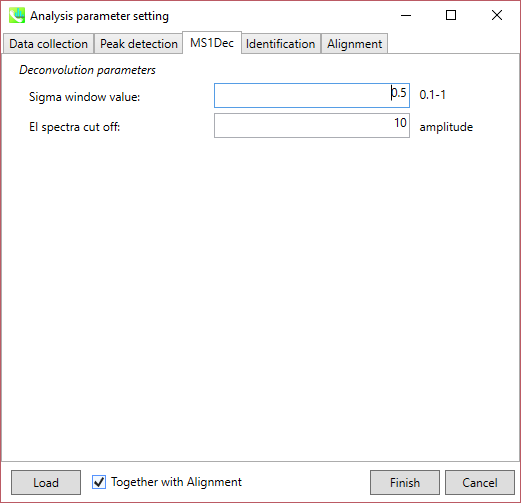  

The sigma window value is highly affected by the resolution of deconvolutions. A higher value (0.7-1.0) will reduce the peak top resolutions, i.e. the number of resolved chromatographic peaks will be decreased. On the other hand, a lower value (0.1-0.3) may also recognize many noise chromatographic peaks.   

In addition, you may set a cutoff value to reduce the MS noises (see Section 3-3 of Chapter 3). This is the same as LC/MS part.  

   
#### Section 3-4: Identification tab  
The peak identification of GC/MS based untargeted analysis is straightforward, but you have to carefully check your conditions especially about retention index for the comprehensive identification of metabolites. In fact, MS-DIAL can use ‘retention time’ as the index of retention information, but it is highly recommended to use retention indexes for the routine identifications. * Since there is retention time information as well in our curated MSP DBs, you may be able to choose ‘retention time’ as the index. However, you should use larger retention time tolerance, at the cost of increasing false positives.   
There are two methods to calculate retention indexes: 1) Kovats on the basis of alkane mixture, and 2) Fiehn on the basis on FAME (fatty acid methyl ester) mixture. These mixtures can be bought for example from Sigma-Aldrich (49452-U for C7-C40 saturated alkane mixture) and from Agilent (<http://www.agilent.com/cs/library/usermanuals/Public/G1676-90001_Fiehn.pdf>). Here, you have to prepare a tab-delimited file which includes the pair-list of carbon number and its retention time.  
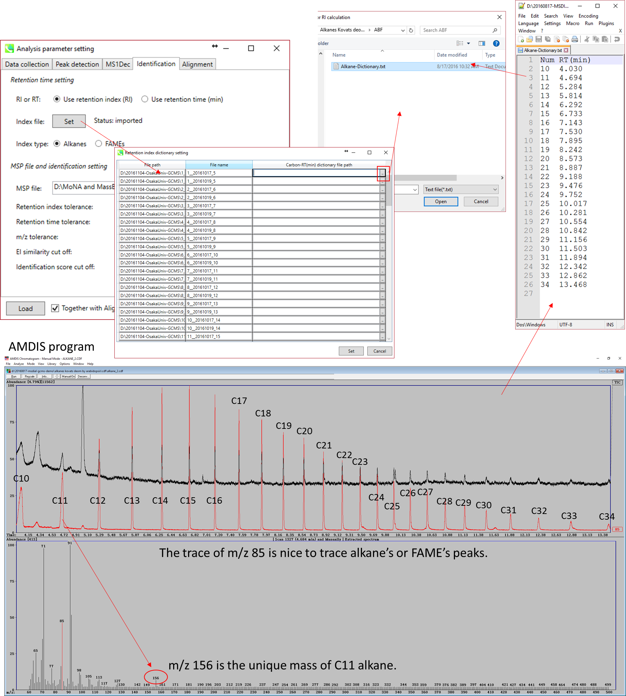  

The figure above describes the way to check the retention times of Alkane mixture (using AMDIS), and the same way can be used for FAME mixture. Note that **for FAME based Fiehn RI calculation**, you MUST prepare all of retention information of C8, C9, C10, C12, C14, C16, C18, C20, C22, C24, C26, C28, and C30 to calculate Fiehn RIs. On the other hand, all of alkanes is not required for the Kovats calculation.   

From version 2.42, MS-DIAL supports ‘retention index’ based peak alignment. Some metabolomics studies can be acquired over months / years.  Cutting 10-15 cm of the GC column during instrument maintenance makes retention times shorter but this does not influence retention index. In some cases, there are many isomers (e.g., analysis of volatiles), thus, use of wide retention time tolerance (e.g., 0.5-1 min) could lead to wrong peak alignment. In order to deal with this requirement, users have to define the ‘pair’ of analysis file path and carbon-RT dictionary file in the parameter setting. Use ‘auto fill’ of context menu to apply a dictionary file into all of the other analysis files.  

&#042; AMDIS (<http://chemdata.nist.gov/mass-spc/amdis/downloads/>) is a nice and very robust program for GC/MS analysis. It can also be used to check the retention times of both alkanes and FAMEs since you can directly see your raw data without any processing. In contrast, MS-DIAL has to be executed first to check raw data sets.  

*MSP file*: Set your MSP file here. (Tutorial data: **GCMS DB_MassBank-Restek-RIKEN.msp**.) Importantly, as long as you use FAME mixture, you do not have to prepare your own MSP since MS-DIAL internally has the Fiehn BinBase spectra records. Of course, you can choose your own MSP file for FAME based GC/MS metabolome analysis.  

*Parameters*: If you put retention time (RT) information in your MSP file, set the RT tolerance value (default is 0.5). In the case that you choose ‘retention index’ as the identification index, set about 10-20 for alkane (Kovats index) and about 2000-3000 for FAME (Fiehn index) for ‘Retention index tolerance’.  
Even if you use accurate GC/MS data, 0.5 for *m/z* tolerance is recommended unless you have your own high resolution EI library. The EI similarity cut off is used for the first filtering of compound identifications, and then the cutoff of the identification score which is the total score of retention time similarity and EI spectral similarity will be used for the final ranking of compound identification.   

   
#### Section 3-5: Alignment tab  
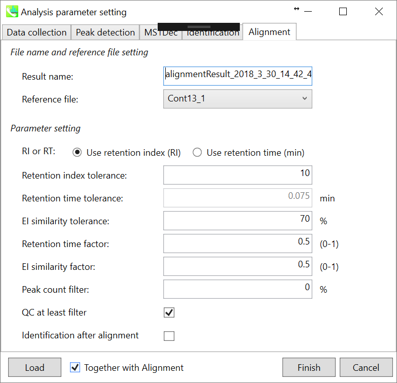  

*Parameters*: If you already have a suitable quality control (QC) data, typically a mixed sample data, then specify the QC file here. All sample data will be aligned to this QC file. When no QC file is available, select one of imported files (blank sample is not suitable). The metabolite peaks of a specific sample which are not monitored in the representative file can be automatically interpolated by the algorithm of MS-DIAL (gap-filling).   
&emsp;&emsp;&emsp;&emsp;In this demonstration, Const13_1 is selected as the representative file. The RT and EI similarity tolerances for peak alignment depend on your chromatographic conditions (set 0.075 min and 70% here). Note that you can use retention index as the criteria for peak alignment once the carbon-RT dictionary files are defined correctly in the identification tab (see the identification tab section).  
&emsp;&emsp;&emsp;&emsp;If you want to remove specific peaks that are not fully detected in the alignment, specify the peak count filter. For example, the tutorial data include at least 4 biological replicates with the same peak information and the total number of data is 23. Then, you may set the peak count filter as (4/23)&lowast;100 = 17.4 %. This means peaks will be removed when they include missing values for more than 17.4%. If you can prepare many QC sample data, tick the “QC at least filter” box. Then a peak will be removed if it is missing in any of the QC samples. Recently, the option termed as ‘identification after alignment’ was prepared. If you do not want to execute the compound identification function for each sample file, and if you want to execute it only for the alignment table, please check it. When you use NIST or Willy EI-MS database (containing > 4 million records), this option may be useful to reduce the computational time.  

**Note:** When you execute the compound identification, the representative spectra with identification results are automatically determined from one of imported files which has the highest identification score. In the case that an alignment spot is not identified in any samples, the EI spectrum of one sample which has the highest ion abundance in imported files is assigned as the representative spectrum.  

### Section 4: Data curation for the reduction of false positive identifications  
MS-DIAL can automatically identify the metabolite peaks by the similarity calculation of retention index (or retention time) and EI spectrum with the reference databases. However, there are also false positive identifications in the result of peak identifications as well as true positives. Therefore, as an analytical chemist, the result should be manually checked and sometimes some of identified peaks should be curated and modified.   
Practically, what you have to do is to curate the identification result of an alignment result file registered in ‘**Alignment navigator**’ since the identification result of its alignment file will be reflected as the final output. By the GUI of MS-DIAL, you can check if an aligned spot is false positive/negative identification or not. For further information about GUI of MS-DIAL, see Chapter 5.  

&#042; Note: in contrast to LC/MS (precursor oriented data), each alignment spot does not describe a ‘precursor’ ion of metabolite but instead describe the quant mass (or unique mass, unique *m/z*) of the deconvoluted peak. The representative quant mass is determined by the voting way from quant masses of all biological samples.   
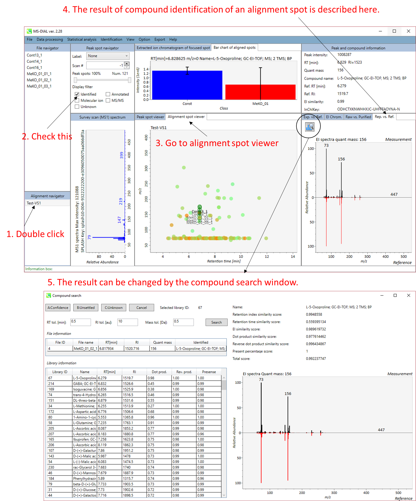

## Chapter 5: Graphical user interface of MS-DIAL  
### Section 1: Mouse function  
A)	Mouse right click (or hold) and move: zoom in and out  
B)	Mouse left click (or hold) and move: select and scroll  
C)	Mouse left double click: reset range and select files in the file navigator  
D)	Mouse wheel: zoom in and out  
E)	Right click: popup context menu  
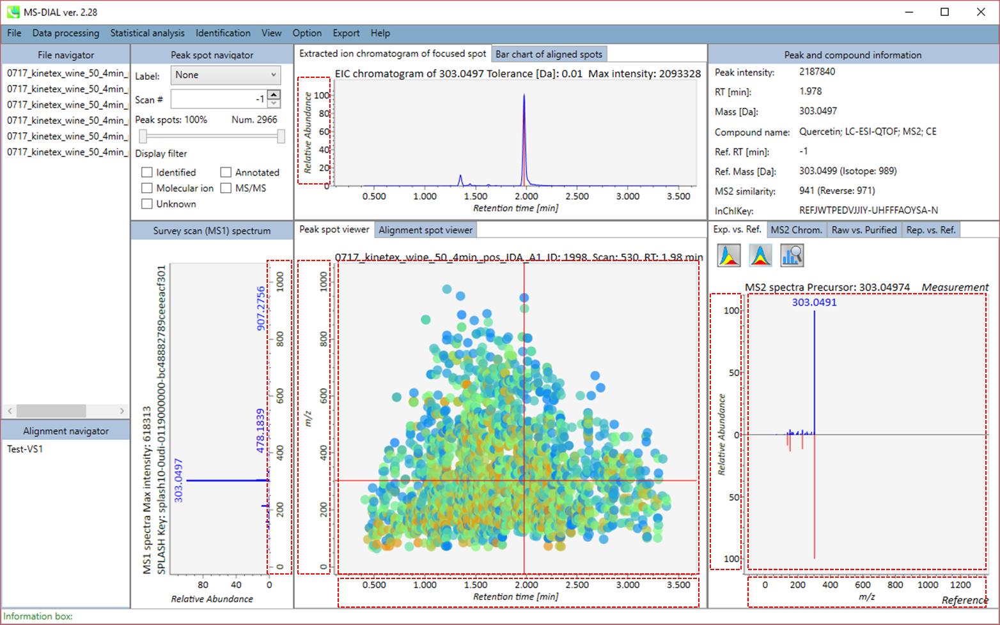

&#042; Red rectangle: acceptable click point

### Section 2: Overview of the MS-DIAL main window in LC/MS (precursor oriented) project  
In the main viewer of MS-DIAL, the detected peak information is shown in the central window by double clicking the file name in the File navigator. In the center window (**Peak spot viewer**), each spot denotes the detected peak (precursor ion) information: blue spots describe peaks of lower abundance in the sample, red spots describe peaks of higher abundance, and green spots describe peaks of middle abundance. In a lipidomics project, the spot color will mean a specific lipid class such as PC, PE, and TAG etc. The left window (**Survey scan spectrum**) displays the MS1 spectrum of the focused peak and the upper window (**Extracted ion chromatogram of focused spot**) displays the extracted ion chromatogram of the focused peak. The right window (**Exp. vs. Ref.**) displays the MS/MS spectrum (blue or black) and the reference MS/MS spectrum (red). In data independent MS/MS project, the detail of deconvolution is shown in ‘**MS2 chrom.**’ And ‘**Raw vs. Purified**’ tabs of the right panel. The MS/MS chromatograms (both raw- and deconvoluted) are depicted in ‘MS2 Chrom.’. In addition, the raw- and deconvoluted (purified) MS/MS spectrum were depicted in ‘Raw vs. Purified tab. Other peak information (metadata) is displayed in the top-right of this window.  

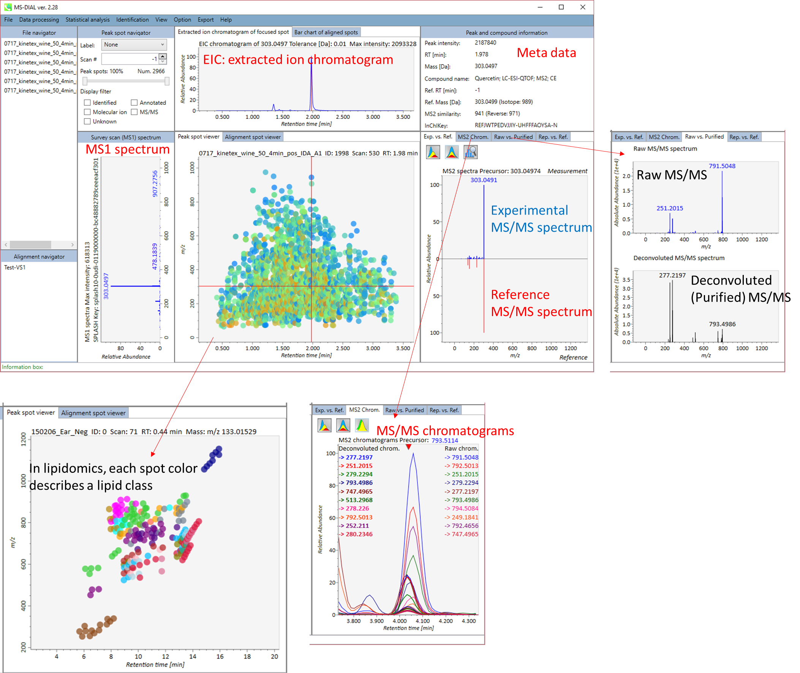

On **Alignment spot viewer**, each spot shows an aligned spot including all retention time, accurate mass, intensity, and MS/MS spectrum of all samples. As in the **Peak spot viewer**, red, blue, and green “alignment” spot denotes higher, lower, and middle abundance (on average) in the alignment, respectively. By clicking each spot, you can check all retention times and accurate masses of aligned samples. The green spot is associated with the “detected” flag, showing whether all samples contain the spot. The red spot is associated with the “interpolated” flag, showing whether the software program augmented originally missing values.   
On **Rep. vs. Ref.** tab of right panel, in combination with the **alignment spot viewer**, the window compares a representative MS/MS spectrum and a reference MS/MS spectrum. The representative MS/MS is automatically selected as the spectrum of the highest identification score for all samples aligned to the focused alignment spot.  
On **Bar chart of aligned spots** of top panel, you can see the summary of the target ion abundances by means of its average and standard deviation (SD) of the specific biological class. The biological classes can be defined from ‘Option -> File property’.  

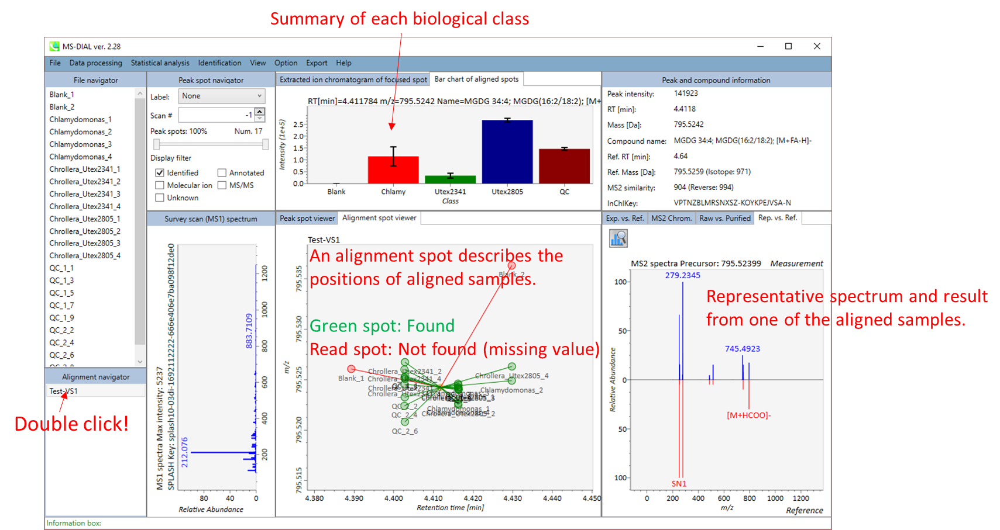

   
### Section 3: Overview of the MS-DIAL main window in GC/MS project  
The main viewer of MS-DIAL GC/MS is mostly the same as the viewer of LC/MS part. The specific difference between GC/MS part and LC/MS part are in ‘**Peak spot viewer**’. The peak picking and deconvolution results of a GC/MS file are shown in the center window by mouse left double click of the file name in the File navigator. In the center window (**Peak spot viewer**), each circle spot denotes the detected peak on each mass (*m/z*) trace: blue spots describe peaks of lower abundance in the sample, red spots describe peaks of higher abundance, and green spots describe peaks of middle abundance. However, in contrast to LC/MS part, these circle spots are not meaningful very much. Instead, the **reverse triangle** is the important description to recognize detected metabolites.   
Once you click one of the reverse triangles, you can see the detail of detected (deconvoluted) peak. The left window (**Survey scan spectrum**) displays the MS1 spectrum of the focused peak and the upper window (**Extracted ion chromatogram of focused spot**) displays the extracted ion chromatogram of the quant mass of focused peak. The right window (**Exp. vs. Ref.**) displays the EI spectrum (blue or black) and the reference MS/MS spectrum (red). The detail of deconvolution is shown in ‘**EI chrom.**’ And ‘**Raw vs. Purified**’ tabs of the right panel. The EI chromatograms (both raw- and deconvoluted) are depicted in ‘EI Chrom.’. In addition, the raw- and deconvoluted (purified) EI spectrum were depicted in ‘Raw vs. Purified tab. Other peak information (metadata) is displayed in the top-right of this window.  

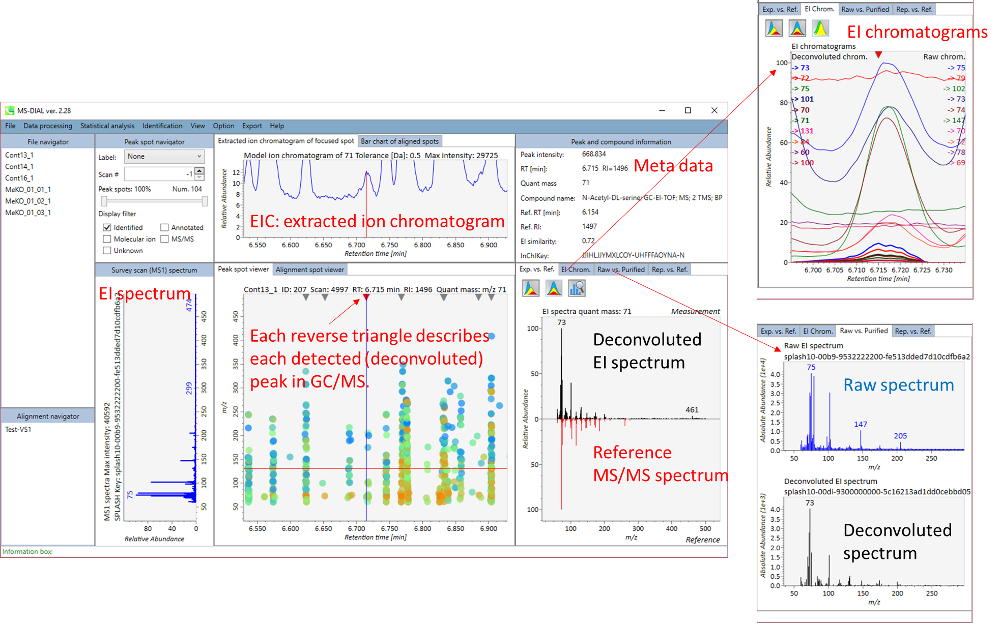

   
On **Alignment spot viewer**, the description is also mostly the same as that of LC/MS part. Each spot shows an aligned spot including all retention time, **quant mass**, intensity, and EI spectrum of all samples. As in the **Peak spot viewer**, red, blue, and green “alignment” spot denotes higher, lower, and middle abundance (on average) in the alignment, respectively. By clicking each spot, you can check the difference of retention times of aligned samples. Note that the difference of Y-axis does not have any physical meaning: the drawing of Y-axis is performed randomly to separately draw each samples. The green spot is associated with the “detected” flag, showing whether all samples contain the spot. The red spot is associated with the “interpolated” flag, showing whether the software program augmented originally missing values.   
On **Rep. vs. Ref.** tab of right panel, in combination with the **alignment spot viewer**, the window compares a representative EI spectrum and a reference EI spectrum. The representative EI is automatically selected as the spectrum of the highest identification score for all samples aligned to the focused alignment spot.  
On **Bar chart of aligned spots** of top panel, you can see the summary of the target ion abundances by means of its average and standard deviation (SD) of the specific biological class. The biological classes can be defined from ‘Option -> File property’.  

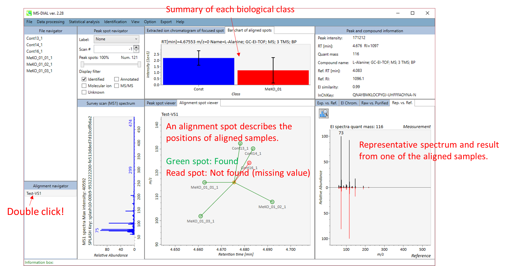

   
### Section 4: Compound search for the result curation of peak identification  
The automatic identification process cannot escape from mis-identification. MS-DIAL provides the user-interface so that users can manually correct the identification result. In this option, you can customize the identification criteria into three levels: “confident”, “unsettled”, and “unknown.” For example, in the phospholipid identification, we often determine only the cumulative composition such as PC 36:1 without positions of acyl chains, e.g. PC(18:0/18:1). You can add “unsettled” tag to such peaks as the signpost to comment that “we only checked the cumulative composition”.   
Information of identification is available not only in the “peak viewer” but also in the “alignment viewer”. Although you only see representative spectra from all samples in the alignment viewer, it is very helpful to make a data matrix and to check your peak identification result. Importantly, the curation in the alignment viewer will be reflected in principal component analysis or the output of data matrix.  
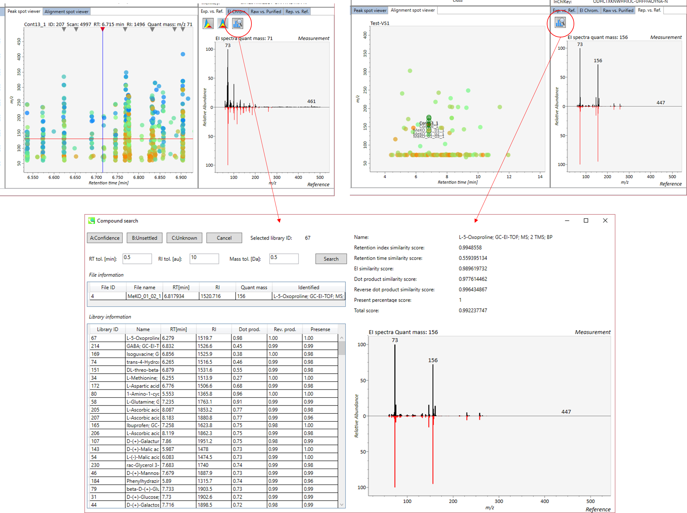
A)	Mouse double click in each row of the library information to show identification details.  
B)	Add a tolerance value for identification and click the “Search” button.  
C)	You can select either “A: Confident”, “B: Unsettled” or “C: Unknown.”  

   
### Section 5: Normalization and statistical analysis in MS-DIAL  
A)	Data normalization by internal standards or LOESS algorithm  
B)	Principal component analysis  

A)	If you want to use internal standards to normalize your peak list, you have to set the IS information in **Option** menu. MS-DIAL also supports LOESS and cubic spline algorithm to normalize batch or amplitude drifts. In order to use the LOESS algorithm, you have to set “quality control” and “analytical order” information correctly in the **Option** menu.  
B)	If you want to use the other statistics, please go to PRIMe web site:  
<http://prime.psc.riken.jp/Metabolomics_Software/StatisticalAnalysisOnMicrosoftExcel/index.html>  

&#042; Below is the brief description of how to do LOWESS normalization with an internal standard compound information in MS-DIAL. In the below setting, all ‘QC_&#042;&#042;&#042;’ samples will be recognized as ‘quality control’ and the injection order is recognized as this setting. Then, all metabolite peaks will be divided by the ion abundance of alignment spot ID ‘176’ which was annotated LysoPC 17:0 from the setting below.  

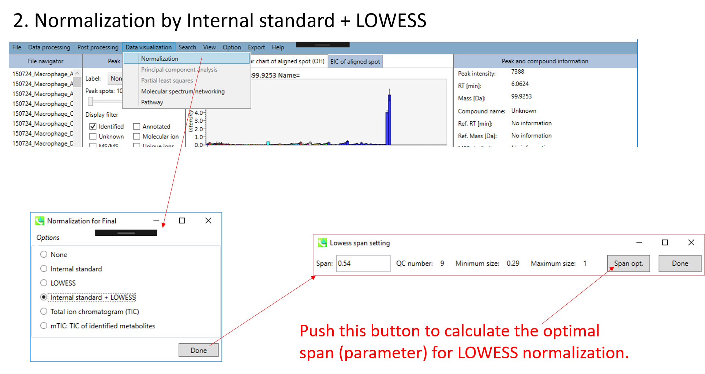
### Section 6: Export  
A)	Peak list export  
B)	Alignment result export  
C)	Context menu strip  

A)	*Peak list export*: You can get the peak list information of each sample including retention time, *m/z*, MS/MS spectra information, and so on. Available formats are MSP, MGF or Text.  
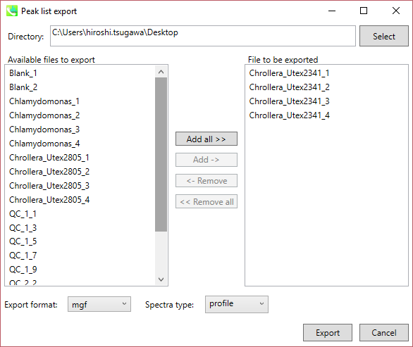

Step1.	Choose an export folder path.  
Step2.	Choose files which you want to export.  
Step3.	Select export format.  
Step4.	Click the export button.  

B)	*Alignment result export*: You can get data matrix or spectral information.  
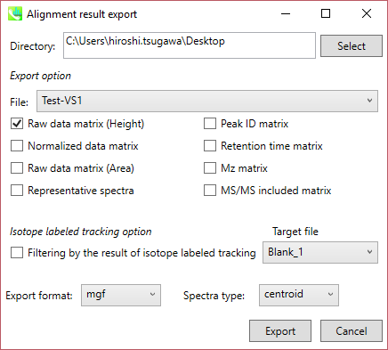

Step1.	Choose an export folder path.  
Step2.	Choose an alignment file which you want to export.  
Step3.	Select export format if you want to export the representative spectra.  
Step4.	Click the export button.    

### Section 7: Save  

**Your project is managed in MTD file.** Although your project is saved automatically whenever you do the data processing method, this program is not saved after your manual modification such as the curation of identification result, internal standard setting, and file or class information setting. Therefore, you have to save your project from this option after your modification.  

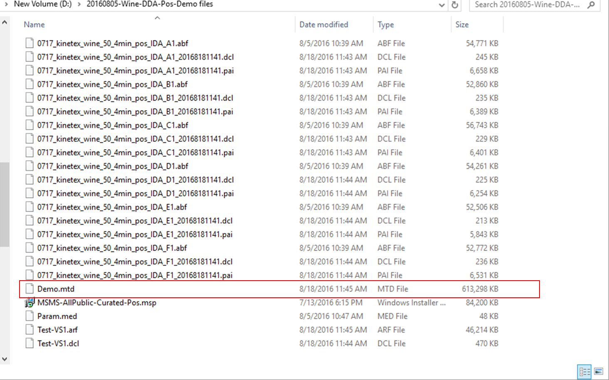

**Your data processing parameter can be saved as MED format file.** When you want to use your method file for your data processing method, select your MED format file in the data processing setting.  
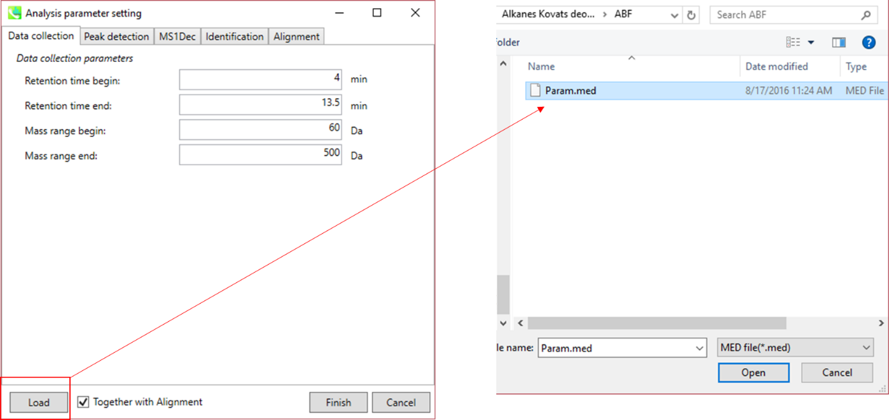

 

### Section 8: Open  

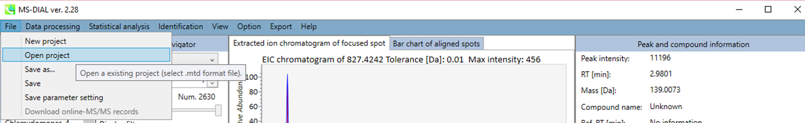

The project file is saved as MTD file format automatically whenever you perform data processing method. The manual save is described in section 7. **You can re-start your project from the MTB file.** The manual curation of peak identification result is highly recommended. In addition, the manual annotation can be set from *Identification* menu.  

   
### Section 9: Option  
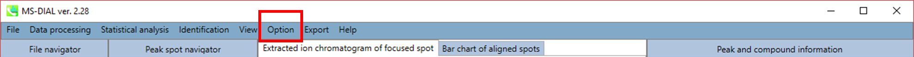

You can set properties of aligned peaks and files. In the file properties, you can reset file type, class ID, or analytical order (but not the file name). If you clear the check box of the “Included” column, the corresponding data are no longer used in the statistical analysis. In the alignment properties, you can set internal standard information for each aligned peak. Please make sure to assign “alignment ID” in the “internal standard” column.  

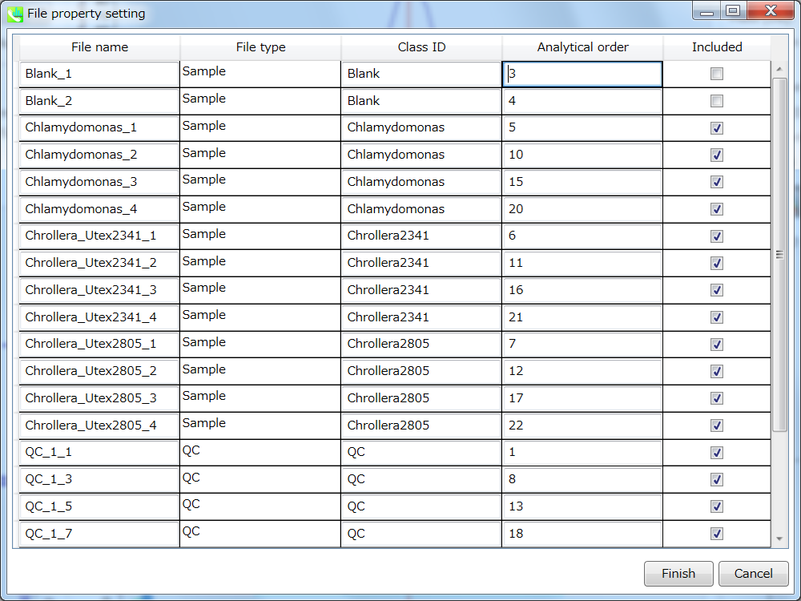
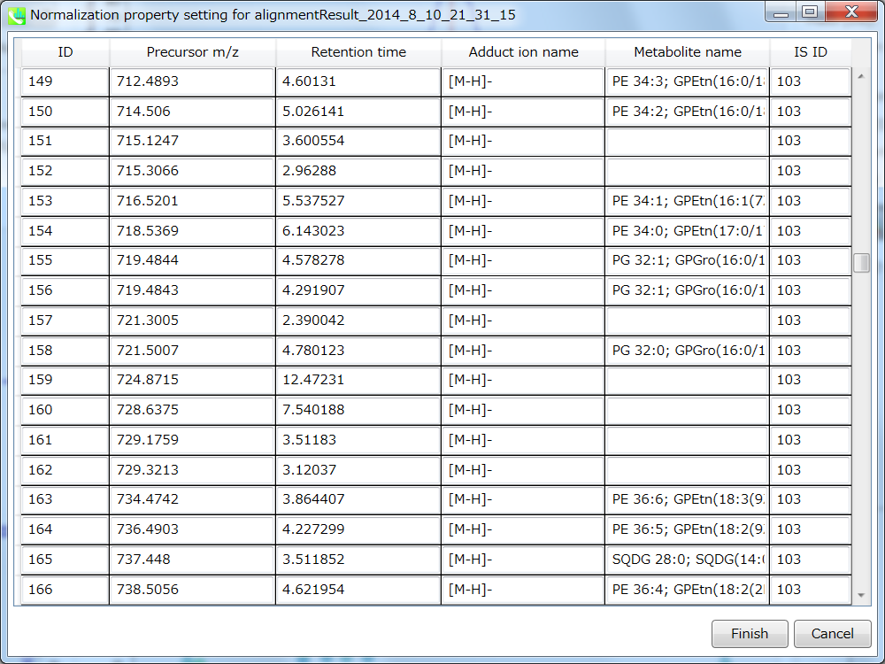

 
### Section 10: Manual annotation on Identification menu  

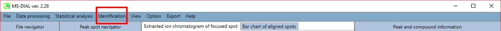

*Identification setting*: You can manually correct identification result. This option may be useful to check internal standards which are not included in the reference library.  

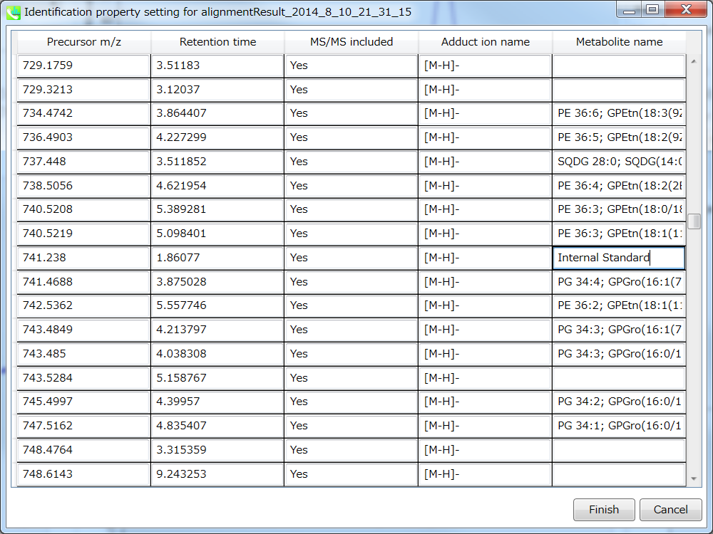
   
### Section 11: Chromatogram viewers  

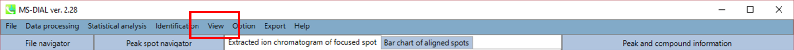

*Display total ion chromatogram*: You can see the total ion chromatogram of the focused sample.  
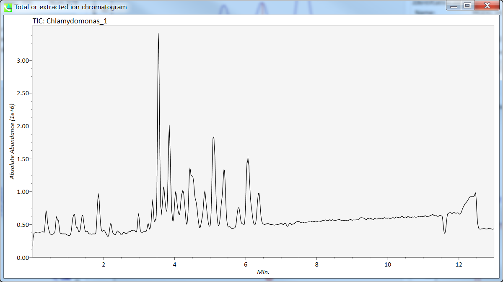

*Display extracted ion chromatogram*: You can see the extracted ion chromatograms which you want to display for the focused sample.  

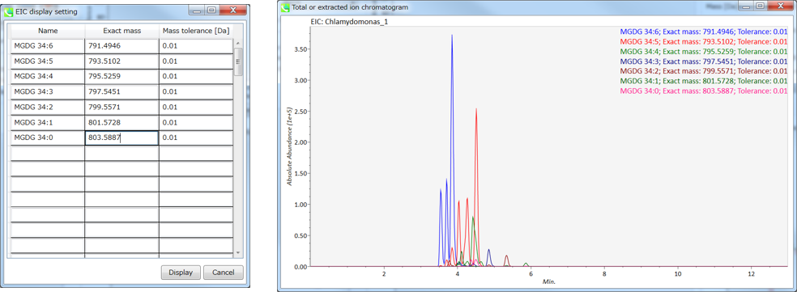

### Section 12: Explanation of buttons and tabs of MS-DIAL  
#### Section 12-1: Display filters  

*Label*: You can check the peak information such as retention time, accurate mass, metabolite name, adduct ion name and isotope ion in the center window of MS-DIAL. Shown below are examples.  

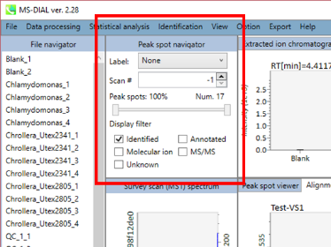
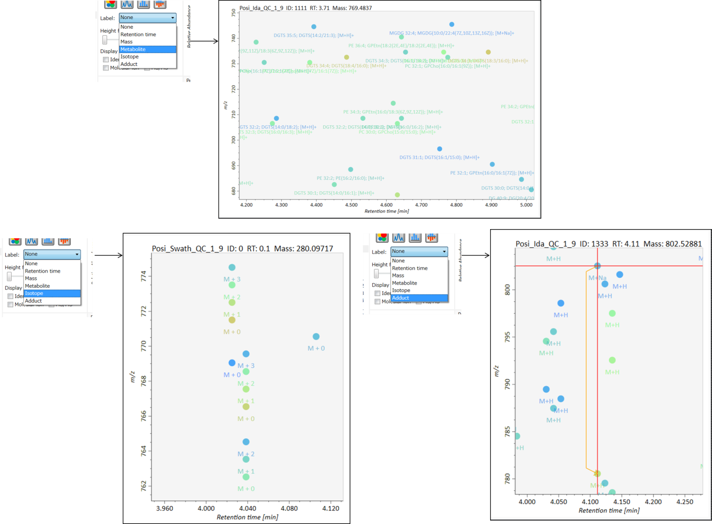
   
*Height filter*: This filter is used to check the peak abundance. Each peak is assigned a rank with respect to its peak abundance in the focused sample.  

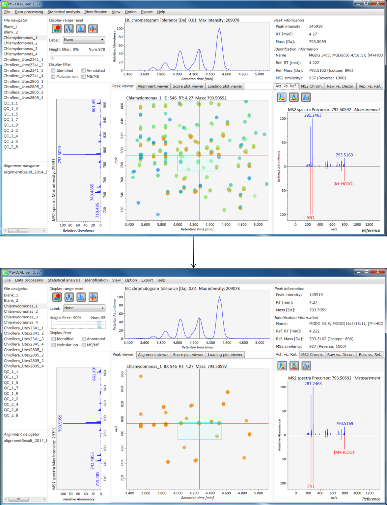

*Display filter*   
1. “Identified” shows only identified peaks with the MS/MS spectrum.  
2. “Annotated” shows only identified peaks without the MS/MS spectrum.  
3. “Molecular ion” shows de-isotoped molecular ions only.  
4. “MS/MS” shows only peaks having the MS/MS spectrum.  
5. “Unknown” shows only unknown peaks.  

#### Section 12-2: Tabs of MS-DIAL  

 
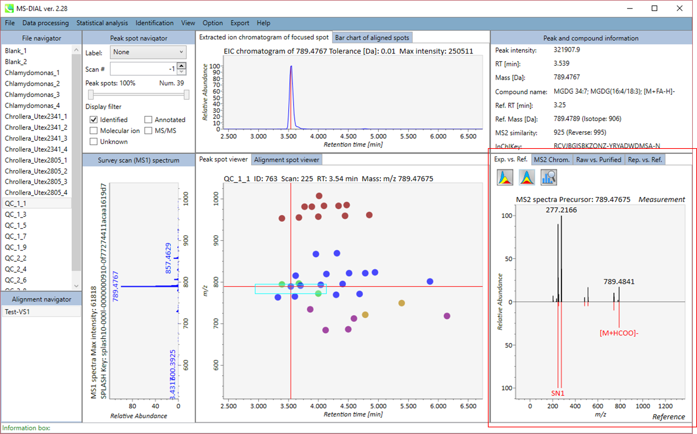

This viewer is prepared especially for data independent MS/MS analysis or GC/MS analysis.   
*Exp. vs. Ref.*: The upper spectrum (blue or black) displays the centroided information of the MS/MS spectrum. The lower spectrum (red) displays the reference MS/MS spectrum. In case of data independent MS/MS or GC/MS analysis, de-convoluted MS/MS spectrum can be displayed by clicking the de-convolution icon .  

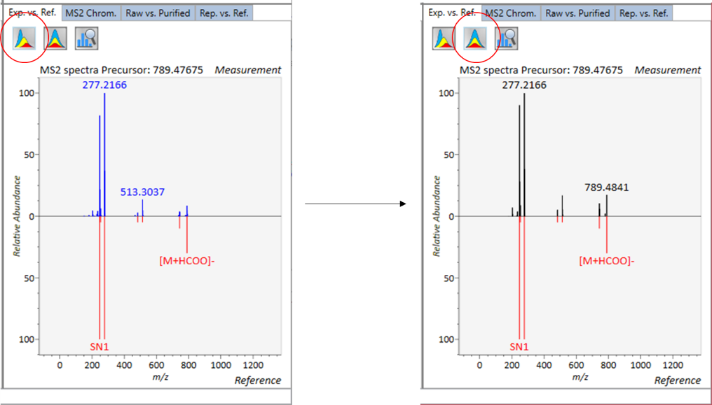

*MS2 Chrom.*: The MS/MS chromatograms inside the sky-blue rectangle in the center window are displayed. In GC/MS part (named MS1 Chrom.), there is no sky-blue rectangle in the viewer, and the peak width is automatically determined by the algorithm of MS-DIAL instead.   

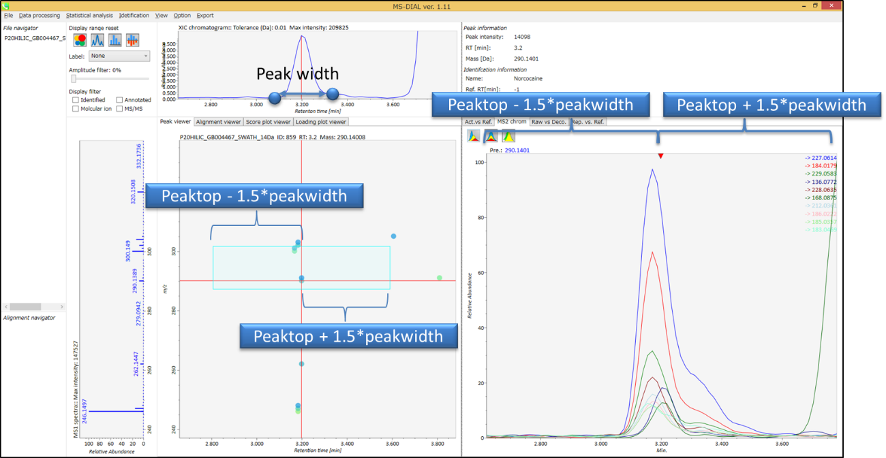

 This icon displays the raw EI or DIA-MS/MS chromatograms.  
 This icon displays the de-convoluted EI or DIA-MS/MS chromatograms.  
 This icon displays both the raw and de-convoluted EI or DIA-MS/MS chromatograms.  

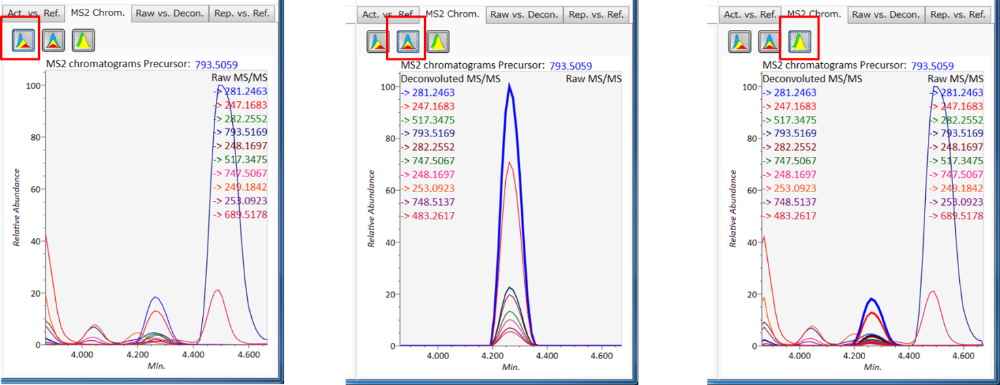
   
*Raw vs. Purified.*: The upper and bottom windows display the raw and de-convoluted EI or DIA-MS/MS spectrum, respectively.  

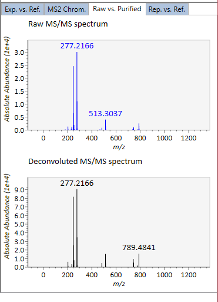

*Rep. vs. Ref.*: In combination with the **alignment viewer**, the window compares a representative EI or MS/MS spectrum and a reference EI or MS/MS spectrum. The representative EI or MS/MS is automatically selected as the spectrum of the highest identification score for all samples aligned to the focused alignment spot.   

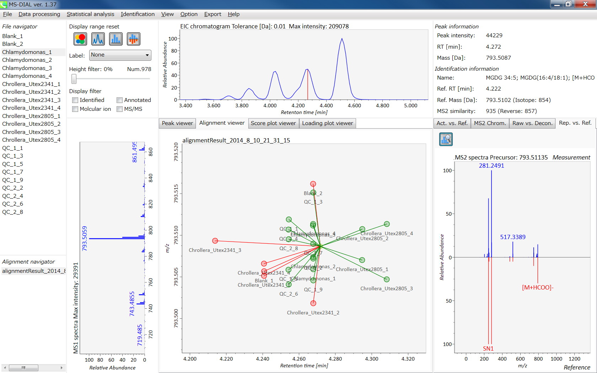

### Section 13. Search  
#### MS/MS fragment searcher  
In LC-MS/MS project, there is a ‘search’ function to find precursor ions containing the user-defined product ions and/or neutral losses. The function can be applied for both peak spot- and alignment spot results. The search type can be set as ‘product ion’ or ‘neutral loss’. Below is the example using ’96.9597’ Da as product ion search in order to find the precursor ions contacting sulfate (SO4-). The result can be found by clicking ‘unique ions’ checkbox in MS-DIAL main window.  

#### Amalgamation of different polarity peak list  
The adduct type determination for unknown molecules is the important process for compound identification. The integration of positive- and negative ion features is often helpful. For example, if we see *m/z* 273.076 in positive and *m/z* 271.061 in negative ion data at the same retention time region, the adduct type can be determined as [M+H]+ and [M-H]- because of the 2.015Da difference.  

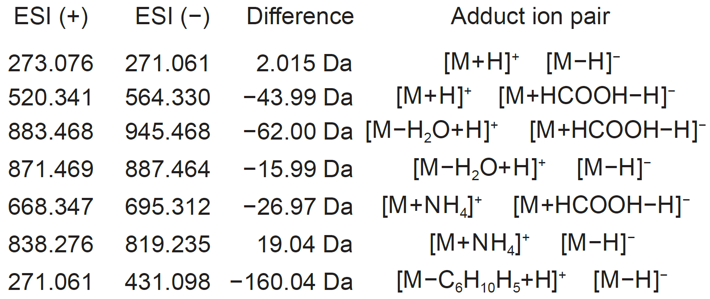
Example of mass difference for adduct type determination  

Therefore, MS-DIAL provides the utility integrating the different polarity peak features. Here, this demonstration will use the feature list from negative ion mode data to determine the adduct types of positive ion peak features.   
1.	In negative ion mode project, select ‘Export’ -> ‘Peak list export’.  
2.	Export a detected peak list (feature list) as tab delimited text format.  
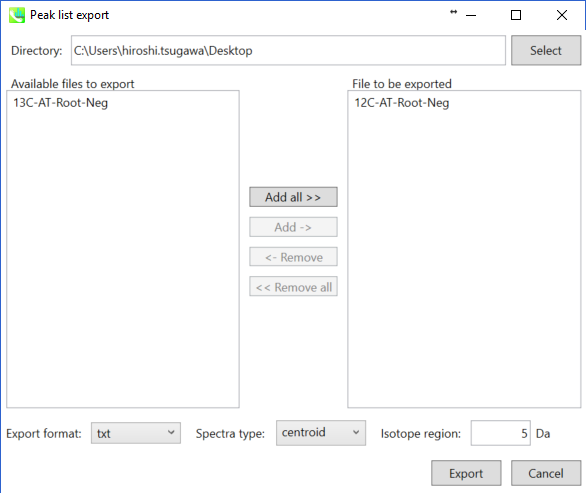
3.	Then, make the peak list containing *m/z* value (first column) and retention time value as tab delimited text format file. Now, (for example), it is saved as ‘12C-AT-Root-Neg ion features.txt’.   
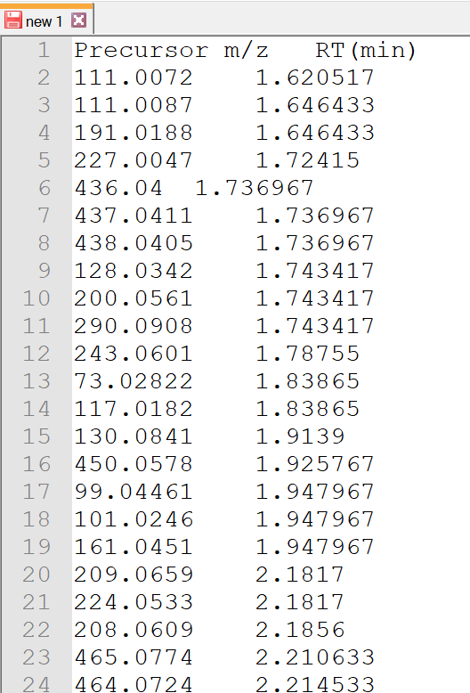
4.	Open the project using positive ion mode data. Ideally, the sample origins should be the same as handled in negative ion mode. Then, follow as “Search” -> “Amalgamation of different polarity peak list”. Then, browse the ion features of negative ion project, i.e. 12C-AT-Root-Neg ion features.txt. Please select the adduct type pairs to be considered for the adduct type determination. After the ion feature amalgamator is executed, you will get the integrated result of different polarity data.   
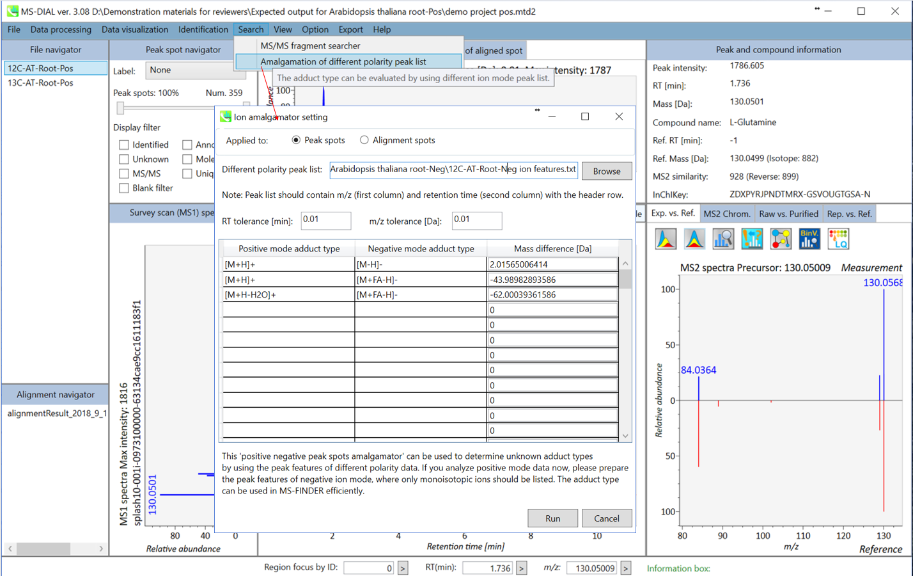

   
## Chapter 6: Other utilities of MS-DIAL  
### Section 1: Link to MS-FINDER for searching unknowns  
MS-FINDER aims to provide 4lutions for 1) formula predictions, 2) fragment annotations, and 3) structure elucidations by means of survey scan MS and MS/MS spectra of unknowns. The detail of MS-FINDER is described in <http://prime.psc.riken.jp/Metabolomics_Software/MS-FINDER/index.html>. **Note that you have to download the MS-FIDNER program from the website above on your PC.**   
The current MS-DIAL program can send the unknown query. On the first time that you try to send a query into MS-FINDER, a pop up window will be generated, and then select ‘MSFINDER.exe’ from its dialog box. Moreover, MS-DIAL can export all of peak- or alignment spots as ‘MAT’ format file which can be imported by MS-FINDER (**Add components to search list**).   

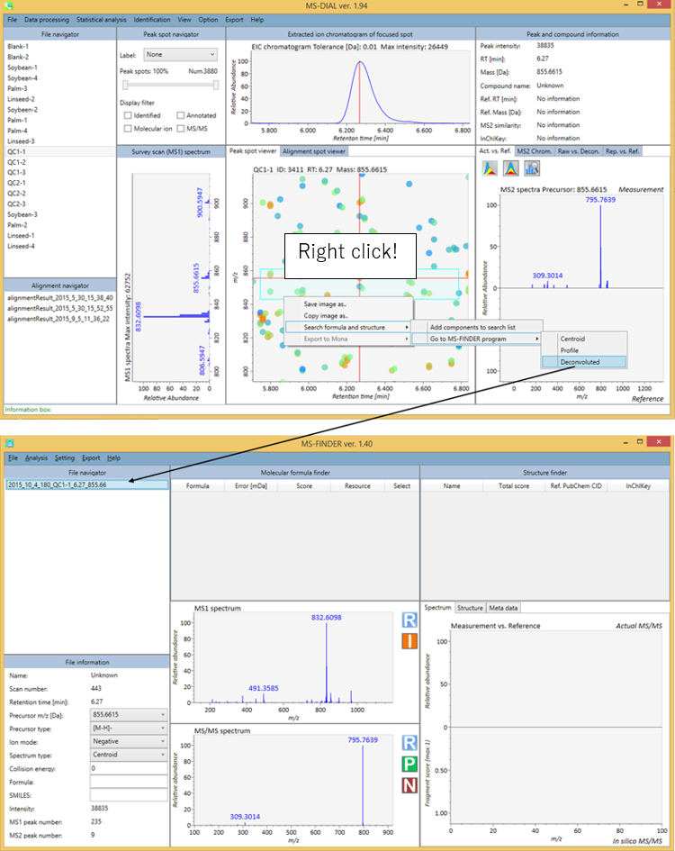

### Section 2: Bridge to MRMPROBS for DIA-MS or GC/MS data sets  
The purpose of this section is to announce the utility of ‘MRMPROBS’ instead of MS-DIAL for SWATH-MS or other DIA-MS data. MRMPROBS was originally developed for targeted metabolomics using triple quadrupole MS data (multiple reaction monitoring, MRM; selected reaction monitoring, SRM). It also supports the entire workflow from data import until statistical analysis as MS-DIAL does. Compared to the MS-DIAL program, MRMPROBS is optimized for targeted metabolomics: 1) users can manually curate the peak left- and right edges of chromatographic peaks, 2) users can simultaneously check all samples’ peaks of a targeted compound, and 3) users can easily curate the identification results. <http://prime.psc.riken.jp/Metabolomics_Software/MRMPROBS/index.html>  

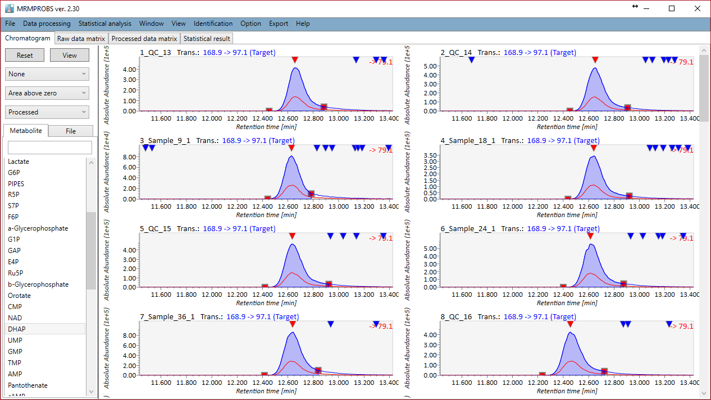

&emsp;&emsp;&emsp;&emsp;MRMPROBS is now launched as a universal program to deal with DIA-MS data and GC/MS data as well as QqQ-MS data. While the current MS-DIAL program always calculates the peak intensity (height) and peak area of compounds by the survey scan MS1 data, MRMPROBS can utilize the MS/MS chromatograms for metabolite quantifications. In addition, the tools for untargeted analysis like MS-DIAL will often provide the false positive things in the process of peak picking, deconvolution, and peak alignment. In contrast, users can easily parse the targeted compounds with the user-friendly graphical user interface. The ‘bridge’ from MS-DIAL to MRMPROBS was described in next figure. The workflow can also be utilized for GC/MS data. The detail of MRMPROBS is fully described in the tutorial of MRMPROBS program.  
<http://prime.psc.riken.jp/Metabolomics_Software/MRMPROBS/index.html>  

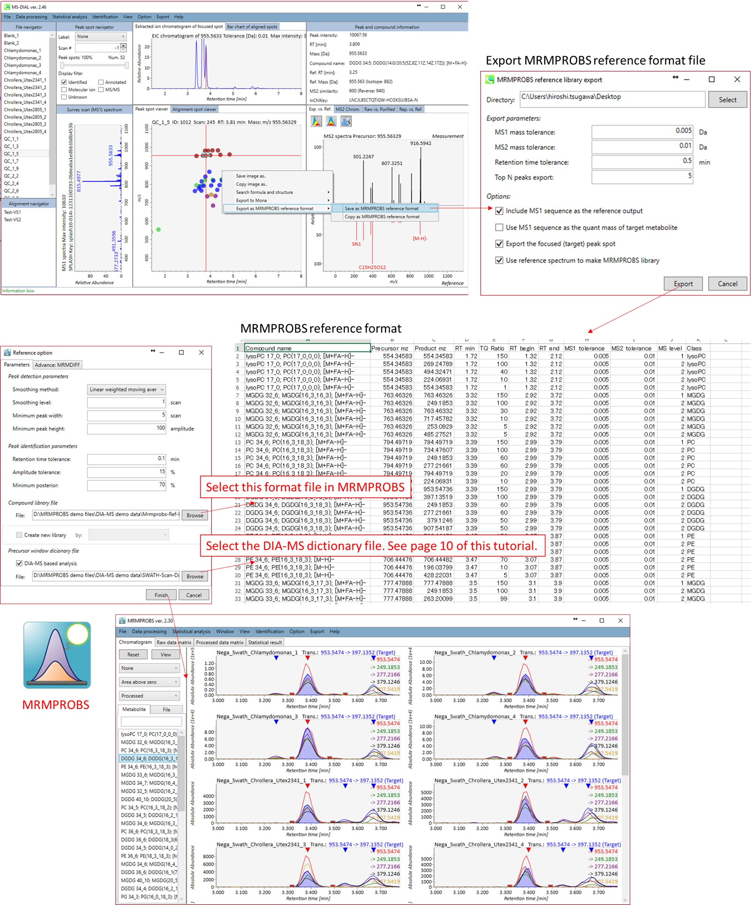
Workflow of the ‘bridge’ from MS-DIAL to MRMPROBS   

 
### Section 3: Molecular spectrum networking for metabolite annotations  
The molecular spectrum networking is a useful technique to get the insight for unknown metabolite structures as used in GNPS and MS2LDA projects. The basic hypothesis is that the mass spectra should be similar (and partially same) among a metabolite subfamily (class). In addition, the metabolic profile’s similarity among aligned ion spots is also a useful information to know the biosynthesis regulations among samples. There are several methods to perform the molecular spectrum networking analysis in MS-DIAL. Note that please set FireFox as the default html viewer for the rapid browsing of your result.  

A.	Follow as ‘Data visualization’ -> ‘Molecular spectrum networking’. Then, follow the below setting. If you select ‘Alignment spots’, the analysis is performed for the alignment spots displayed in ‘alignment spot viewer’. The mass tolerance [Da] should be the mass accuracy of MS/MS spectrum. For nominal mass GC-MS project, the tolerance should be set to 0.25 Da. The similarity cut off is applied to the score of ‘Bonanza spectral clustering algorithm’ [Falkner, J. A., Falkner, J. W., Yocum, A. K. & Andrews, P. C. J. Proteome Res. 7, 4614–4622 (2008)]: the algorithm is a little bit modified form the original one, and the detail will be described after new paper is published. MS-DIAL also provides the retention time tolerance where the target retention time is defined as what you select in the spot viewer.  

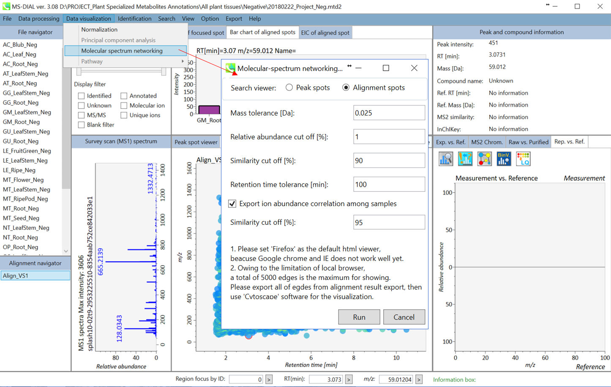

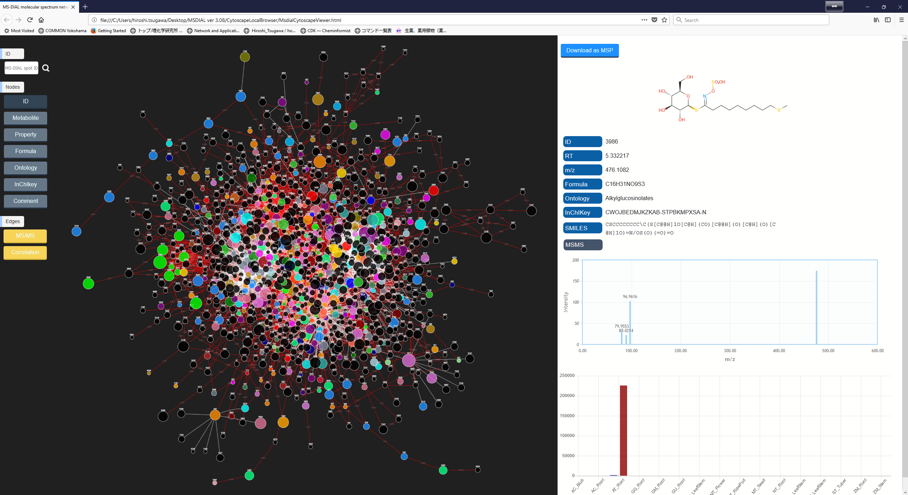

B.	Second way to perform the network analysis is to click the network button at the right panel of MS-DIAL as shown below. This method is used to find the spots having similar MS/MS spectrum or similar metabolic profile among samples with the focused spot.  

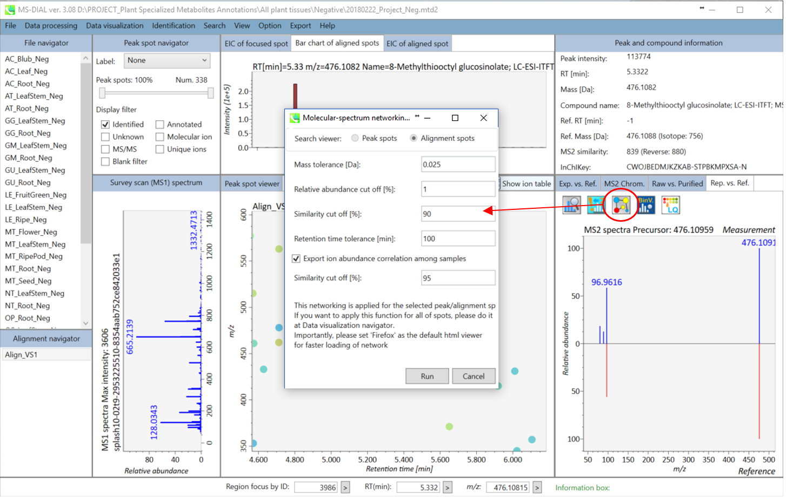

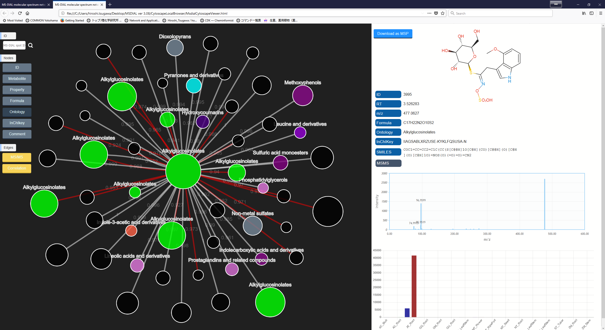

C.	 Due to the limitation of cytoscape.js as used in A and B, MS-DIAL does not show all of nodes and edges to be used in the network analysis. If you want to use all of information with the flexible graphical user interface, please export the node- and edge files from the export option. The exported results can be imported by the cytoscape program (<http://www.cytoscape.org/cy3.html>).   

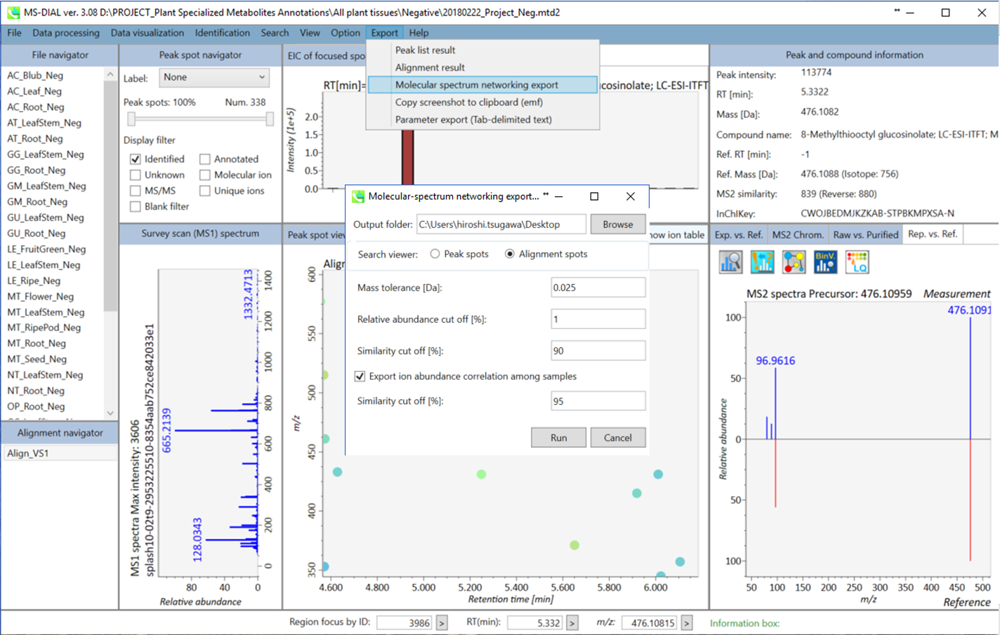

### Chapter 7: MS-DIAL isotope tracking function  

Stable isotope assisted metabolomics is a great approach to reveal the metabolic turnover of a nutrient source, to calculate flux balances, and to determine the molecular element (CNOS) of unknown molecules. Here, a project using LC-MS/MS data sets of non-labeled- and fully 13C labeled Arabidopsis thaliana samples for the comprehensive annotation of plant specialized metabolites is demonstrated. The purpose of this study was to determine the carbon element count of molecular formula by using 13C labeled plant tissues. The files used for this demonstration can be downloaded from <http://prime.psc.riken.jp/Metabolomics_Software/MS-DIAL/index.html>.   

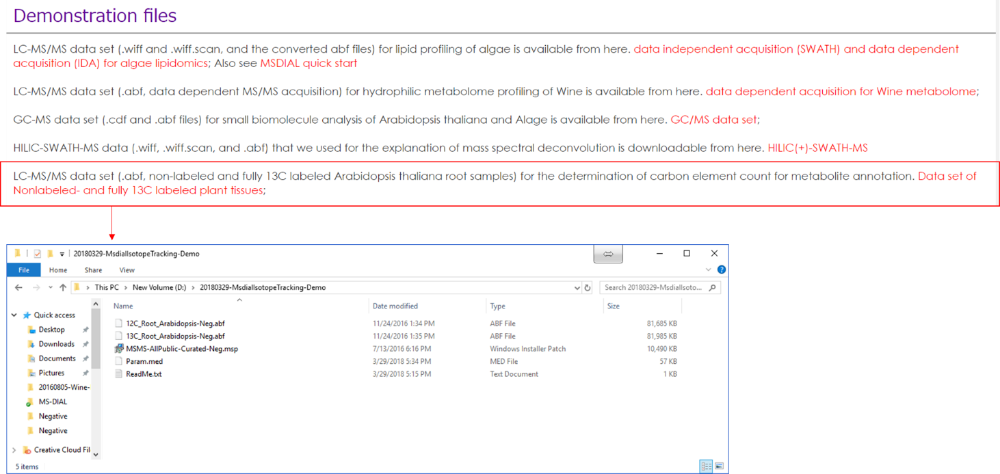  

### Section 1: Starting up your project  

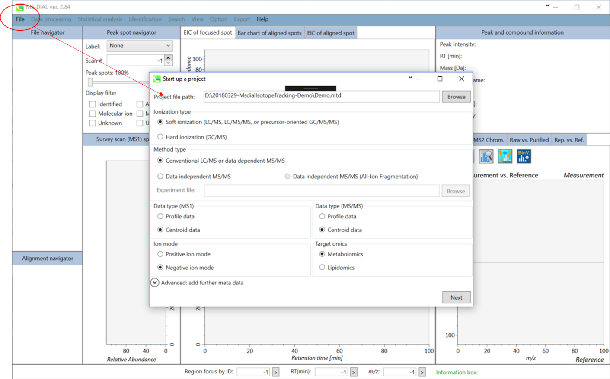

1. File -> new project  
2. Set your project file path to the directory of your ABF files  
3. Select your ionization type as soft ionization  
4. Choose data type centroid data  
5. Choose negative ion mode  

   
### Section 2: Importing ABF files  
1.	Select ABF files  
2.	Class ID in this demonstration is set to ‘Non-labeled’ and ‘Uniform-labeled’.  

Note: Please finalize your file name here, because you cannot change it later.  

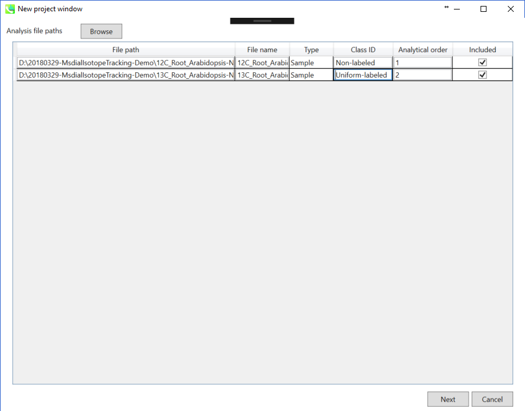

   
### Section 3: Setting parameters  
#### Section 3-1: Data collection tab  

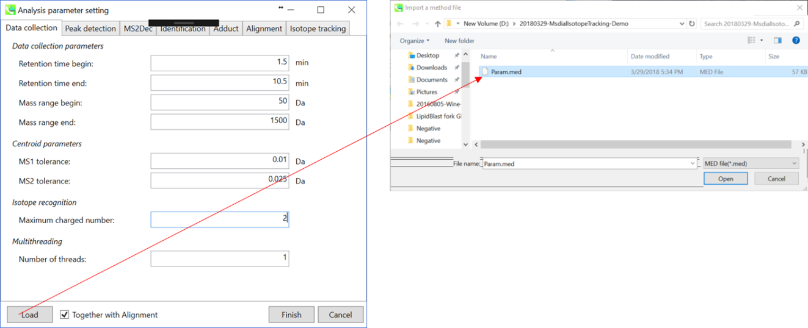

&#042; For the quick start and its explanations, load ‘Param.med’ as shown above.  

*Data collection parameters*: You can set analysis ranges (RT and MS1 axis). Here, set 1.5-10.5 min and 50-1500 Da for the ranges.  

Centroid parameters: After the peak detection algorithm is applied along the MS axis with a very low threshold, MS-DIAL performs spectral centroiding if your files are profile data. By default, mass spectrum of ±0.01 and ±0.025 Da range from each peak top is integrated in MS1 and MS2, respectively.   

*Isotope recognition*: As long as you focus on small molecule researches (less than 2000 Da), the maximum charged number can be set to 2. On the other hand, the parameter can be changed to 8 or more to process proteome or snRNA research data.  

Multithreading: Please set the count of threads that you want to use. You can check the maximum thread counts in resource monitor. (open task manager->open resource monitor)  
   
#### Section 3-2: Peak detection tab and MS2Dec tab  
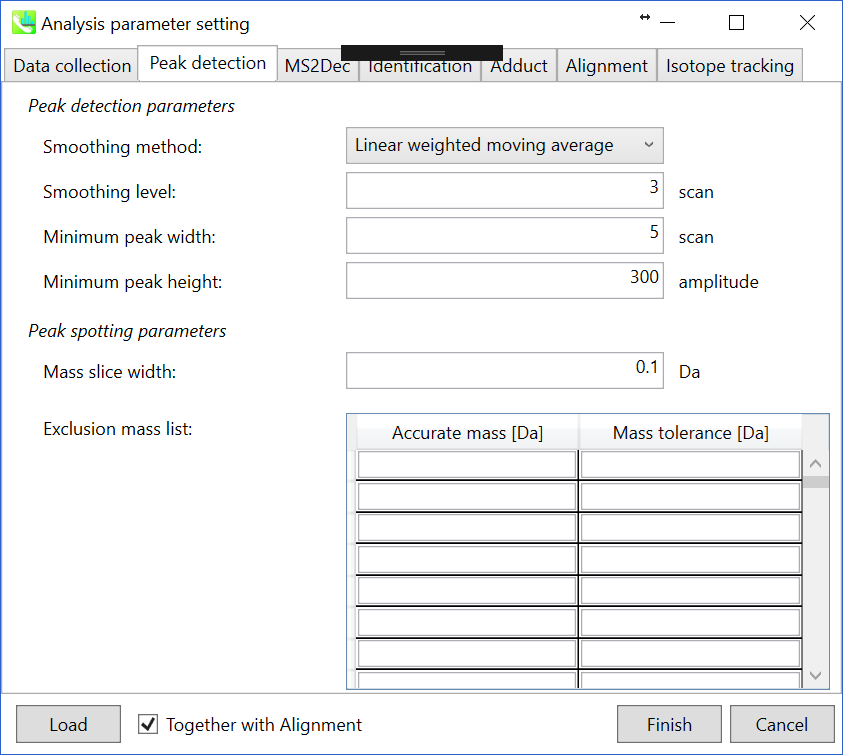

The details are described in Chapter 2&3. In Waters and Bruker QTOF, the minimum peak height can be set to 300-500 as long as I confirmed. Here, 300 is set for minimum peak height because the demonstration file was obtained by Waters Xevo QTOF.  

#### Section 3-3: Identification tab  
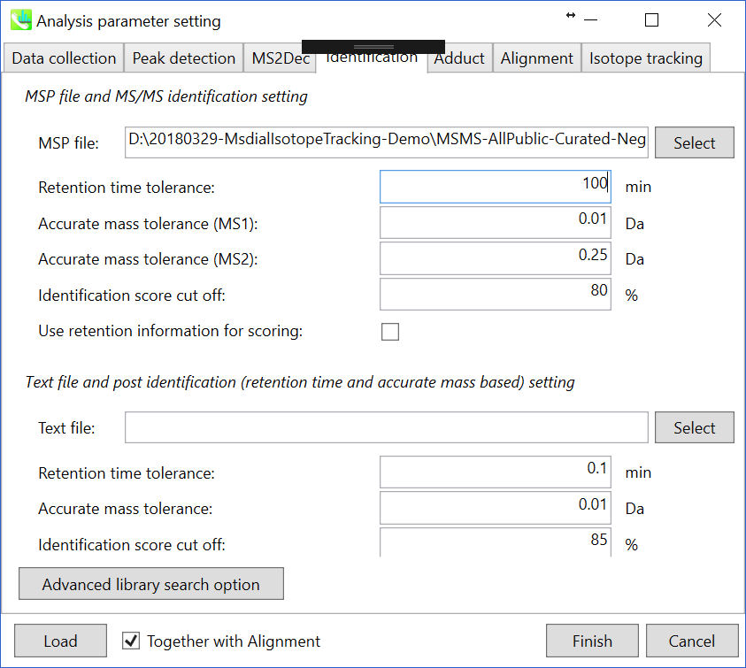

*MSP file*: Set your MSP file here. (Tutorial data: **MSMS-AllPublic-Curated-Neg.msp.**)   

*Parameters*: Normally, there is no compatibility for retention time in LC-MS project in contrast to GC-MS. Therefore, the checkbox of ‘Use retention information for scoring’ was recently prepared. If the checkbox is unchecked, the scoring of retention time is not used for the calculation of total score which is used for the identification cut off.   

Please make sure that in isotope tracking project, the identification result of non-labeled sample as set as ‘reference file’ is reflected in the alignment result.   

#### Section 3-5: Adduct tab  
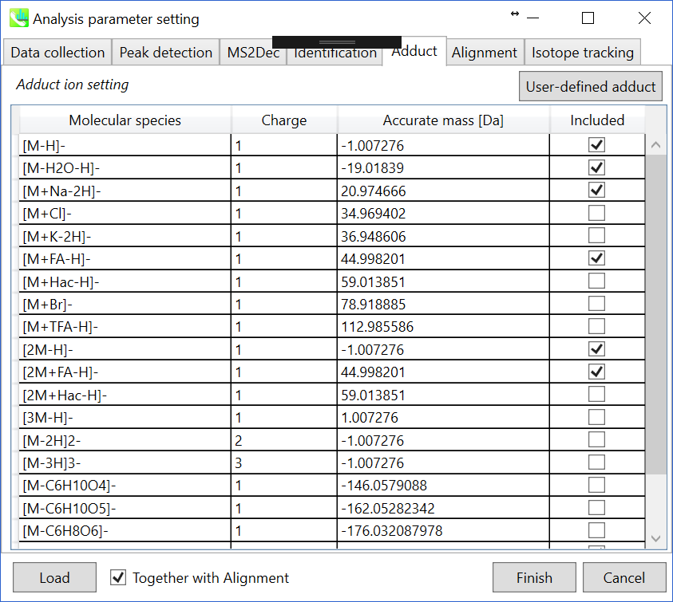

You can tick the adduct ions and charge values to be considered. In doing the metabolome analysis for plant specialized metabolites, the losses for C6H10O4, C6H10O5, and C6H8O6 etc may be added because there are many in source fragment ions detected in hexosylmetabolites.  

   
#### Section 3-6: Alignment tab  
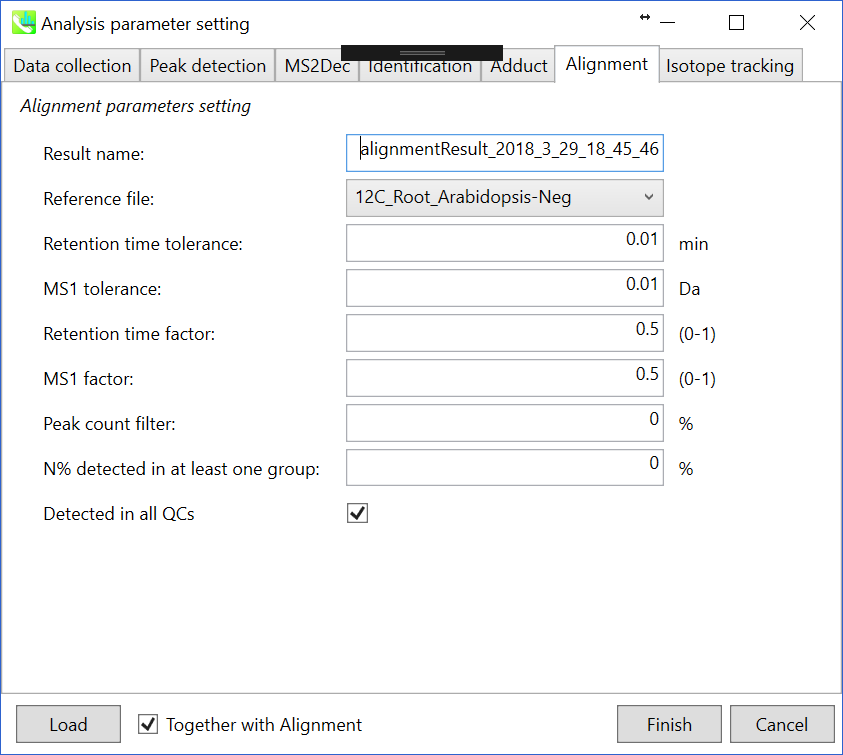

*Parameters*: The details of alignment parameter are shown in chapter 2 and 3.   

**Note:** Please set one of ‘non-labeled’ biological samples as the reference file when the isotope tracking function is used.  
   
#### Section 3-7: Isotope tracking tab  
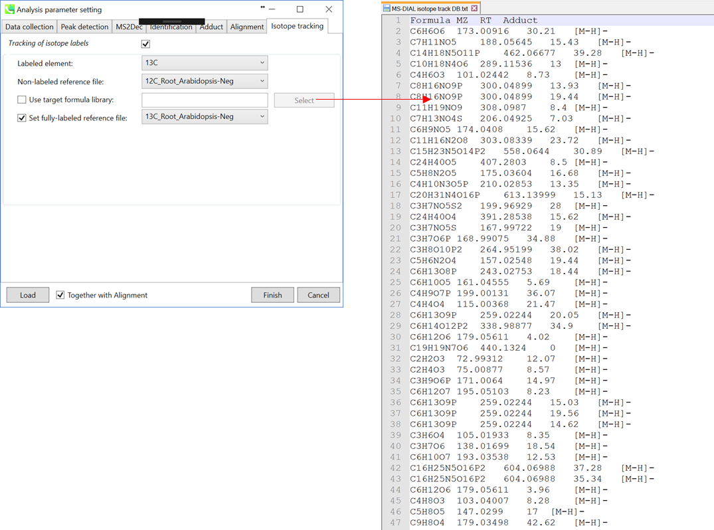

When the isotope tracking function is used, check ‘tracking of isotope labels’. And select your labeled element (in this project, select ‘13C’). Currently, MS-DIAL requires at least one ‘non-labeled’ sample data in order to know which peaks should be considered as ‘baseline’.   
&emsp;&emsp;&emsp;&emsp;If you have the targeted formula list as shown above (top-right), please make the tab-delimited text file containing (first column) formula, (second column) *m/z*, (third column) retention time, and (last column, as option) adduct type. MS-DIAL will first identify the metabolites for non-labeled reference file by means of the library, and then, the isotope recognitions are performed.   
&emsp;&emsp;&emsp;&emsp;If you have fully labeled sample data, check ‘set fully-labeled reference file’, and then, select one of the fully labeled sample data. In this demonstration, please follow the above setting (the targeted formula list is not prepared).   

   
### Section 4: Data curation for isotope tracking result  
The result can be checked as described below. Practically, I recommend the following procedures for the data analysis of isotope labeled metabolomics.  

1. It’s much better ‘NOT’ to perform the peak alignment at the first run of data analysis. It means that please perform peak spotting only.  
2. Then, please curate the identification result for non-labeled reference file because the identification result is reflected in the alignment result.  
3. After the curation is finished, run the peak alignment function with the setting of isotope tracking function.   
4. As described in next page, please check ‘Filtering by the result of isotope labeled tracking’ in the alignment result export. Of course, if you are a programmer, you do not check it because you can do the filtering method by yourself.  
5. Moreover, if you do right click at the panel of alignment spot viewer, then, follow as ‘Search formula and structure’ -> ‘Add components to search list’, you will get the mat files containing the information of determined carbon element number to be used in MS-FINDER.  

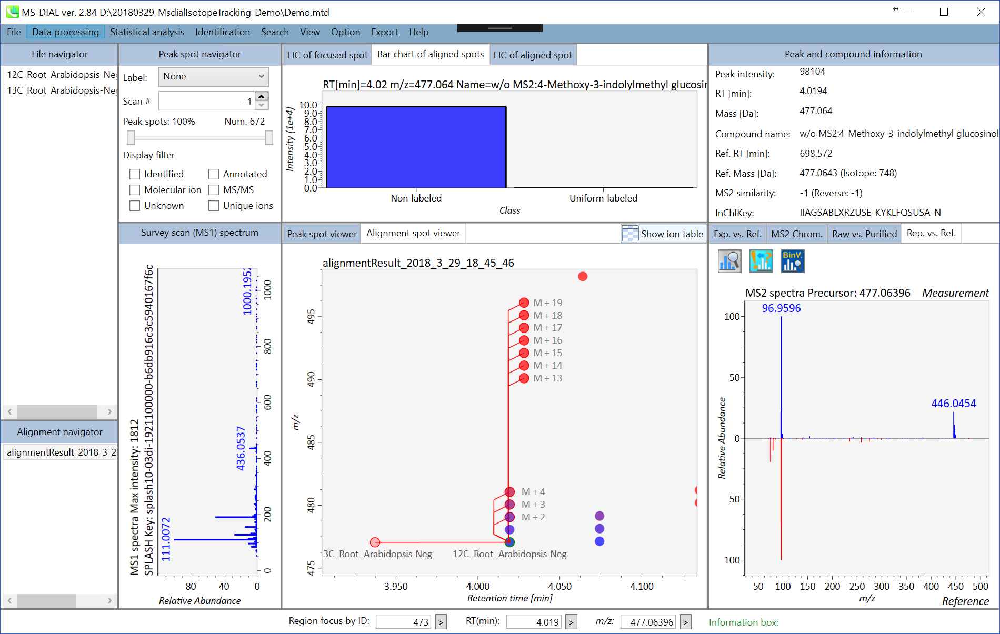

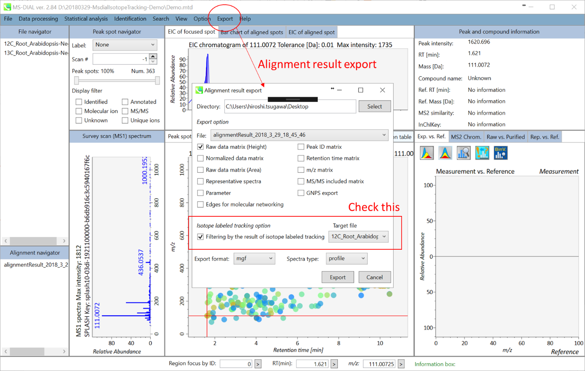

## Chapter 8: Project for all ion fragmentation with multiple collision energies   
We recently started the development for data independent MS/MS acquisition data from all-ion approach (such as MSE, all-ions, or all ion fragementations) with ‘multiple collision energies (like a sequential loop of 0V, 10V, and 40V)’. Here, a project is demonstrated using LC/MS/MS data sets from yeast strains, which have already published (Ohashi et al., 2017, DOI:10.1038/s41598-017-12392-6). The abf files used for this demonstration can be downloaded from the below link.  
<http://prime.psc.riken.jp/Metabolomics_Software/MS-DIAL/index.html>  

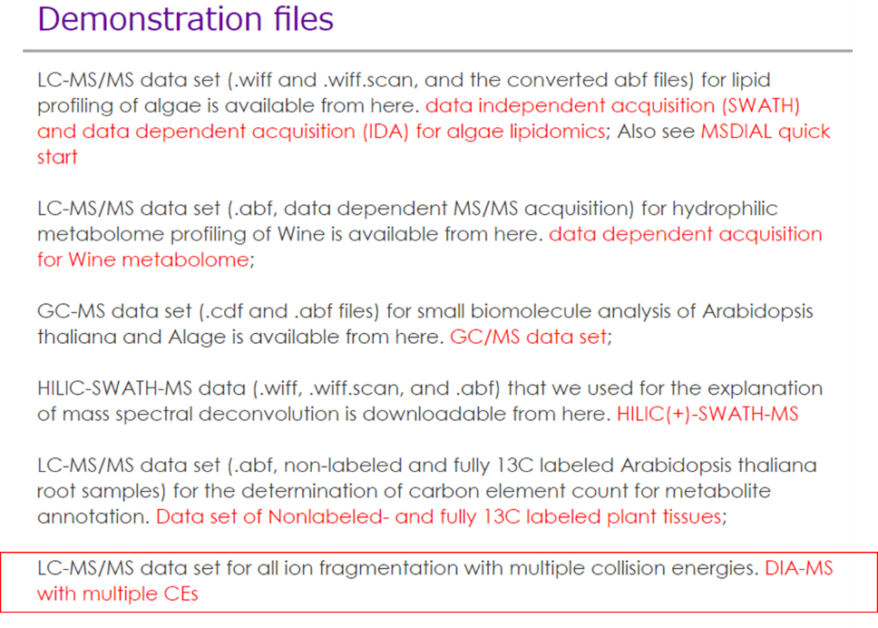

This chapter uses total 7 files and the MSP file is contained in the same folder of this demonstration. Also, there is a parameter file (Param.med) in this folder to be used in MS-DIAL for the quick start.   

**Experiment summary:**  
**Samples:** The demo project contains 7 files in total:  
Blank2 - blank sample  
QC1, QC2 - quality control samples pooled from multiple yeast strain samples  
Sc1, Sc2, Sc3 - WT yeast strain samples  
Sc4 - *bna2* yeast strain  

Data was collected on a 1290 Infinity II ultrahigh performance liquid chromatography (UHPLC) system coupled to a 6550 iFunnel quadrupole time-of-flight (Q-TOF) mass spectrometer equipped with a dual AJS electrospray ionization source (Agilent Technologies) as published in Naz et al 2017 (DOI: 10.1021/acs.analchem.7b00925).  

**Liquid chromatography:** Polar metabolites were separated on a HILIC SeQuant ZIC-HILIC (Merck, Darmstadt, Germany) column 100 Å (100 × 2.1 mm, 3.5 μm particle size) coupled to a guard column (2.1 × 2 mm, 3.5 μm particle size) and an inline-filter. Sample analysis in positive ionization mode was performed using water with 0.1% formic acid (solvent A) and acetonitrile with 0.1% formic acid (solvent B). The elution gradient used was as follows: isocratic step at 95% B for 1.5 min, 95 to 40% B in 12 min, maintained at 40% B for 2 min, then decreasing to 25% B at 14.2 min, maintained for 2.8 min, then returned to initial conditions over 1 min, and then the column was equilibrated at initial conditions for 7 min. The flow rate was 0.3 mL/min; injection volume was 2 μL, and the column oven was maintained at 25 °C.  

**Mass spectrometer:** Nitrogen (purity >99.999%) was used as a sheath gas and drying gas at a flow of 8 and 15 L/min, respectively. The drying and sheath gas temperature was set at 250 °C with the nebulizer pressure at 35 psig and voltage 3000 V. The fragmentor voltage was set at 380 V. The acquisition was obtained with a mass range of 40−1200 *m/z* in AIF mode, where a single high-resolution full scan is acquired, including three sequential experiments at three alternating collision energies (one full scan at 0 eV, followed by one MS/ MS scan at 10 eV, and then followed by one MS/MS scan at 30 eV). The data acquisition rate was 6 scans/s. Data was acquired in centroid mode.		  

An internal lock mass mixture (Agilent Technologies) was prepared at a final concentration of 2 μM purine (C5H4N4) and 2.5 μM HP-0921 (C18H18O6N3P3F24) in acetonitrile:water (19:1, v/v). The internal lock mass mixture was constantly infused at a flow rate of 1 mL/min (split 1:100) using an isocratic pump together with the LC eluent for constant mass correction [positive ionization mode: purine (*m/z* 121.0509), HP-0921 (*m/z* 922.0098); Although observed mass accuracy will depends upon the resolution, potential metabolite coelution, and isobaric compounds, a mass accuracy of <5 ppm was expected.  

   
### Section 1: Starting up your project  

1. File -> new project  
2. Set your project file path to the directory of your ABF files  
3. Select your method type as ‘All-ions with multiple CEs’  
4. Select the experimental file: **Experimental_Information_ForAIF.txt**. (see the next page)  
5. Choose data type centroid data for both MS1 and MS/MS  
6. Choose positive ion mode  
7. Choose target omics as metabolomics  
   

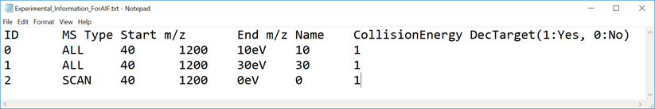
Experimental_Information_ForAIF.txt (**tab-separated** file)  

**&#042; To handle multiple collision energy data, please use this modified dictionary file format.** First four columns are the same as the original dictionary file (see Section 4 of Chapter 1). The additional columns are set as follows;   
**ID:** experimental ID from 0  
**MS Type:** please set “SCAN” as MS1 scan  
**Start m/z:** minimum m/z  
**End m/z:** max m/z  
**Name:** cycle name to show viewers  
**Collision Energy:** collision energy  
**DecTarget:** 0 or 1. If you want to get deconvoluted spectra in this cycle, please set 1. Please set 1 at least 1 cycle.  

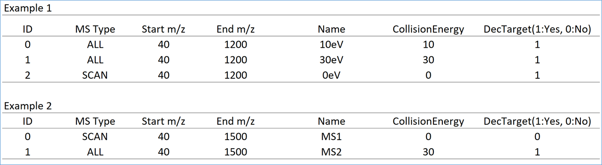
Examples of the modified dictionary file  

### Section 2: Importing ABF files  

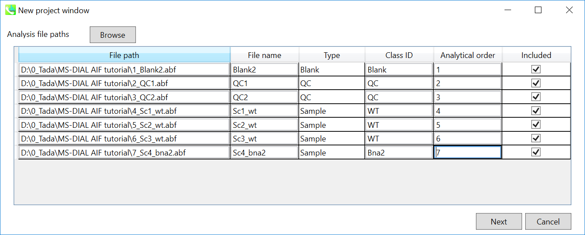

1. Select ABF files  
2. Change the sample names and set the sample type and class  

**Note:** Please finalize your file name here, because you cannot change it later.  

   
### Section 3: Setting parameters  
#### Section 3-1: Data collection tab  

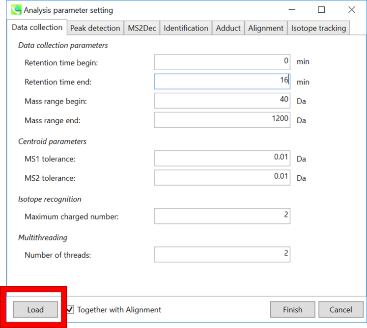

&#042; For the quick start and its explanations, load ‘Param.med’.	  

*Data collection parameters*: You can set analysis ranges (RT and MS1 axis). In this demonstration, your expected data range is 1.5-15 min for 40-1200 Da.  
Note: The chromatographic peaks are highly coeluted in the beginning of this LC-MS data, i.e. 0-1.5 min area. Therefore the AIF data deconvolution is applied for 1.5-15 min in this demonstration.  

*Centroid parameters*: After the peak detection algorithm is applied along the MS axis with a very low threshold, MS-DIAL performs spectral centroiding. By default, mass spectrum of ±0.01 and ±0.01 Da range from each peak top is integrated in MS1 and MS2, respectively. Importantly, this MS2 tolerance value is also used to build the MS/MS chromatogram for a certain *m/z* trace. The MS/MS chromatograms are dedicated to the MS2Dec deconvolution program.  

#### Section 3-2: Peak detection tab  
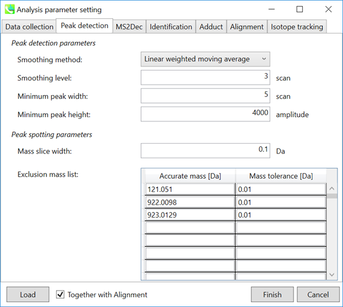

*Peak detection parameters*: Linear-weighted moving average is used for the peak detection by default to accurately determine the peak left- and right edges. The recommended smoothing level is 3 (see Note). MS-DIAL provides two simple thresholds: minimum values for peak width and height. Peaks below these thresholds are ignored (see also MS-DIAL mathematics: <http://prime.psc.riken.jp/Metabolomics_Software/MS-DIAL/MS-DIAL%20FAQ-vs2.pdf>). For FT-ICR or Orbitrap data, the minimum peak height may be 50,000 or more.  
**Note:** check the smoothing level at the raw data  
**Note:** it is recommended to set the minimum peak height at least 2-5 fold higher than the noise level, otherwise the data analysis will take very long time. To check the noise level you can for example check several scans in the non-busy region of the mass spectrum. The small peaks not found consistently across the scans can be regarded as noise.   

*Peak spotting parameters*: The width of mass slice is set here. From our experience, 0.1 or 0.05 is suitable for Agilent Q-TOF, AB Sciex TripleTOF, and Thermo Q-Exactive. If you already know unwanted m/z peaks from columns or solvent, you can specify them in the “Exclusion mass list.”  

In this demonstration, the m/z values for calibrant compounds, i.e. purine and HP-921, are set in the exclusion list.   
Purine 121.0509 [M+H]+  
HP-921 922.0098 [M+H]+ and 923.0129 [M+H]+ isotope with 0.01 tolerance  

#### Section 3-3: MS2Dec tab  
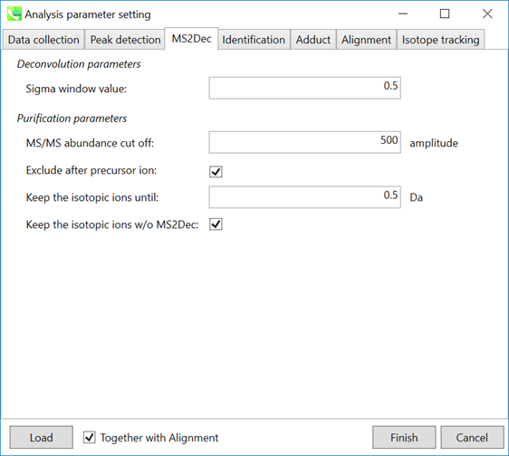

The sigma window value is highly affected by the resolution of deconvolutions. A higher value (0.7-1.0) will reduce the peak top resolutions, i.e. the number of resolved peaks will be decreased. On the other hand, a lower value (0.1-0.3) may also recognize many noise chromatographic peaks.  
In addition, you may be able to set a cut off value to reduce the MS noises (see Section 3-3 of Chapter 3). Finally, if you want to remove the product ions with higher m/z than the focused precursor ion (recommended for metabolomics and lipidomics), check “Exclude after precursor”.  

#### Section 3-4: Identification tab  
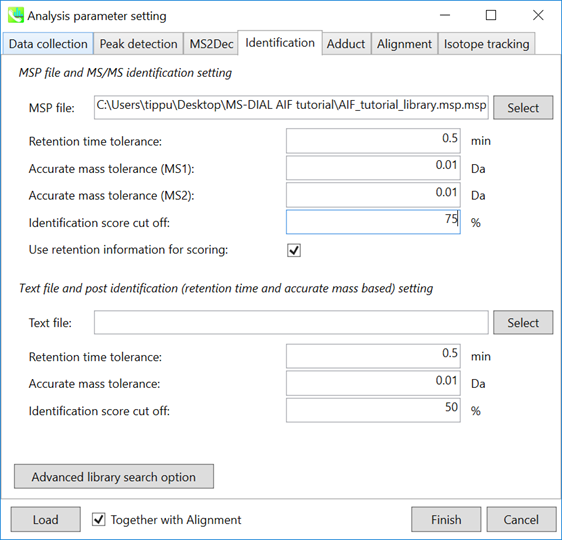

*MSP file*: Set your MSP file here (Tutorial data: **AIF_tutorial_library.msp**). In the case that you selected ‘lipidomics’ project, please select what you want to find in your data sets for lipid profiling.  

*MSP libary contains*  
Tryptophan, Kynurenine, Kynurenic acid, 3-hydroxyanthranillic acid, 3-hydroxykynurenine, internal standards (MES, CHES, PIPES, HEPES)   
*Parameters*: If you put retention time (RT) information in your MSP file, set the RT tolerance value (default is 0.5). The two mass tolerances for MS1 and MS2 are required for the compound search and they are dependent on your instrument performance.  
The cutoff of the identification score should be greater than 0.6 or 0.7.  

*Text file*: If you want to perform “post identification” processing, set your text file here.   

*Parameters*: The meanings of parameters are the same as MSP based identification.  

#### Section 3-5: Adduct tab  
  

*Adduct ion setting*: You can tick the adduct ions and charge values to be considered.  
&#042; see also the section 3-5 of Chapter 3 for the explanation of how to determine your own adduct ion.  

#### Section 3-6: Alignment tab  
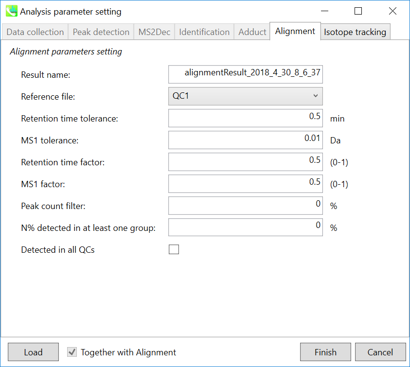  

*Parameters*: If you already have a suitable quality control (QC) data, typically a mixed sample data, then specify the QC file here. All sample data will be aligned to this QC file. The RT and MS1 tolerances for peak alignment depend on your chromatographic conditions (see MS-DIAL mathematics for details). If you want to remove specific peaks that are not fully detected in the alignment, specify the peak count filter. If you can prepare many QC sample data, tick the “QC at least filter” box. Then a peak will be removed if it is missing in any of the QC samples.  

**Note:** When you execute the compound identification, the representative spectra with identification results are automatically determined from one of imported files which has the highest identification score. In the case that an alignment spot is not identified in any samples, the MS/MS spectrum of one sample which has the highest ion abundance in imported files is assigned as the representative spectrum.  

#### Section 4: Result checking  
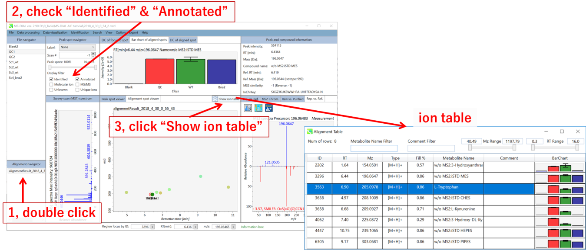  

MS-DIAL can automatically identify metabolite peaks by the similarity calculation of retention time, precursor *m/z*, isotopic ratios, and MS/MS spectrum with the reference databases. You can easily check the result from alignment ion spot table.  

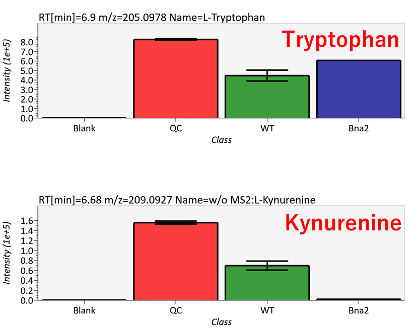  

Ion intensities of tryptophan are stable across samples; however, the intensity of kynurenine, which is synthesized from tryptophan, is very low in the mutant sample (bna2). Please refer to the original paper for details (Ohashi et al., 2017, DOI:10.1038/s41598-017-12392-6). For further information about GUI of MS-DIAL, see Chapter 5 & Chapter 9.  

## Chapter 9: Graphical user interface of MS-DIAL in AIF mode  
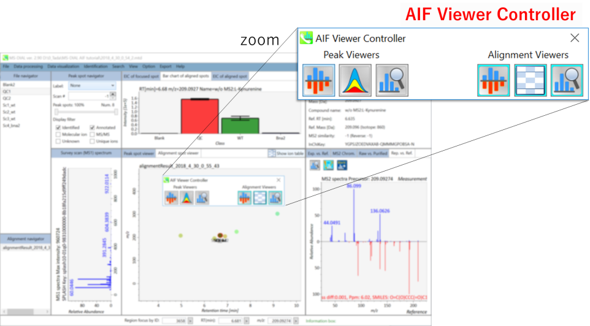  

If you choose “All-ions with multiple CEs” as method type in the project, the **AIF Viewer Controller** will be launched when you open the project. The controller currently has 6 buttons to lunch additional viewers.   

   
### Section 1: Mass spectrum viewers in peak spot and alignment viewer  
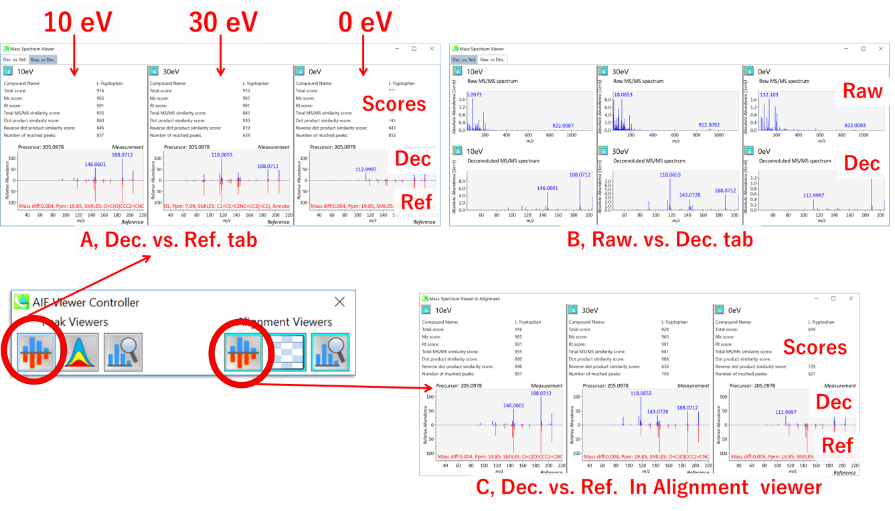  

These viewers show mass spectrum with different collision energies in parallel. **Mass Spectrum Viewer** in peak viewer has two tabs. The window (**A**) on **Exp. vs. Ref.** tab displays the deconvoluted MS/MS spectrum (blue, the upper part) and the reference MS/MS spectrum (red, the lower part). The window (**B**) on **Raw. vs Dec.** tab displays the raw- and deconvoluted MS/MS spectrum on the upper and lower panel respectively. The window (**C**, **Mass Spectrum Viewer in alignment**) displays the deconvoluted MS/MS spectrum (blue, upper) and the reference (red, lower).   

### Section 2: MS/MS chromatogram viewer in peak viewer  
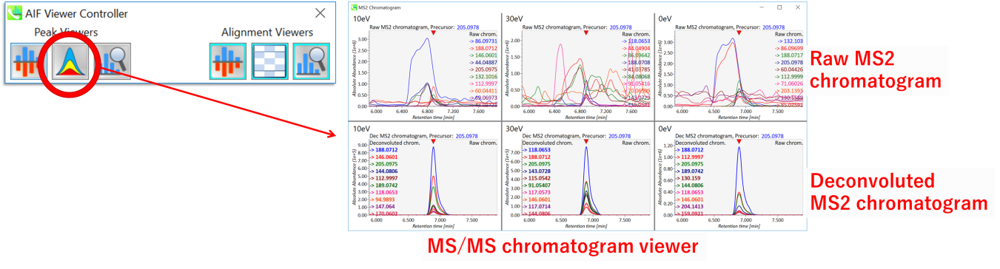  

The detail of deconvolution is shown in the **MS2 chromatogram** viewer. The window displays the raw- and deconvoluted MS/MS chromatogram on the upper and lower panel respectively. Please use this viewer for checking the quality of deconvolution.   

### Section 3: Compound search for the curation of peak identification  
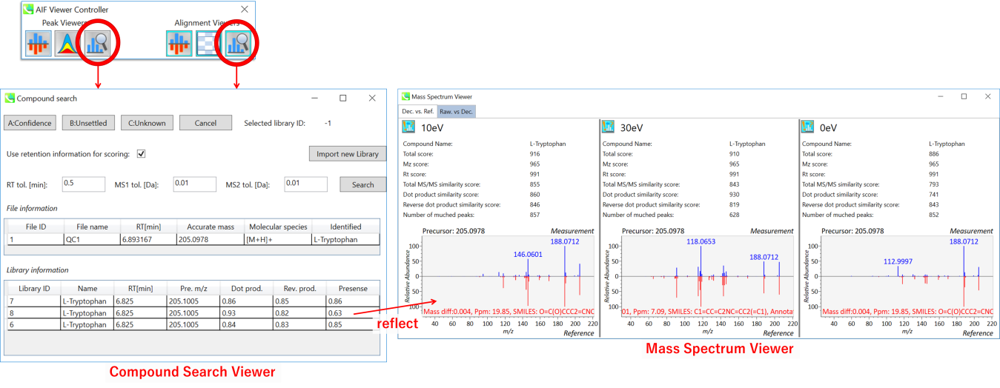  

This function is almost the same as the compound search in the main viewer. Please refer to Section 4 of Chapter 5. Additionally, you can change a compound library by clicking the “Import new Library” button. After changing a library file, you cannot click the confidence/unsettled button. In that case, please change the annotation using the ion table directly.   
When you select a different reference spectrum, the mass spectrum viewers will be changed (the score and the reference MS/MS spectrum). Then, please also launch Mass Spectrum Viewer when you use this function.   

### Section 4: Aligned sample table viewer for checking each sample  
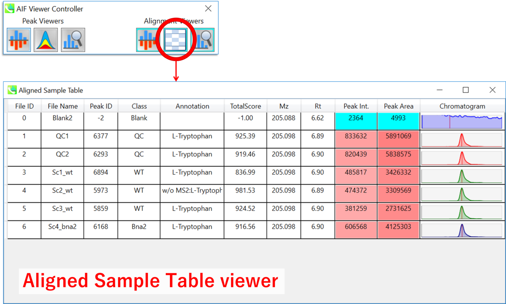  

This viewer shows each sample’s peak information including chromatogram peak shapes in an alignment spot. The value of ‘-2’ in “Peak ID” column means that the peak is not detected by peak picking process. (but calculated by gap-filling method). In the case of gap-filled peak, the colors of the “Peak Int.” and “Peak Area” columns become light blue. In normal, the colors (red) reflect the level of peak intensity or peak area. You cannot refine the peak and alignment yet, but that function will be developed.   
   
