# MS-DIAL　チュートリアル

最終編集日：2019年10月1日

## はじめに
MS-DIALは、ノンターゲット・メタボローム解析のためのユニバーサル・ツールであり、複数の機器（GC/MS、GC/MS/MS、LC/MS、LC/MS/MS）および複数のMSベンダー（Agilent、Bruker、LECO、Sciex、 Shimadzu、Thermo、およびWaters）に対応しています。このプログラムでは、netCDF（AIA）やmzMLなどの一般的なデータ形式を扱うことができます。さらに、EIスペクトルやMS/MSスペクトルを含むいくつかのMSPファイルをスタートアップ・キットとしてリリースしています。また、MS-DIALの内部には、FiehnラボのGC/MSデータベース（FAME RIインデックスに基づく）と、LC/MS/MSベースのリピドミクス用のin silico保持時間およびMS/MSデータベースがあります。同位体ラベル付き追跡は、LC/MSプロジェクトでも実行できます。  
&emsp;&emsp;&emsp;MS-DIALの特徴は、（1）GC/MSとデータインディペンデントのMS/MSの両方を対象としたスペクトルデコンボリューション、（2）ピーク識別の合理化された基準、（3）生データのインポートから統計分析までのすべてのデータ処理ステップのサポート、および（4） ユーザーフレンドリーなグラフィックユーザーインターフェース（GUI）です。  
&emsp;&emsp;&emsp;MS-DIALは、JST/NSF SICORP「低炭素社会のためのメタボロミクス」プロジェクトの支援を受けて、有田正規教授のチーム（理研）とOliver Fiehn教授のチーム（UC Davis）との共同研究として開発されました。  

津川裕司 
hiroshi.tsugawa@riken.jp

Lead developer: Hiroshi Tsugawa (RIKEN)   
Main contributors: Diego Pedrosa (UC Davis), Tomas Cajka (Institute of Physiology CAS), Ipputa Tada (NIG), Haruki Uchino (Keio)  

MS-DIAL screenshot  
 

<h1 id="ms-dial-tutorial">MS-DIAL tutorial</h1>
<h2 id="目次">目次</h2>

<a href="#第1章">第1章: MS-DIALとは</a> 
&emsp;<a href="#セクション 1-1">セクション 1-1: ベンダーのフォーマットをABFに変換するfile converterのダウンロード</a> 
&emsp;<a href="#セクション1-2">セクション1-2: ファイル変換のための条件をチェック</a> 
&emsp;<a href="#セクション1-3">セクション1-3: ファイル変換</a> 
&emsp;<a href="#セクション1-4">セクション1-4: MS-DIALのプロジェクトの立ち上げ</a> 
&emsp;<a href="#セクション1-5">セクション1-5: CentroidかProfileか？ABFデータの中身</a> 
&emsp;<a href="#セクション1-6">セクション1-6: 化合物同定のためのデータベース(MSP or Text)</a> 
&emsp;&emsp;<a href="#セクション1-6-1">セクション1-6-1: プリカーサーとMS/MSのライブラリにおけるMSフォーマット</a> 
&emsp;&emsp;<a href="#セクション1-6-2">セクション1-6-2: アダクトイオンのフォーマット</a> 
&emsp;&emsp;<a href="#セクション1-6-3">セクション1-6-3: 保持時間と正確な質量検索のためのテキスト形式のライブラリ（同定後）</a> 
&emsp;&emsp;<a href="#セクション1-6-4">セクション1-6-4: GC/MSライブリーとしてのMSPフォーマット</a> 
&emsp;&emsp;<a href="#セクション1-6-5">セクション1-6-5: 保持インデックスを計算するためのAlkane-またはFAME保持時間のディクショナリー</a> 
<a href="#第2章">第2章: MS-DIALのLipidBlastデータベース(in silico保持時間および脂質用のMS/MSライブラリ）を使用したLC/MS/MS（data independent MS/MS）プロジェクト</a> 
&emsp;<a href="#セクション2-1">セクション2-1: プロジェクトの立ち上げ</a> 
&emsp;<a href="#セクション2-2">セクション2-2: ABFファイルのインポート</a> 
&emsp;<a href="#セクション2-3">セクション2-3: パラメーターの設定</a> 
&emsp;&emsp;<a href="#セクション2-3-1">セクション2-3-1: Data collectionタブ</a> 
&emsp;&emsp;<a href="#セクション2-3-2">セクション2-3-2: Peak detectionタブ</a> 
&emsp;&emsp;<a href="#セクション2-3-3">セクション2-3-3: MS2Decタブ</a> 
&emsp;&emsp;<a href="#セクション2-3-4">セクション2-3-4: Identificationタブ</a> 
&emsp;&emsp;<a href="#セクション2-3-5">セクション2-3-5: Adductタブ</a> 
&emsp;&emsp;<a href="#セクション2-3-6">セクション2-3-6: Alignmentタブ</a> 
&emsp;<a href="#セクション2-4">セクション2-4: 偽陽性の同定を削除するためのデータキュレーション</a> 
<a href="#第3章">第3章: ユーザーが定義したMS/MSデータベースを使用したLC/MSあるいはLC/MS/MS(data dependent MS/MS)プロジェクト</a> 
&emsp;<a href="#セクション3-1">セクション3-1: プロジェクトの立ち上げ</a> 
&emsp;<a href="#セクション3-2">セクション3-2: ABFファイルのインポート</a> 
&emsp;<a href="#セクション3-3">セクション3-3: パラメーターの設定</a> 
&emsp;&emsp;<a href="#セクション3-3-1">セクション3-3-1: Data collectionタブ</a> 
&emsp;&emsp;<a href="#セクション3-3-2">セクション3-3-2: Peak detectionタブ</a> 
&emsp;&emsp;<a href="#セクション3-3-3">セクション3-3-3: MS2Decタブ</a> 
&emsp;&emsp;<a href="#セクション3-3-4">セクション3-3-4: Identificationタブ</a> 
&emsp;&emsp;<a href="#セクション3-3-5">セクション3-3-5: Adductタブ</a> 
&emsp;&emsp;<a href="#セクション3-3-6">セクション3-3-6: Alignmentタブ</a> 
&emsp;<a href="#セクション3-4">セクション3-4: 偽陽性の同定を削除するためのデータキュレーション</a> 
<a href="#第4章">第4章: MS-DIALにおける公称および正確なGC/MSに基づく代謝プロファイリング</a> 
&emsp;<a href="#セクション4-1">セクション4-1: プロジェクトの立ち上げ</a> 
&emsp;<a href="#セクション4-2">セクション4-2: ABFファイルのインポート</a> 
&emsp;<a href="#セクション4-3">セクション4-3: パラメーターの設定</a> 
&emsp;&emsp;<a href="#セクション4-3-1">セクション4-3-1: Data collectionタブ</a> 
&emsp;&emsp;<a href="#セクション4-3-2">セクション4-3-2: Peak detectionタブ</a> 
&emsp;&emsp;<a href="#セクション4-3-3">セクション4-3-3: MS1Decタブ</a> 
&emsp;&emsp;<a href="#セクション4-3-4">セクション4-3-4: Identificationタブ</a> 
&emsp;&emsp;<a href="#セクション4-3-5">セクション4-3-5: Alignmentタブ</a> 
&emsp;<a href="#セクション4-4">セクション4-4: 偽陽性の同定を削除するためのデータキュレーション</a> 
<a href="#第5章">第5章: MS-DIALのGUI</a> 
&emsp;<a href="#セクション5-1">セクション5-1: マウスの機能</a> 
&emsp;<a href="#セクション5-2">セクション5-2: LC/MS（プリカーサー指向）プロジェクトでのMS-DIALメインウィンドウの概説</a> 
&emsp;<a href="#セクション5-3">セクション5-3: GC/MSプロジェクトでのMS-DIALメインウィンドウの概説</a> 
&emsp;<a href="#セクション5-4">セクション5-4: ピーク同定の結果のキュレーションのための'compound search'</a> 
&emsp;<a href="#セクション5-5">セクション5-5: MS-DIALでのデータの標準化と統計的解析</a> 
&emsp;<a href="#セクション5-6">セクション5-6: エクスポート</a> 
&emsp;<a href="#セクション5-7">セクション5-7: 保存</a> 
&emsp;<a href="#セクション5-8">セクション5-8: 開く</a> 
&emsp;<a href="#セクション5-9">セクション5-9: オプション</a> 
&emsp;<a href="#セクション5-10">セクション5-10: 'Identification'メニューでのマニュアル・アノテーション</a> 
&emsp;<a href="#セクション5-11">セクション5-11: クロマトグラムのビュウア</a> 
&emsp;<a href="#セクション5-12">セクション5-12: MS-DIALのボタンとタブの説明</a> 
&emsp;&emsp;<a href="#セクション5-12-1">セクション5-12-1: ディスプレイ・フィルター</a> 
&emsp;&emsp;<a href="#セクション5-12-2">セクション5-12-2: MS-DIALのタブ</a> 
&emsp;<a href="#セクション5-13">セクション5-13: サーチ</a> 
&emsp;&emsp;<a href="#セクション5-13-1">セクション5-13-1: MS/MSフラグメントの探索</a> 
&emsp;&emsp;<a href="#セクション5-13-2">セクション5-13-2: 異極性ピークリストの融合</a> 
&emsp;<a href="#セクション5-14">セクション5-14: パスウェイマップ</a> 
<a href="#第6章">第6章: MS-DIALの他のユーティリティ</a> 
&emsp;<a href="#セクション6-1">セクション6-1: MS-FINDERへのリンク：アノテートできなかった化合物の探索</a> 
&emsp;<a href="#セクション6-2">セクション6-2: MRMPROBSの紹介：DIA-MS あるいは GC/MSのデータセット</a> 
&emsp;<a href="#セクション6-3">セクション6-3: 代謝物のアノテーションのための分子スペクトルネットワークの形成</a> 
<a href="#第7章">第7章: MS-DIALの同位体追跡機能</a> 
&emsp;<a href="#セクション7-1">セクション7-1: プロジェクトの立ち上げ</a> 
&emsp;<a href="#セクション7-2">セクション7-2: ABFファイルのインポート</a> 
&emsp;<a href="#セクション7-3">セクション7-3: パラメーターの設定</a> 
&emsp;&emsp;<a href="#セクション7-3-1">セクション7-3-1: Data collectionタブ</a> 
&emsp;&emsp;<a href="#セクション7-3-2">Section 7-3-2: Peak detectionタブとMS2Decタブ</a> 
&emsp;&emsp;<a href="#セクション7-3-3">セクション7-3-3: Identificationタブ</a> 
&emsp;&emsp;<a href="#セクション7-3-4">セクション7-3-4: Adduct tab</a> 
&emsp;&emsp;<a href="#セクション7-3-5">セクション7-3-5: Alignmentタブ</a> 
&emsp;&emsp;<a href="#セクション7-3-6">セクション7-3-6: Isotope trackingタブ</a> 
&emsp;<a href="#セクション7-4">セクション7-4: 同位体追跡結果のキュレーション</a> 
<a href="#第8章">第8章: マルチプルコリジョン・エネルギーによる全イオンフラグメンテーションプロジェクト</a> 
&emsp;<a href="#セクション8-1">セクション8-1: プロジェクトの立ち上げ</a> 
&emsp;<a href="#セクション8-2">セクション8-2: ABFファイルのインポート</a> 
&emsp;<a href="#セクション8-3">セクション8-3: パラメーターの設定</a> 
&emsp;&emsp;<a href="#セクション8-3-1">セクション8-3-1: Data collectionタブ</a> 
&emsp;&emsp;<a href="#セクション8-3-2">セクション8-3-2: Peak detectionタブ</a> 
&emsp;&emsp;<a href="#セクション8-3-3">セクション8-3-3: MS2Decタブ</a> 
&emsp;&emsp;<a href="#セクション8-3-4">セクション8-3-4: Identificationタブ</a> 
&emsp;&emsp;<a href="#セクション8-3-5">セクション8-3-5: Adductタブ</a> 
&emsp;&emsp;<a href="#セクション8-3-6">セクション8-3-6: Alignmentタブ</a> 
&emsp;<a href="#セクション8-4">セクション8-4: Result checking</a> 
<a href="#第9章">第9章: AIFモードでのGUI</a> 
&emsp;<a href="#セクション9-1">セクション9-1: Mass spectrum viewers（peak spot viewerとalignment viewer）</a> 
&emsp;<a href="#セクション9-2">セクション9-2: peak viewerのMS/MSクロマトグラムヴューア</a> 
&emsp;<a href="#セクション9-3">セクション9-3: ピーク同定結果のキュレーションのための化合物サーチ</a> 
&emsp;<a href="#セクション9-4">セクション9-4: 各サンプルをチェックするための'Aligned sample table'ヴューア</a> 
<a href="#第10章">第10章: LC-イオンモビリティ・プロジェクト</a> 
&emsp;<a href="#セクション10-1">セクション10-1: IBFファイルへの変換</a> 
&emsp;<a href="#セクション10-2">セクション10-2: プロジェクトの立ち上げ</a> 
&emsp;<a href="#セクション10-3">セクション10-3: IBFファイルのインポート</a> 
&emsp;<a href="#セクション10-4">セクション10-4: パラメーターの設定</a> 
&emsp;&emsp;<a href="#セクション10-4-1">セクション10-4-1: Data collectionタブ</a> 
&emsp;&emsp;<a href="#セクション10-4-2">セクション10-4-2: Peak detectionタブとMS2Decタブ</a> 
&emsp;&emsp;<a href="#セクション10-4-3">セクション10-4-3: Identificationタブ</a> 
&emsp;&emsp;<a href="#セクション10-4-4">セクション10-4-4: Adductタブ</a> 
&emsp;&emsp;<a href="#セクション10-4-5">セクション10-4-5: Alignmentタブ</a> 
&emsp;&emsp;<a href="#セクション10-4-6">セクション10-4-6: Mobilityタブ</a> 
&emsp;<a href="#セクション10-5">セクション10-5: 結果のチェック</a>

## 第1章
## MS-DIALとは
現在のMS-DIALは、ノンターゲット・メタボロミクスのためのパイプラインです。図1にワークフローの概要を示しています。（1）MS-DIALを使用したメタボロミクスの最初のステップは、Reifycs file converterまたはProteoWizard msconverterを使用して、ベンダーのフォーマットをABF（analysis base file）フォーマットまたはmzMLフォーマットに変換することです。これについては、この章の最初のセクションで説明します。（2）次のステップでプロジェクトを選択します：現在のMS-DIALプログラムはGC/MS、LC/MS、LC/MS/MS（DDA：data dependent acquisition）、LC/MS/MS（DIA: data independent acquisition (SWATH or All ions）およびLC-Ion mobility tandem MSのパイプラインが実行可能です。ピークピッキング、ディコンボリューション、化合物同定、およびピークアラインメントを含むデータ処理の後、MS-DIALは正規化（LOWESSを含む）および主成分分析（PCA）による多変量解析を実行します。（3）最後に、他のプログラムを使ってさらなる分析を行えるよう、解析結果を表形式（SIMCA-P、MetaboAnalyst、およびMetFamilyなどに対応）や、MS-FINDER、CSI:FingerID、CFM-ID、MetFrag、およびMetFamilyなどによる化合物同定に対応する複数のスペクトル形式（NIST、MassBank、Mascot形式など）として出力できます。MS-DIALのアルゴリズムを含むパラメータの説明については、<http://prime.psc.riken.jp/Metabolomics_Software/MS-DIAL/MS-DIAL%20FAQ-vs2.pdf>でダウンロード可能な‘MS-DIAL mathematics’も参照してください。    

  
 

### セクション 1-1
### ベンダーのフォーマットをABFに変換するファイルコンバーターのダウンロード
1. 次のサイトに移動 <http://www.reifycs.com/AbfConverter/index.html>  
2. ダウロード要件とライセンス条項を確認して、コンバーターをダウンロード。 (**図2**)  
&#042; ファイルコンバーターは無料でダウンロードできます。  

  
   
### セクション1-2
### ファイル変換のための条件をチェック

Bruker、LECO、Shimadzu、Thermo、Watersなどのファイルを変換するには、特定のデータアクセスライブラリをPCにインストールする必要があります (**表1**)。   

**表1: ファイル変換のために必要なPC条件**

|Vendor|Formats|Required|
|:-:|:-:|---|
|Agilent|	.D|なし。ただし、ChemstationからのファイルはnetCDFに変換する必要があります。|
|Bruker|.D|CompassXtract|  
|LECO|.PEG|最初にすべてのPEGファイルをnetCDF (AIA)に変換する必要があります。|
|Sciex|.WIFF|なし|
|Shimadzu for GC/MS|.QGD|GCMS solution|
|Shimadzu for LC/MS|.LCD|LCMS solutions|
|Thermo|.RAW|MSFileReader|
|Waters|.RAW|MassLynx Raw Data Reader Interface Library|
|netCDF|.CDF|Microsoft Visual J# 2.0|

**FAQ (最新バージョンは以下のサイト参照: <http://prime.psc.riken.jp/Metabolomics_Software/MS-DIAL/index3.html>)**  
*	Agilent: Agilentの生データ（.D）のほとんどすべては、追加の手順なしで簡単に変換できます。 ただし、唯一の例外は、ChemStationから取得したGCMSデータセットで、これはABFに直接変換することができません。そのため、まずChemStationでファイルをnetCDF（AIA）に変換してください。その後、ダウンロードしたファイルコンバーターを使ってAIAファイルをABFに変換してください。  
*	Bruker: 次のサイトに移動 <https://www.bruker.com/service/support-upgrades/software-downloads/mass-spectrometry.html>。登録後に、ご使用のオペレーティングシステム環境と互換性のあるバージョン（32ビットまたは64ビット）のインストーラーをダウンロードしてインストールを行って下さい。  
* LECO: 最初にすべてのデータをnetCDF (AIA) に変換してから、ダウンロードしたファイルコンバーターを使ってABFに変換してください。  
*	Shimadzu: 生データを直接変換した場合は、まずデータを一般的なデータ形式（netCDFまたはmzML）に変換してください。 GC/MSの場合は、GCMS solutionを使用してデータをnetCDFに変換します。 LC-ITTOF/MSの場合は、ProteoWizard（<http://proteowizard.sourceforge.net/index.shtml>）を使用してデータをmzMLに変換してください。 次に、それらをABFに変換します。  
*	Thermo: 次のリンクはMSFileReaderのインストール方法を説明しています： <http://fields.scripps.edu/rawconv/> 。GC/MSデータの場合は、まずデータをnetCDFに変換する必要があります。次に、ダウロードしたファイルコンバーターを使ってABFに変換します。 GC-QExactive生データをABFに直接変換できることは確認済みですが、一部のGC/MSデータ（DSQなど）は最初にnetCDFに変換する必要がありました。  
*	Waters: 1. MassLyncs Raw Data Reader Interface Library をダウンロード(<a href="http://www.waters.com/waters/supportList.htm?cid=511442&filter=documenttype|DWNL&locale=en_US">http://www.waters.com/waters/supportList.htm?cid=511442&filter=documenttype|DWNL&locale=en_US</a>). 2. アーカイブファイル watersrawsdkredist.zipを解凍し、MassLynxRaw.dll（64ビット）をファイルコンバーターの ABFCvtSvrWtrRwフォルダーにコピーしてください。 32ビット環境は、ファイル変換はまだサポートされていません。   
*	NetCDF: J＃依存関係の問題でエラーが発生したら、以下のサイトからMicrosoft Visual J＃2.0ライブラリをダウンロードしてインストールしてください。   

### セクション1-3
### ファイル変換
1.	“AnalysisBaseFileConverter.exe”を実行   
2.	生データをこのプログラムにドラッグ＆ドロップ  
3.	右下の“Convert”をクリック  
4.	生データと同じフォルダにABFファイルが生成されます(**図3**)  

  

### セクション1-4
### MS-DIALのプロジェクトの立ち上げ
このチュートリアルでは、（1）GC/MS、（2）LC/MSまたはLC/MS/MS（DDA: data dependent acquisition）、および（3）LC/MS/MS（data independent acquisition）の3つのプロジェクトについてパラメータと必要なファイルを説明します。このセクションでは、3つのプロジェクトが要約されており、プロジェクト立ち上げの最小要件がわかります。 LC/MS/MS（DIA）、LC/MS/MS（DDA）、およびGC/MS処理の詳細は、それぞれ第2章、第3章、および第4章に記載されています。   

&#042; 上記のdictionary fileをタブ区切りのテキストファイルとして準備してください  
&#042; SWATH data-independent analysisの場合、experiment fileはPeakViewで作成できます（Show->sample information）。 列の順序は変更しないでください。“SCAN”は消さないでください。   

   
### セクション1-5
### CentroidかProfileか？ABFデータの中身
ABFファイルの問題の一つは、データタイプがCentroidかProfileのどちらなのかを自分で決めなければならないことです。 データタイプがCentroidの場合、MS-DIALでspectral centroiding処理を実行する必要はありません。一方、Profileデータの場合、MS-DIALでcentroiding処理を実行する必要があります。 以下のように、いくつかの機器についてデータタイプを検証しました。
（CentroidとProfileの違いは何ですか？：<http://blog.acdlabs.com/elucidation/2008/03/what-is-the-dif.html>）

&#10003; SCIEX QTOF: Profile  
&#10003;	Thermo Q-Exactive: Profile  
&#10003;	Thermo LTQ-Orbitrap: MS1についてはProfile、MS/MSについてはCentroid  
&#10003;	All nominal GC/MS data: Centroid  

その他の機器については、ABFのデータタイプは、あなたのMS設定によって異なります。  

&#10003;	Agilent: MassHunterソフトウェアで出力タイプを"centroid"または"both"に設定すると、ABF converterはデータタイプを‘centroid’として認識します。 それ以外の場合は、"profile"と見なされます。  

Bruker LC-QTOFとFT-ICR、およびWaters LC-Xevo QTOFとSynapt G2のデータタイプは、ほとんど‘centroid’でした：MS-DIALでは、データタイプとして‘centroid’を選択する必要があります。 しかし、まだ保証はありません。   

&#10003;	mzML: ProteoWizardプログラムなどでの出力方法によります。  

&#042; 実際のプロジェクトを開始する前に、次のようにMS-DIALでデータタイプを確認してください。  

1.	どれか一つのファイルを用いて、MS-DIALプロジェクトを"Centroid"モードで始める  
2.	MS1とMS2のスペクトラムを"Peak spot viewer"で見て、スペクトラの形を確認する  
3.	波形がcentroidingを必要としていると思われる場合、プロジェクトを"Profile"モードで再スタートさせる  

### セクション1-6
### 化合物同定のためのデータベース(MSP or Text)  
このセクションでは、GC/MSまたはLC/MSデータセットのためのデータベースのフォーマットについて説明します。GC/MS（EI-MS）とLC/MS（ESI-MS/MS）の主な違いは、プリカーサーイオンとそのMS/MSが取得できるかどうかです。 プリカーサーの *m/z* およびそのMS/MSは、ほとんどのESI（または他のソフトイオン化）- MS/MSで取得可能であるが、EI-MS中の分子イオンはハードイオン化のために検出するのが難しいです。いくつかのMSPファイルは、<http://prime.psc.riken.jp/Metabolomics_Software/MS-DIAL/index.html>からMS-DIALのスターターキットとしてダウンロードできます。  

#### Section 1-6-1
#### プリカーサーとMS/MSのライブラリにおけるMSフォーマット  
MS-DIALは、ASCIIテキストでMSP（<http://www.nist.gov/srd/upload/NIST1a11Ver2-0Man.pdf>）形式をサポートしています（下図参照）。 さらに、このソフトウェアでは、代謝物の識別に"RETENTIONTIME："、"PRECURSORTYPE："、および"FORMULA："の情報を使用できます(大文字／小文字は区別されない)。 可能であれば、保持時間を分単位で指定する必要があります。 アダクトイオンの情報、すなわち"Precursor type"は、アダクトイオン検索アルゴリズムで使用されます（セクション７を参照）。  

図：MSPフォーマットのライブイラリーの例
   
#### セクション1-6-2
#### アダクトイオンのフォーマット  
アダクトイオンの情報は、このセクションで記述するフォーマットに従う必要があります：[M+Na]+, [M+2H]2+, [M-2H2O+H]+, [2M+FA-H]-, 等  
1.	イオン情報を囲む括弧は、"[" と"]"を使用します。  
2.	"]"の後ろに"+"か"-"の記号を指定して、数字は記号の前に書きます。  
3.	C6H12O5のような有機物の化学式を定義したい時は、[M+C2H5COOH-H]や[M+H+(CH3)3SiOH]のように複数要素や括弧なしで書く必要があります。  
4.	"2"H2Oのような有機物の化学式の最初の数字は、 H2O × 2として認識されます。これもまた、2(H2O)と指定しないでください。  
5.	構造方程式を採用: [2M+H-C6H12O5+Na]2+ (very apt.)  
6.	MS-DIALは、以下のようなアダクトタイプの略語または一般的な有機化学式も使用可能です。  
&emsp;&emsp;アセトニトリル: ACN, CH3CN  
&emsp;&emsp;メタノール: CH3OH  
&emsp;&emsp;イソプロパノール: IsoProp, C3H7OH  
&emsp;&emsp;ジメチルスルホキシド: DMSO  
&emsp;&emsp;ギ酸: FA, HCOOH  
&emsp;&emsp;酢酸: Hac, CH3COOH  
&emsp;&emsp;トリフルオロ酢酸: TFA, CFCOOH  

   
#### セクション1-6-3
#### 保持時間と正確な質量検索のためのテキスト形式のライブラリ（同定後）  
MS-DIALは、保持時間とMS1の正確な質量情報によるピーク同定のためのタブ区切りテキストフォーマットライブラリもサポートしています。この同定処理は、ＭＳＰフォーマットライブラリに基づくピーク同定を完了した後に実行されます。このため、この同定処理を「同定後」と呼びます。最初の行にはヘッダー情報が含まれています。 1列目、2列目、3列目、4列目には、それぞれ代謝物名、正確な質量[Da]、保持時間[分]、およびアダクトイオンを含める必要があります。このライブラリはMicrosoft Excelで簡単に作成できます。スプレッドシートをタブ区切りテキスト形式で保存します。このオプションは、内部標準の同定などに役立ちます（MS/MSライブラリを持っていない場合でも、保持時間と正確な質量に基づくピーク同定はこのオプションから利用できます）。   

&#042; このテキストライブラリの最小要件は、単に"metabolite name"と"m/z"の情報です。つまり、最初の2列が必要です。保持時間とアダクトイオンは、それぞれMS-DIALにおけるピーク同定とアダクトイオンピッキングに関する情報を提供します。  

  
図：テキスト形式のライブラリの例  
   
#### セクション1-6-4
#### GC/MSライブリーとしてのMSPフォーマット  
MS-DIALは、セクション6-1と同様に、ASCIIテキストでMSPフォーマット（<http://www.nist.gov/srd/upload/NIST1a11Ver2-0Man.pdf>）をサポートしています。 MS-DIALは、リファレンスの「保持」情報として「RETENTIONTIME：」または「RT」、および「RETENTIONINDEX」または「RI」の2項目を参照します。 可能であれば、保持時間情報は分[min]単位で指定する必要があります。   

  
図：GC/MSのMPSフォーマットライブラリーの例  

   
#### セクション1-6-5
#### 保持インデックスを計算するためのAlkane-またはFAME保持時間のディクショナリー  
保持時間と保持インデックスは、GC/MSを用いたメタボロミクスにおける代謝物の同定に使用されます。 現在のMS-DIALプログラムには、保持情報の使用にあたって、3つのオプションがあります。1）保持時間、2）アルカンミックスベースの保持インデックス、および3）FAME（脂肪酸メチルエステル）ミックスベースの保持インデックスです。  

アルカンあるいはFAMEを混合した実験の詳細にてういは、下記ページを参照してください。  
アルカン: <http://www.sciencedirect.com/science/article/pii/S1389172311001848>  
アルカン: <https://en.wikipedia.org/wiki/Kovats_retention_index>  
FAMEs: <http://www.ncbi.nlm.nih.gov/pmc/articles/PMC2805091/>  

検出されたピークの保持インデックスを計算するために、ユーザーはタブ区切りのテキストとして炭素数とその保持時間のペアを含む辞書を用意しなければなりません（次ページ参照）。  

**FAQ**  
*	アルカン混合物による保持インデックスの計算は、Kovatsの方法（温度プログラムクロマトグラフィー）に基づいています。  
*	FAME混合では、計算はFiehnの方法に基づいています。 重要なことは、炭素数C8、C9、C10、C12、C14、C16、C18、C20、C24、C26、C28、およびC30のFAME（合計13のFAME）は、Fiehnのインデックスを計算するためにこの辞書に含まれなければなりません。 5次の多項式回帰は、C9からC28の間のクロマトグラフのピークに適用されます。 C8（とそれ以前）とC9の間、およびC28とC30（およびそれ以降）の間のピークは、線形回帰によって補完されます。 元のインデックスは、標準品の保持時間（秒）* 1000に基づいています。

  
図: アルカンとFamesの辞書  

   
## 第2章
## MS-DIALのLipidBlastデータベース(in silico保持時間および脂質用のMS/MSライブラリ）を使用したLC/MS/MS（data independent MS/MS）プロジェクト

脂質のin silico保持時間およびMS/MSデータベース（MS-DIALのLipidBlast）と組み合わせて、 data independent MS/MSの取得を扱うプロジェクトをデモンストレーションします。実験プロトコルは以前の研究を参照して下さい。：<http://www.nature.com/nmeth/journal/v12/n6/abs/nmeth.3393.html>.   

このチュートリアルは、下記リンクからダウンロードされた23ファイルを使用しています。   
<http://prime.psc.riken.jp/?action=drop_index>  

**実験の概要:**   
液体クロマトグラフィー：Waters Acquity UPLC CSH C18 column (100×2.1 mm; 1.7 μm)を使用して、各サンプルごとに合計15分のラン。  
質量分析法: SWATH method、ネガティブイオンモード.  
&emsp;&emsp;&emsp;MS1取得時間, 100 ms  
&emsp;&emsp;&emsp;MS2取得時間, 10 ms  
&emsp;&emsp;&emsp;Collision energy, 45 V  
&emsp;&emsp;&emsp;Collision energy spread, 15 V  
&emsp;&emsp;&emsp;Cycle time, 731 ms  
&emsp;&emsp;&emsp;Q1 window, 21 Da  
&emsp;&emsp;&emsp;Mass range, *m/z* 100-1250  

### セクション2-1
### プロジェクトの立ち上げ  

1. File -> new project  
2. ABFファイルが格納されているフォルダの絶対パスを指定  
3. method typeとして"Data independent MS/MS’を選択  
4. experimental fileを選択: **ABSciex_Experiment_Information_CSH21Da.txt**.  
5. "MS1"と"MS/MS"についてdata typeを選択  
6. "negative ion mode"を選択  
7. "target omics"として"lipidomics"を選択  
"lipidomics’プロジェクトを選択した場合、MS-DIALにはQTOFMS用のLipidBlastが含まれているため、NIST MSPフォーマットライブラリを準備する必要はありません。  
**&#042; 詳しくはセクション1-4を見てください**  

### セクション2-2
### ABFファイルのインポート  

1.	ABFファイルを選択  
2.	ファイルがピークアラインメントの"quality control"サンプルの場合は、そのようにタイプを設定します。  

注意：ファイル名は後で変更することはできないので、ここで確定してください。  

   
### セクション2-3
### パラメーターの設定  
#### セクション2-3-1
#### Data collectionタブ  

  

*Data collection parameters*: 解析範囲（RT軸とMS1軸）を設定できます。 このデモでは、予想されるデータ範囲は100-1250 Daに対して0.5-10分です。  

*Centroid parameters*: ピーク検出アルゴリズムが非常に低い域値でMS軸に適用された後、MS-DIALはスペクトルセントロイドを実行します。 デフォルトでは、各ピークトップから±0.01と±0.025 Daの範囲のマススペクトルが、それぞれMS1とMS2に統合されています。 重要なことは、このMS2許容値は、特定の*m/z*トレースのMS/MSクロマトグラムを作成する時にも適用されます。 MS/MSクロマトグラムはMS2Decデコンボリューションプログラム専用です。  

*Isotope recognition*: 小さな分子（2000 Da未満）に焦点を合わせている限り、最大荷電数は2に設定できます。一方、プロテオームまたはsnRNAのデータを処理する場合は、パラメータを8以上に変更することができます。  

*Multithreading*: 使用するスレッド数を設定してください。最大スレッド数はリソースモニターで確認できます。（タスクマネージャー->リソースモニター）   

#### セクション2-3-2
#### Peak detectionタブ  

  

*Peak detection parameters*: ピーク検出にはデフォルトで線形加重移動平均（Linear-weighted moving average）が使用され、ピークの左右のエッジが正確に決定されます。 推奨されるスムージングレベルは1〜3です。 MS-DIALでは2つの域値（ピーク幅と高さの最小値）を指定できます。これらの閾値を下回るピークは無視されます（MS-DIALで用いる数理モデルについては<http://prime.psc.riken.jp/Metabolomics_Software/MS-DIAL/MS-DIAL%20FAQ-vs2.pdf>も参照してください）。 FT-ICRまたはOrbirapデータの場合、ピークの高さの最小値は50、000以上にするのが良いかもしれません。  

*Peak spotting parameters*: マススライスの幅をここで設定します。我々の経験から、Agilent Q-TOF、AB Sciex TripleTOF、およびThermo Q-Exactiveには0.1または0.05が適しています。カラムまたは溶媒からの不要な*m/z*ピークが既に分かっている場合は、それらを"Exclusion mass list"で指定できます。  

   
下記は<http://prime.psc.riken.jp/Metabolomics_Software/MS-DIAL/MS-DIAL%20FAQ-vs2.pdf>からの抜粋  

  

#### セクション2-3-3
#### MS2Decタブ  

  

"sigma window value"は、デコンボリューションの分解能の影響を大きく受けます。 より高い値（0.7〜1.0）はピークトップ分解能を低下させる、つまり、分解されるピークの数は減少します。 一方で、より低い値（0.1〜0.3）もまた多くのノイズとなるピークを取得していまいます。   

さらに、MSノイズを減らすためにカットオフ値を設定することができます（セクション3-3-3を参照）。 最後に、注目したプリカーサイオンの後にプロダクトイオンを削除する場合は（メタボロミクスとリピドミクスに推奨）、"Exclude after precursor ion"にチェックを入れます。  

*Keep the isotopic ions until*: 実際、MS1スペクトルの同位体パターンはしばしば乱されます。 一方、MS/MSスペクトルの同位体パターンは、MS1スペクトルの同位体パターンよりも明確な場合があり、分子式の正確なアノテーションに使用できる場合があります。 このパラメータを5に設定した場合、MS2Decアルゴリズムが終了した後、プリカーサー+5Daまでのイオンは保持されます。   

*Keep the isotopic ions w/o MS2Dec*: 時々、MS2Decアルゴリズムは数学的問題のためにプリカーサーの同位体イオンを消去するかもしれません。 そのため、このオプションによって、プリカーサーの同位体イオンについてのみ加工していないMS/MSスペクトルを保持できます。   
   
#### セクション2-3-4
#### Identificationタブ  

*MSP file*: "lipidomics"プロジェクトを選択した場合、脂質プロファイリングのためにデータセットの中から見つけたい脂質を選択してください。 このデモで用いている藻類リピドミクスにおいては、上の図で示している脂質（FA、 lysoPC、 lysoPE、 PA、 PC、 PE、 PG、 PI、 PS、 MGDG、 DGDG、 SQDG）にチェックを入れてください。  

*Parameters*: MSPファイルに保持時間（RT）情報を含める場合は、RT許容値を設定します（デフォルトは0.5）。例えば、我々の脂質DBには、我々の15分LCメソッドに最適化された予測RT情報が含まれています。 適切なRT情報が得られない場合は、許容値を100以上に設定します（LC時間よりも長い値を設定して下さい）。  
MS1とMS2のmass tolerancesは化合物検索に必要であり、それらは機器の性能に依存します。  
identification scoreのカットオフ値は0.7または0.8より大きくなければなりません。  

*Text file*: "post identification"処理を実行する場合は、ここでテキストファイルを指定してください。(このデモの場合: **Lipid_Nega_IS_PostIdentification_vs1.txt**)  

*Parameters*: パラメータの意味はMSPに基づいた同定と同じです。  

*Advanced library search option*: ライブラリ検索のためのオプションはここで設定します。 現在のプログラム（2014/11/30）では、ライブラリ検索には2つのオプションがあります。  

  

MS/MSタブ:  
1.	*Relative abundance cut off*: ユーザーが定義する値よりも小さいマススペクトルピークは、MS/MSのsimilarity calculationには使用されません。  

Post ident.タブ:  
2.	*Only report the top hit*: いくつかのクロマトグラムピークは識別アルゴリズムにより同じ化合物とアノテーションされるので、このオプションにより、多数の結果からidentification scoreに基づいて候補を一つに絞り込むことができます。  

#### セクション2-3-5
#### Adductタブ  
  

アダクトイオンの指定: 考慮すべきアダクトイオンとcharge valuesを指定することができます。  
&#042; アダクトイオンの決定方法についてはセクション3-3-5の説明も参照してください。  

   
#### セクション2-3-6
#### Alignmentタブ  
  

*Parameters*: 適切なquality control（QC）データ（通常は混合サンプルデータ）が既にある場合は、ここでQCファイルを指定します。 すべてのサンプルデータはこのQCファイルにアラインされます。 ピークアライメントに対するRTおよびMS1の許容誤差は、クロマトグラフの条件によって異なります（詳細については、MS-DIAL mathematicsを参照してください）。 アライメントで完全に検出されていない特定のピークを削除する場合は、"peak count filter"を指定します。 たとえば、チュートリアルデータには、同じピーク情報を持つ少なくとも4つの生物学的反復データが含まれ、データの総数は23です。次に、ピークカウントフィルタを（4/23）&lowast;100 = 17.4％に設定します。 これは、欠けている値が17.4％以上含まれているとピークが削除されることを意味します。 さらに、"N% detected in at least one group"では、フィルタリングは各サンプルグループ内で行われます。 100％に設定すると、ピークはそのクラスすべてのサンプルで検出されます。  
多数のQCサンプルデータを準備することができる場合は、"Detected in all QCs"ボックスをチェックしてください。そうすると、どのQCサンプルにも存在しないピークは、削除されます。   

**注意:** 化合物同定を実行すると、同定結果の代表スペクトルは、インポートされたファイルのうち最も同定スコアの高いものから自動的に決定されます。 アライメントスポットがどのサンプルからも認めれない場合、インポートされたファイルの中で最もイオン存在量が多いサンプルのMS/MSスペクトルが代表スペクトルとして割り当てられます。  

   
### セクション2-4
### 偽陽性同定を減らすためのデータキュレーション  
MS-DIALは、保持時間、プリカーサー *m/z* 、同位体比、MS/MSスペクトルについて、サンプルとリファレンスデータベースとの類似度を計算し、それによって自動的に代謝物のピークを同定することができます。 しかしながら、残念なことに、ピーク同定の結果には偽陽性の同定も含まれてしまう場合があります。 したがって、分析化学者として、結果を手作業でチェックし、特定されたピークを修正する必要があります。 もちろん、最終的な目標は、偽陽性および偽陰性のない完全な同定です。   
実際にやることは、アライメントファイルの同定結果のキュレーションです。なぜなら、アライメントファイルの同定結果が"peak height"データマトリックスのような最終出力ファイルに反映されるからです。MS-DIALのGUIを使うことにより、アラインスポットが偽陽性/偽陰性の同定結果であるかどうかチェックできます。 MS-DIALのGUIの詳細については、第5章を参照してください。  

   
## 第3章
## ユーザーが定義したMS/MSデータベースを使用したLC/MSあるいはLC/MS/MS(data dependent MS/MS)プロジェクト  

ここでは、ユーザー定義のMSPライブラリ（MassBank、GNPS、およびRespectの統合ライブラリ）と組み合わせたdata dependent MS/MSのプロジェクトについて説明します。 実験プロトコルは、過去の研究を参照してください: <http://pubs.acs.org/doi/abs/10.1021/acs.jafc.5b04890>。このデモのためのABFファイルは我々のwebサイトからダウロードできます: <http://prime.psc.riken.jp/Metabolomics_Software/MS-DIAL/index.html>。   

このセクションでは合計6つのファイルを使用し、MSPファイルはこのデモの同じフォルダに含まれています。 また、すぐに解析がスタートできるようにMS-DIALで使用されるパラメータファイル（Param.med）もこのフォルダの中にあります。  

**実験の概要:**  
液体クロマトグラフィー: 各サンプルにつき計4分間走らせる。Kinetex C18 2.6 μm (50×1.0 mm)を使用。  
溶液A: 0.1%酢酸水溶液  
溶液B: 0.1%酢酸アセトニトリル溶液  
質量分析: data dependentのポジティブイオンモード  
&emsp;&emsp;&emsp;&emsp;Collision energy、 35 V  
&emsp;&emsp;&emsp;&emsp;Collision energy spread、 15 V  
&emsp;&emsp;&emsp;&emsp;Cycle time、 125 ms  
&emsp;&emsp;&emsp;&emsp;Mass range、 *m/z* 60-1250  
   
### セクション3-1
### プロジェクトの立ち上げ  

1. File -> new project  
2. "project file path"としてABFファイルのあるフォルダを指定  
3. "method type"として"conventional LC/MS"か"data dependent MS/MS"を選択  
4. MS1とMS/MSについて"data type"を選択  
5. "positive ion mode"を選択  
6. "target omics"として"metabolomics"を選択  
"lipidomics"を選択した場合は、NIST MSPフォーマットライブラリを準備する必要はありません。 代わりに、データセットに必要な化合物を選択する必要があります（第2章を参照）。 一方、"metabolomics"を選択した場合、化合物の同定にはユーザー自身がMSPファイルを準備する必要があります。  

&#042; セクション1-4も参照して下さい。  

   
### セクション3-2
### ABFファイルのインポート  
1.	"Brose"ボタンからインポートするABFファイルを選択  
2.	もしファイルが、ピークアライメントのための"quality control"サンプルなら、"type"でそのようにセットする（この例では、この設定を変える必要はありません）。  

注意: これ以降のステップでは変えることが出来ませんので、ここでファイル名を確定してください。  

   
### セクション3-3
### パラメーターの設定  
#### セクション3-3-1
#### Data collection タブ  
  

&#042; すぐに解析が始められるように、上記の"Param.med"をロードして下さい（下記の説明においても使用しています）。  

*Data collection parameters*: 解析幅を設定できます(RT軸とMS1軸). ここでは0.4-3.5分と50-1000 Daと設定します。  

*Centroid parameters*: ピーク検出アルゴリズムが非常に低い域値でMS軸に適用された後、ファイルがプロファイルデータである場合、MS-DIALはスペクトルセントロイドを実行します。 デフォルトでは、各ピークトップから±0.01と±0.05 Daの範囲の質量スペクトルが、それぞれMS1とMS2に統合されています。   

*Isotope recognition*: 小さな分子（2000 Da未満）に焦点を合わせている限り、最大荷電数は2に設定できます。一方、プロテオームまたはsnRNAデータを処理する場合は、パラメータを8以上に変更することができます。  

*Multithreading*: 使用するスレッド数を設定してください。 最大スレッド数はリソースモニタで確認できます。（タスクマネージャ->リソースモニタ）。  
   
#### セクション3-3-2
#### Peak detection タブ  
  

*Peak detection parameters*: ピーク検出にはデフォルトで線形加重移動平均（Linear-weighted moving average）が使用され、ピークの左右のエッジが正確に決定されます。 推奨されるスムージングレベルは1〜3です。 MS-DIALでは2つの域値（ピーク幅と高さの最小値）を指定できます。これらの閾値を下回るピークは無視されます（MS-DIALで用いる数理モデルについては<http://prime.psc.riken.jp/Metabolomics_Software/MS-DIAL/MS-DIAL%20FAQ-vs2.pdf>も参照してください）。 FT-ICRまたはOrbirapデータの場合、ピークの高さの最小値は20、000以上にして下さい。  

*Peak spotting parameters*: マススライスの幅をここで設定します。 我々の経験から、Agilent Q-TOF、AB Sciex TripleTOF、およびThermo Q-Exactiveには0.1または0.05が適しています。 カラムまたは溶媒からの不要なm/zピークがすでにわかっている場合は、それらを"Exclusion mass list"で指定できます。  
   
#### セクション3-3-3
#### MS2Dec タブ  
data independent MS/MSデータセットがなければ、このセクションはスキップできます。 ただし、以下の図で説明しているように、MSノイズを減らすためにカットオフ値を設定することができます。 以下に示す図は前述のデータセットではありませんが、特にWaters社やAgilent社の機器では、このパラメータが計算時間とスペクトルの類似性の過小評価を減らすために非常に重要であることが分かっています。  

  
図: "purification parameters"の説明  
   
#### セクション3-3-4
#### Identification タブ  

  

*MSP file*: MSPファイルをここで指定してください（このチュートリアルの場合: **MSMS-AllPublic-Curated-Pos.msp**）。 "lipidomics"を解析している場合、どの脂質を同定したいのか選択してください。  

*Parameters*: MSPファイルに保持時間（RT）情報を含める場合は、RT許容値（retention time tolerance）を設定して下さい（デフォルトは0.5）。 ただし、このMSPファイルの保持時間はこのデモと同じ方法で記録されているわけではないため、RT許容値の影響を無視するために、ここでは100以上に設定します。 化合物の同定には、MS1とMS2の2つの"accurate mass tolerance"の指定が必要です。 このデモンストレーションのMSPファイルには、すべての化合物についてプリカーサーm/zの理論値が含まれています。 したがって、飛行時間型MSのMS1の"accurate mass tolerance"はここでは0.025 Daに設定されています。 一方、このMSPファイルには低解像度（QqQなど）のMSデータも含まれているため、すべてのクエリを広く利用するには0.2以上が適しています。 偽陽性を避けるために、"identification score cut off"値は0.7または0.8より大きくなければなりません。  

*Text file*: "post identification"処理を実行する場合は、ここにテキストファイルを設定してください。（このデモ用のテキストDBはありません。）  

*Advanced library search option*: ライブラリ検索のためのオプションはここで定義されます。 現在のプログラム（2014/11/30）では、ライブラリ検索には2つのオプションがあります。  

  

MS/MS タブ:  
*Relative abundance cut off*: ユーザー定義値よりも低いマススペクトルのピークは、MS/MSの類似性の計算には使用されません。  

Post ident. タブ:  
*Only report the top hit*: いくつかのクロマトグラムピークは、識別アルゴリズムにより同じ化合物と同定されるので、このオプションは、得られた複数の結果の中から識別スコアを使って候補を一つに決定することを可能にします。  

#### セクション3-3-5
#### Adduct タブ  
  
考慮すべきアダクトイオンをチェックし、charge値を設定します。  
さらに、アダクトイオンについて独自に定義することができます。（セクション1-6-2のアダクトイオンのフォーマットを参照して下さい。）  

#### セクション3-3-6
#### Alignment タブ  
  

*Parameters*: 適切なquality control (QC)データ（通常は混合サンプルデータ）が既にある場合は、ここでQCファイルを指定します。すべてのサンプルデータはこのQCファイルに基づいてアライメントされます。利用可能なQCファイルがない場合は、インポートされたファイルのうつ1つを選択します（ブランク用のサンプルは適していません）。代表としたファイルでは検出されていない代謝産物ピークがある場合、MS-DIALのアルゴリズム（gap-filling）によって自動的に補間できます。このデモでは、0717_kinetex_wine_50_4min_pos_IDA_A1が代表ファイルとして選択されています。ピークアラインメントの"Retention time tolerance"および"MS1 tolerance"の値は、クロマトグラフ条件によって異なります（ここでは、0.05分および0.025 Daに設定します）。アライメントで完全に検出されていない特定のピークを削除する場合は、"peak count filter"を指定します。たとえば、チュートリアルデータには、同じピーク情報を持つ少なくとも4つの生物学的反復データが含まれ、データの総数は23です。その場合、ピークカウントフィルタを(4/23)&lowast;100 = 17.4 %に設定します。これは、欠けている値が17.4％以上含まれているとピークが削除されることを意味します。さらに、"N% detected in at least one group"では、フィルタリングは各サンプルグループ内で行われます。100％に設定すると、ピークはそのクラスのすべてのサンプルで検出されなければなりません。  
多数のQCサンプルデータを準備することができる場合は、"Detected in all QCs"ボックスにチェックを入れてください。ピークがQCサンプルのいずれにも存在しない場合、ピークは削除されます。    

**注意:** 化合物同定を実行すると、同定結果の代表スペクトルは、インポートされたファイルのうち最も高い同定スコアを持つものから自動的に決定されます。 アライメントスポットがどのサンプルでも検知されない場合、インポートされたファイルの中で最もイオン存在量が多いサンプルのMS/MSスペクトルが代表スペクトルとして割り当てられます。  

### セクション3-4
### 偽陽性の同定を削除するためのデータキュレーション  
MS-DIALは、保持時間、プリカーサー*m/z*、同位体比、MS/MSスペクトルについて、サンプルとリファレンスデータベースとの類似度を計算し、それによって自動的に代謝物のピークを同定することができます。 しかしながら、残念なことに、ピーク同定の結果には偽陽性の同定も含まれてしまう場合があります。 したがって、分析化学者として、結果を手作業でチェックし、特定されたピークを修正する必要があります。    
実際にやることは、アライメントファイルの同定結果のキュレーションです。なぜなら、アライメントファイルの同定結果が"peak height"データマトリックスのような最終出力ファイルに反映されるからです。MS-DIALのGUIを使うことにより、アラインスポットが偽陽性/偽陰性の同定結果であるかどうかチェックできます。MS-DIALのGUIの詳細については、第5章を参照してください。  

  
   
## 第4章
## MS-DIALにおける公称および正確なGC/MSに基づく代謝プロファイリング  
質量分析と組み合わせたガスクロマトグラフィーは代謝プロファイリングのための頑強で安定した技術です。 実際には、LC/MSに比べて操作やメンテナンスが容易であるという点で、ノンターゲット・メタボローム解析の最初の選択肢となるでしょう。 さらに、GC/MSの化合物同定は、保持時間（およびリテンションインデックス）とEIスペクトルの膨大なデータベースにより、現在では簡単になっています。  
ここでは、シロイヌナズナノックアウト変異体のGC/MSデータセットを使用したプロジェクト（この研究の一部）を示します。 詳細は以下を参照して下さい： <http://prime.psc.riken.jp/meko/>。アルカン混合物に基づく保持指数（Kovats）が使用されています。 FAME混合に基づく保持指数（Fiehn）または保持時間を使用する他の方法も説明します。 このデモに使用されるファイルは、次のサイトからダウンロードできます。： <http://prime.psc.riken.jp/Metabolomics_Software/MS-DIAL/index.html>   

  

  

### セクション4-1
### プロジェクトの立ち上げ  

  

1. File -> new project  
2. "project file path"としてABFファイルのあるフォルダを指定  
3. "ionization type"としてEI (GC/MS) を選択
4. "data type"としてcentroid data を選択
5. "positive ion mode"を選択  

&#042; "Data type"の説明はセクション4-1も参照して下さい。  

**FAQ:**   
*	MS-DIALは、GC/MSのようにLC/MSデータも同様に処理できる。   
*	正確なGC/MSデータがある場合は、その精度を設定するためのパラメータを、パラメータ設定セクションで指定できます  
* GC-CI-（化学イオン化）、GC-FI-（chemical ionization）、GC-PI-（field ionization）、GC-APCI-MSなどのprecursor orientedなGC/MS/MS手法でデータが得れている場合、"ionization type"として、ESI（LC/MS、LC/MS/MS、またはprecursor orientedなGC/MS/MS）に特化している必要があります。第3章を参照してください。  
 

### セクション4-2
### ABFファイルのインポート  
  

1.	"Brose"ボタンからインポートするABFファイルを選択  
2.	もしファイルが、ピークアライメントのための"quality control"サンプルなら、"type"でそのようにセットする（このデモでは、この設定を変える必要はありません）。  
注意: ファイルの名前をここで確定してください。この後で変えることはできません。  

### セクション4-3
### パラメーターの設定  
#### セクション4-3-1
#### Data collection タブ  
  

&#042; すぐに解析が始められるように、上記の"Param.med"をロードして下さい（下記の説明においても使用しています）。  

*Data collection parameters*: 解析幅を設定できます(RT軸とMS1軸).　例えば、あなたのデータの解析幅が、4-13.5分と60-500 Daが適切と予想されるなら（このデモの場合）、そのように設定します。  

*Multithreading*: 使用するスレッド数を設定してください。 最大スレッド数はリソースモニターで確認できます。（タスクマネージャー->リソースモニター）。  
   
#### セクション4-3-2
#### Peak detection タブ  
  

*Peak detection parameters*: GC/MSデコンボリューションのワークフローは、１）各*m/z*クロマトグラムにおけるピークピッキング、および２）検出されたピークスポットに基づくデコンボリューションである。 このピークピッキングのアルゴリズムは、GC/MSではパラメータリストから除外された除外質量リストを考慮すること以外は、LC/MSと同じです。   
ピーク検出にはデフォルトで線形加重移動平均（Linear-weighted moving average）が使用され、ピークの左右のエッジが正確に決定されます。 推奨されるスムージングレベルは1〜3です。 MS-DIALでは2つの域値（ピーク幅と高さの最小値）を指定できます。これらの閾値を下回るピークは無視されます（MS-DIALで用いる数理モデルについては<http://prime.psc.riken.jp/Metabolomics_Software/MS-DIAL/MS-DIAL%20FAQ-vs2.pdf>も参照してください）。GC-Q-Exactiveデータの場合、ピークの高さの最小値は50、000以上にして下さい（最初の試行）。  

*Peak spotting parameters*: もしデータが、Agilent GC-QTOFMSやGC-QExactiveのような高解像度のGCMSで得られた場合、"accurate MS"にチェックを入れてく、"mass slice"を設定して下さい。我々の経験から、0.1か0.05がaccurate GCMSに適しています。また、"mass accuracy"も設定してください。これはEI-クロマトグラムの構築に使用され、その後にデコンボリューション（MS1Dec）プログラムが実行されます。  

#### セクション 4-3-3
#### MS1Dec タブ  
  

"sigma window value"はデコンボリューションの分解能に大きく影響されます。 高い値（0.7-1.0）に設定すると、ピークトップ分解能が低下する、すなわち、分離されたクロマトグラフィーピークの数は減少するでしょう。 他方、低い値（0.1-0.3）に設定すると、多くのノイズクロマトグラフィーピークを拾ってしまうかもしれません。   

また、MSノイズを減らすためにカットオフ値を設定することができます（LC/MSの時と同じです：セクション3-3-3を参照）。  

   
#### セクション 4-3-4
#### Identification タブ  
GC/MSベースのノンターゲット分析でのピーク同定は簡単ですが、特に代謝物の包括的な同定のための保持指数については、条件を注意深く確認する必要があります。 実際、MS-DIALは保持情報のインデックスとして保持時間を使用できますが、型どおりの識別には保持インデックスを使用することを強くお勧めします。&#042;我々の提供するMSP DBにも保持時間の情報があるため、インデックスとして保持時間を選択できる場合があります。 ただし、この場合より長い"retention time tolerance"を設定する必要がありますが、偽陽性が増えてしまいます。   
保持情報のインデックスの計算方法は２つあります：1) アルカン混合物に基づくKovats、および、2) FAME（脂肪酸メチルエステル）混合物に基づくFiehn。これらの混合物は、例えばSigma-Aldrich(C7-C40飽和アルカン混合物については49452-U)とAgilent (<http://www.agilent.com/cs/library/usermanuals/Public/G1676-90001_Fiehn.pdf>)から購入することができます。ここでは、炭素数とその保持時間のリストを含むタブ区切りのファイルを用意する必要があります。  
  

上の図は（AMDISを使用して）アルカン混合物の保持時間をチェックする方法を説明しており、同じ方法がFAME混合物に使用することができます。 **FAMEに基づいたFiehn RIの計算** では、Fiehn RIを計算するためにC8、C9、C10、C12、C14、C16、C18、C20、C22、C24、C26、C28、およびC30のすべての保持情報を準備する必要があります。一方、Kovatsの計算にはすべてのアルカンが必要というわけではありません。   

MS-DIALでは、バージョン2.42から"retention index"に基づいたピークアライメントができます。研究によっては、数か月や数年かけてデータ収集・解析を行う場合もあります。機器のメンテナンス中にGCカラムを10〜15 cmカットすると、保持時間は短くなりますが、これは保持指標に影響しません。 多くの異性体（例えば、揮発性物質の分析）を含む場合は、広い"retention time tolerance"（例えば、0.5-1分）を設定することになるが、ピークアラインメントを誤ってしまうこともあり得ます。この問題に対処するために、ユーザーは分析ファイルパスと"carbon-RT dictionary file"のペアをパラメータ設定で定義する必要があります。 他のすべての分析ファイルに同じ一つのdictionary fileを適用するには、コンテキストメニューの"auto fill"を使用します。  

&#042; AMDIS (<http://chemdata.nist.gov/mass-spc/amdis/downloads/>)は、GC/MS分析のための非常に優れたプログラムです。生データを直接見ることができるため、アルカンとFAMEの両方の保持時間をチェックするためにも使用できます。 対照的に、生データセットをチェックするためには、MS-DIALを最初に実行する必要があります。  

*MSP file*: MSPファイルをここで指定してください。(このデモの場合: **GCMS DB_MassBank-Restek-RIKEN.msp**.) 重要なのは、FAME混合物を使用している限り、MS-DIALはFiehn BinBaseスペクトルレコードを内部に持っているので、新たにMSPを準備する必要はありません。 もちろん、FAMEベースのGC/MSメタボローム解析用に独自のMSPファイルを指定することもできます。  

*Parameters*: MSPファイルに保持時間（RT）情報を含める場合は、"Retention time tolerance"を設定します（デフォルトは0.5）。 識別インデックスとして"retention index"を選択した場合は、"Retention index tolerance"の値を、アルカン（Kovatsインデックス）の場合は約10-20、FAME（Fiehnインデックス）の場合は約2000-3000に設定します。  
"accurate GC/MS"データを使用している場合でも、独自の高解像度EIライブラリを使用していない限り、'*m/z* tolerance"は0.5を推奨します。"EI similarity cut off"を化合物同定の最初のフィルタリングに使用し、次に、保持時間とEIスペクトルの類似性の合計スコアである"identification score cut off"を化合物同定の最終順位付けに使用します。   

   
#### セクション4-3-5
#### Alignment タブ  
  

*Parameters*: 適切なquality control（QC）データ（通常は混合サンプルデータ）が既にある場合は、ここでQCファイルを指定します。すべてのサンプルデータはこのQCファイルに基づいてアライメントされます。 利用可能なQCファイルがない場合は、インポートされたファイルのうち1つを選択します（ブランク用のサンプルは適していません）。代表としたファイルでは検出されていない代謝産物ピークがある場合、MS-DIALのアルゴリズム（gap-filling）によって自動的に補間できます。   
&emsp;&emsp;&emsp;&emsp;このデモでは、Const13_1が代表ファイルとして選択されています。ピークアライメントのための"Retention time tolerance"と"EI similarity tolerances"の値は、クロマトグラフの条件によて異なります(ここでは0.075分と70%と設定してください)。Carbon-RT dictionaryファイルが"identification"タブで正しく定義されていれば、"retention index"をピークアライメントの基準として使用できることができます。  
&emsp;&emsp;&emsp;&emsp;アライメントで完全に検出されていない特定のピークを削除する場合は、"peak count filter"を設定します。 たとえば、このデモデータには同じピーク情報を持つ4つ以上の生物学的反復データが含まれ、データの総数は23です。この場合、(4/23)&lowast;100 = 17.4 %に設定します。これは、欠けている値が17.4％以上含まれているとピークが削除されることを意味します。たくさんのQCサンプルデータを準備することができるならば、"QC at least filter"ボックスにチェックを入れてください。ピークがQCサンプルのいずれにも存在しない場合、ピークは削除されます。新しいバージョンでは、"identification after alignment"と呼ばれるオプションを設けました。各サンプルファイルに対して化合物同定機能を実行したくない場合、およびアライメントテーブルに対してのみ実行したい場合は、チェックを入れてください。NISTまたはWilly EI-MSデータベース（400万以上のレコードを含む）を使用する場合、このオプションにチェックを入れると、計算時間を短縮するのに役立ちます。  

**注意:** 化合物同定を実行すると、同定結果の代表スペクトルは、インポートされたファイルのうち最も高い同定スコアを持つものから自動的に決定されます。 アライメントスポットがどのサンプルでも検知されない場合、インポートされたファイルの中で最もイオン存在量が多いサンプルのEIスペクトラムが代表として割り当てられます。  
 

### セクション4-4
### 偽陽性の同定を削除するためのデータキュレーション  
MS-DIALは、リファレンスデータベースとの保持インデックス（または保持時間）とEIスペクトルの類似度計算によって、代謝物のピークを自動的に識別できます。 しかしながら、ピーク識別の結果には偽陽性も含まれることがあります。したがって、分析化学者として、結果を手作業でチェックし、特定されたピークを修正する必要があります。   
実際にやることは、"**Alignment navigator**"に登録されたアライメントファイルの同定結果のキュレーションです。なぜなら、アライメントファイルの同定結果は、最終出力ファイルに反映されるからです。MS-DIALのGUIを使うことにより、アラインスポットが偽陽性/偽陰性の同定結果であるかどうかチェックできます。MS-DIALのGUIの詳細については、第5章を参照してください。  

&#042; 注意: LC/MS（プリカーサー指向データ）とは対照的に、各アライメントスポットは代謝産物のプリカーサーイオンを記述せず、その代わりにdeconvolutedピークの定量質量（または固有の質量、固有の *m/z*）を記述します。代表となる定量質量は、すべての生物学的サンプルの定量質量からvoting wayによって決定されます。   
  
 

## 第5章
## MS-DIALのGUI  
### セクション5-1
### マウスの機能  
*	マウスを右クリックしたまま動かす: ズームイン・ズームアウト  
*	マウスの左クリック／左クリックしたまま動かす: 選択／画面のスクロール  
*	左のダブルクリック: 幅の拡大をリセットする／"file navigator"の中のファイルの選択  
*	ホイール: ズームイン・ズームアウト  
*	右クリック: コンテキストメニューのポップアップ  

&#042; 赤破線: クリック可能な場所
   
   

### セクション5-2
### LC/MS（プリカーサー指向）プロジェクトでのMS-DIALメインウィンドウの概説  
MS-DIALのメインビューアでは、左上の"File navigator"でファイル名をダブルクリックすると、検出されたピーク情報が中央のウィンドウに表示されます。中央のウィンドウ（**Peak spot viewer**）では、各スポットは検出されたピーク（プリカーサーイオン）情報を表します。青いスポットはサンプル中の存在量の少ないピークを表し、赤いスポットは存在量の多いピークを表し、緑のスポットは存在量が中程度のピークを表します。リピドミクスのプロジェクトでは、スポットの色はPC、PE、TAGなどの特定の脂質クラスを表します。左側のウィンドウ（**Survey scan spectrum**）はフォーカスされたピークのMS1スペクトルを示し、上部のウィンドウ（**Extracted ion chromatogram of focused spot**）はフォーカスされたピークの"Extracted Ion Chromatogram (EIC)'を表示します。右側のウィンドウ（**Exp. vs. Ref.**）には、MS/MSスペクトル（青または黒）とリファレンスのMS/MSスペクトル（赤）が表示されます。data independent MS/MSプロジェクトでは、デコンボリューションの詳細が右側パネルの"**MS2 chrom.**"および"**Raw vs. Purified**"タブに表示されます。 MS/MSクロマトグラム（生データおよびデコンボリューションの両方）は、"MS2 Chrom."に示されています。さらに、未処理およびデコンボリューションされた（精製された）MS/MSスペクトルが"Raw vs. Purified"タブに表示されます。その他のピーク情報（メタデータ）は、メインビューアの右上に表示されています。

**Alignment spot viewer** では、各スポットは、すべてのサンプルのすべての保持時間、正確な質量、強度、およびMS/MSスペクトルを含んでアライメントされたスポットを表示します。 **Peak spot viewer** と同様に、赤、青、緑の"alignment"スポットは、それぞれアライメントの（平均して）高い、低い、および中間の存在量を示します。 各スポットをクリックすると、すべての保持時間とアライメントされたサンプルの正確な質量を確認できます。 緑色のスポットは "検出された" を意味し、すべてのサンプルがスポットを含むかどうかが分かります。 赤い点は"補間された"こと意味し、ソフトウェアプログラムが元々欠けている値を補間したかどうかが分かります。   
右のパネルの **Rep. vs. Ref.** タブでは、 **alignment spot viewer** とともに、 代表的なMS/MSスペクトルとリファレンスのMS/MSスペクトルの比較が確認できます。注目しているアライメントスポットにアライメントされた全てのサンプルのうち、識別スコアが最も高いスペクトルが代表的なMS/MSとして自動的に選択されます。  
パネル上部の **Bar chart of aligned spots** では、生物学的なクラスごとに、ターゲットイオンの存在量の平均値と標準偏差（SD）が確認できます。各クラスは、"Option -> File property"で設定できます。  

   
### セクション5-3
### GC/MSプロジェクトでのMS-DIALメインウィンドウの概説  
GC/MSでのMS-DIALメインビューアは、LC/MSの場合とほぼ同じです。GC/MSとLC/MSで具体的に異なるところは、"**Peak spot viewer**"です。GC/MSファイルのピークピッキングした結果とデコンボリューションの結果は、"File navigator"のファイル名をマウス左ダブルクリックで選択すると、そのファイルの結果が中央のウィンドウに表示されます。中央のウィンドウ(**Peak spot viewer**)では、円スポットは、それぞれの質量(*m/z*)をトレースして検出されたピークを表します。青いスポットはサンプル中の存在量の少ないピークを表し、赤いスポットは存在量の多いピークを表し、緑色のスポットは存在量が中程度のピークを表します。 しかしながら、LC/MSの時とは対照的に、これらの円スポットにあまり意味はありません。 代わりに、**Peak spot viewer** 上部の **逆三角形** は、検出された代謝物を認識するために重要です。   
逆三角形のいずれかをクリックすると、検出された（デコンボリューションされた）ピークの詳細を見ることができます。 左側のウィンドウ（**Survey scan spectrum**） は注目しているピークのMS1スペクトルを表示し、上のウィンドウ (**Extracted ion chromatogram of focused spot**)は注目しているピークの定量質量の"extracted ion chromatogram"を表示します。 右側のウィンドウ (**Exp. vs. Ref.**) にはEIスペクトル（青または黒）とリファレンスのMS/MSスペクトル（赤）が表示されます。 デコンボリューションの詳細は右パネルの"**EI chrom.**" と "**Raw vs. Purified**" タブに表示されます。EIクロマトグラム（デコンボリューションしていないものとしたものの両方）は **EI chrom.** に示されています。 さらに、EIクロマトグラム（デコンボリューションしていないものとしたものの両方）を **Raw vs. Purified** タブに示しました。 他のピーク情報（メタデータ）はこのウィンドウの右上に表示されています。  

   
**Alignment spot viewer** も、内容はLC/MSの時とほぼ同じです. それぞれのスポットは、すべてのサンプルのすべての保持時間、正確な質量、強度、およびEIスペクトルを含んでアライメントされたスポットを表示します。 **Peak spot viewer** と同様に、赤、青、緑の"alignment"スポットは、それぞれアライメントの（平均して）高い、低い、および中間の存在量を示します。各スポットをクリックすると、アライメントしたサンプルの保持時間の違いを確認できます。Y軸の違いは物理的な意味を持たないことに注意してください。Y軸は、各サンプルを別々に描画するように任意に決まります。緑色のスポットは "検出された" を意味し、すべてのサンプルがスポットを含むかどうかが分かります。 赤い点は"補間された"こと意味し、ソフトウェアプログラムが元々欠けている値を補間したかどうかが分かります。   
右のパネルの **Rep. vs. Ref.** タブでは、 **alignment spot viewer** とともに、 代表的なEIスペクトルとリファレンスのEIスペクトルの比較が確認できます。注目しているアライメントスポットにアライメントされた全てのサンプルのうち、識別スコアが最も高いスペクトルが代表的なEIとして自動的に選択されます。  
パネル上部の **Bar chart of aligned spots** では、生物学的なクラスごとに、ターゲットイオンの存在量の平均値と標準偏差（SD）が確認できます。各クラスは、"Option -> File property"で設定できます。

   
### セクション5-4
### ピーク同定の結果のキュレーションのための"compound search"  
自動的に行われる同定プロセスでは、誤同定を避けることはできません。MS-DIALでは、ユーザーが手動で同定結果を修正できるように、ユーザーインターフェースを提供しています。このオプションでは、同定基準を "confident（確信）"、 "unsettled（未確定）"、 "unknown（不明）" の3つのレベルにカスタマイズできます。例えば、PC(18:0/18:1)などのリン脂質の同定では、アシル鎖の位置情報を含まないPC 36:1などの合算組成のみを決定することがよくあります。このようなピークに"unsettled（未確定）"タグを追加して、「合算組成のみをチェックした」とコメントすることができます。
同定情報は、"peak viewer"だけでなく"alignment viewer"でも利用できます。"alignment viewer"ではすべてのサンプルの代表的なスペクトルしか表示されませんが、データマトリックスを作成してピーク同定結果を確認することは非常に役立ちます。重要なことは、"alignment viewer"のキュレーションは、主成分分析またはデータ行列の出力に反映されます。

  

A)	同定結果の詳細を表示するには、"library information"の各行をダブルクリックします。  
B)	同定のための"tolerance value (tol.)'を与えて"Search"ボタンをクリックします。  
C)	"A: Confident"、 "B: Unsettled"、"C: Unknown"のいずれかを選択します。  

   
### セクション5-5
### MS-DIALでのデータの標準化と統計的解析  
1.	内部標準あるいはLOESSアルゴリズムを用いたデータの標準化  
2.	主成分分析（principal component analysis：PCA）
3.  部分的最小二乗分析（partial least squares：PLS）と直交射影の部分的最小二乗分析（orthogonal partial least squares：OPLS）

A)	ピークリストを標準化するために内部標準を使用したい場合は、 **Option** メニューで内部標準（IS）情報を設定する必要があります。 MS-DIALは、バッチドリフトまたは振幅ドリフトを標準化するためのLOESSおよび3次スプラインアルゴリズムもサポートしています。 LOESSアルゴリズムを使用するには、**Option** メニューで "quality control"と"analytical order"の情報を正しく設定する必要があります。  
B)	その他の統計を使用したい場合は、PRIMeのWebサイトにアクセスしてください:  
<http://prime.psc.riken.jp/Metabolomics_Software/StatisticalAnalysisOnMicrosoftExcel/index.html>  

&#042; 以下は、MS-DIALで内部標準化合物情報を使用してLOWESS標準化を行う方法の簡単な説明です。 以下の設定では、すべての"QC_&#042;&#042;&#042;" サンプルが"quality control"として認識され、"analytical order"も以下のように設定します。 次に、すべての代謝物ピークを、以下の設定ようにLysoPC 17:0と同定されたアラインメントスポットID "176"のイオン存在量で除算します。

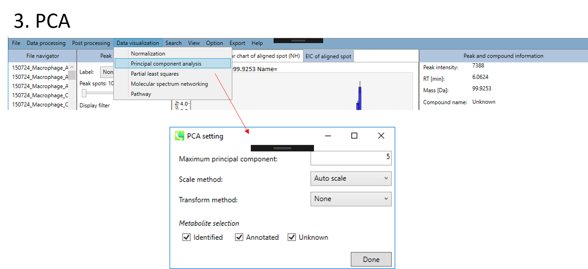

*	解析する代謝物データセットを、"Identified"、 "Annotated"、 "Unknown"の中から選択できます。
*	最後に"Done"ボタンをクリックします。

PCA結果の出力

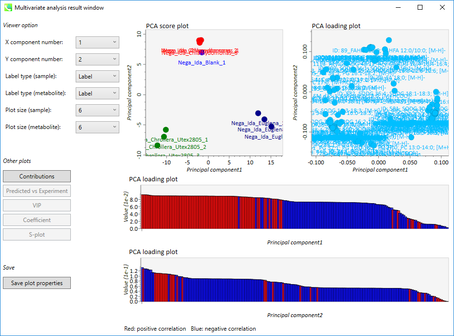

*	上段の左側の図: PCA score plot
*	上段の右側の図: PCA loading plot
*	下段の上側の図: 第一主成分の"PCA loading plot"（赤: 正の相関、 青: 負の相関)
*	下段の上側の図: 第二主成分の"PCA loading plot"（赤: 正の相関、 青: 負の相関)

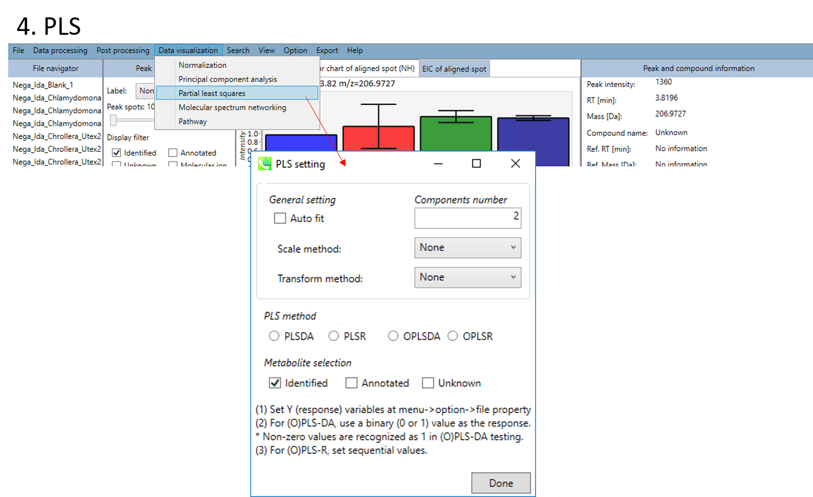

*	PLSあるいはOPLSを選びます（DA: 判別分析discriminant analysis、 R: 回帰分析regression analysis)。
*	解析する代謝物データセットを、"Identified"、 "Annotated"、 "Unknown"の中から選択できます。
*	最後に"Done"ボタンをクリックします。

**!** PLS解析の前に行うファイル設定について
1. Y (応答) 変数を設定する：menu -> option -> file property
2. (O)PLS-DAでは、応答変数としてバイナリー値（0か1）を使ってください。0以外の値は1として解析されます。
3. (O)PLS-Rでは、応答変数として連続変数を設定してください。

PLS結果の出力

*	上段の左側の図: PLS score plot
*	上段の右側の図: PLS loading plot
*	下段の上側の図: 第一主成分の"PLS loading plot"（赤: 正の相関、 青: 負の相関)
*	下段の上側の図: 第一主成分の"PLS loading plot"（赤: 正の相関、 青: 負の相関)

### セクション5-6
### エクスポート  
A)	ピークリストの出力  
B)	アライメント結果の出力  
C)	コンテキストメニューの表示  

A)	*Peak list export*: 保持時間、*m/z*、 MS/MSスペクトル情報などを含む各サンプルのピークリスト情報を取得できます。利用可能なフォーマットはMSP、MGFまたはテキストです。

ステップ1.	エクスポートする場所（フォルダー）を選択します（Directory）  
ステップ2.	エクスポートしたいファイルを右側のリストから選択します（Add->）  
ステップ3.	エクスポートするフォーマットを選択します（Export format）  
ステップ4.	"Export"ボタンをクリックします  

B)	*Alignment result export*: データマトリックスかスペクトル情報を取得できます  

ステップ1. エクスポートする場所（フォルダー）を選択します（Directory）  
ステップ2. エクスポートしたいアライメントファイルを選択します（File:）  
ステップ3. エクスポートしたいデータマトリックスかスペクトル情報を選択します  
ステップ4. 代表的なスペクトルをエクスポートする場合は、エクスポートするフォーマットを選択します（Export format）  
ステップ5. "Export"ボタンをクリックします  

### セクション5-7
### 保存  

**あなたのプロジェクトは、MDTファイルで管理されます。** データ処理を実行するたびにプロジェクトは自動的に保存されますが、手作業での同定結果の修正、内部標準の設定、ファイルまたはクラス情報の設定など、手動で変更した後のプロジェクトは保存されていません。そのため、変更を加えた後はこのオプションからプロジェクトを保存する必要があります。  

**データ処理で使用したパラメータはMEDフォーマットファイルとして保存することができます。** 保存したパラメータファイルをデータ処理に使用したい場合は、"Analysis paramater setting"の"Load"でMED形式ファイルを選択してください。  

 

### セクション5-8
### 開く  

データ処理を実行するたびにプロジェクトファイルは自動的にMTDファイルフォーマットとして保存されます。手動保存はセクション5-7で説明しています。**MTBファイルからプロジェクトを再開することができます。** ピーク同定結果を手作業で修正することを強くお勧めします。また、手作業でのアノテーションは、*Identification* メニューで設定できます。  

   
### セクション5-9
### オプション  

アライメントしたピークとファイルのプロパティを設定できます。 ファイルプロパティでは、ファイルタイプ、クラスID、または分析順序をリセットできます（ただし、ファイル名はリセットできません）。 "Included"のチェックボックスをオフにすると、対応するデータは統計分析に使用されなくなります。 アライメント・プロパティでは、アライメントした各ピークの内部標準情報を設定できます。 必ず "internal standard"欄に"alignment ID"を割り当ててください。  

   

### セクション5-10  
### "Identification"メニューでのマニュアル・アノテーション  

*Identification setting*: マニュアルで識別結果を修正することができます。 このオプションは、リファレンス・ライブラリに含まれていない内部標準を確認するのに役立ちます。  

   
### セクション5-11
### クロマトグラムのビュウア  

*Display total ion chromatogram*: 注目したサンプルのtotal ion chromatogramを見ることができます。  

*Display extracted ion chromatogram*: 注目したサンプルについて表示したいextracted ion chromatogramsを見ることができます。  

### セクション5-12
### MS-DIALのボタンとタブの説明  
#### セクション5-12-1
#### ディスプレイ・フィルター  

*Label*: MS-DIALの中央のウィンドウで、保持時間、正確な質量、代謝物名、アダクトイオン名、同位体イオンなどのピーク情報を確認できます。 以下に例を示します。

   
*Height filter*: このフィルターはピーク量をチェックするために使用されます。注目したサンプル中に存在する各ピークには、ピーク存在量に依存してランクが割り当てられます。  

*Display filter*   
1. "Identified"は、MS/MSスペクトラムを獲得できて同定されたピークのみ表示します。  
2. "Annotated"は、MS/MSスペクトラムを獲得できなかったが、同定されたピークのみ表示します。  
3. "Molecular ion"は、"de-isotoped molecular ions"のみ表示します。  
4. "MS/MS"は、MS/MSスペクトラムを獲得できたピークのみ表示します。  
5. "Unknown"は、同定できなかったピークのみ表示します。  

#### セクション5-12-2
#### MS-DIALのタブ

 

このビュウアーは、特にdata independent MS/MSやGC/MS解析のために用意されています。   
*Exp. vs. Ref.*: 上部のスペクトル（青または黒）は、MS/MSスペクトルのセントロイド情報を示します。 下のスペクトル(赤)は、リファレンスのMS / MSスペクトルを示します。 data independent MS/MSまたはGC/MS分析の場合、de-convoluted MS/MSスペクトルは アイコンをクリックして表示できます。

*MS2 Chrom.*: 中央のウィンドウの水色の四角形の中のMS/MSクロマトグラムが表示されます。GC/MS解析（名称：MS1 Chrom.）では、ビューアにはスカイブルーの長方形がなく、代わりにMS-DIALのアルゴリズムによってピーク幅が自動的に決定されます。  

 このアイコンは、加工前のEIか、DIA-MS/MSのクロマトグラムを表示します。  
 このアイコンは、de-convoluted EIか、DIA-MS/MSのクロマトグラムを表示します。  
 このアイコンは、加工前のEIとde-convoluted EIの両方か、DIA-MS/MSのクロマトグラムを表示します。  

   
*Raw vs. Purified.*: 上部と下部のウィンドウには、それぞれ加工前のEIとde-convoluted EIが表示されるか、DIA-MS/MSのスペクトルが表示されます。  

*Rep. vs. Ref.*: **alignment viewer** とともに、代表的なEIまたはMS/MSスペクトルとリファレンスのEIまたはMS/MSスペクトルを比較します。 注目したスポットにアライメントされたすべてのサンプルの中で、最も高い同定スコアを示したスペクトルが、代表的なEIまたはMS/MSとして自動的に選択されます。

  
 

### セクション5-13
### サーチ  
#### セクション5-13-1
#### MS/MSフラグメントの探索  
LC-MS/MSプロジェクトでは、ユーザー定義のプロダクトイオンおよび/またはニュートラルロスを含むプリカーサイオンを見つけるためのサーチ機能があります。この機能は、ピークスポットとアライメントスポットの両方の結果に適用できます。 サーチするタイプは「プロダクトイオン」または「ニュートラルロス」に設定できます。 以下は、硫酸塩(SO4-)を含むプリカーサイオンを見つけるために、プロダクトイオンとして96.9597 Daを使用して探索した例です。 結果は、MS-DIALのメインウィンドウの"unique ions"チェックボックスをクリックすると表示されます。  

  
 

#### セクション5-13-2
#### 異極性ピークリストの融合  
未知の分子に対するアダクトタイプの決定は、化合物同定のための重要なプロセスです。陽イオンと陰イオンの特徴を統合すると便利です。例えば、同じ保持時間領域で、陽イオンのデータで *m/z* 273.076、陰イオンのデータで *m/z* 271.061と表示される場合、2.015Daの違いによりアダクトタイプは[M+H]+と[M-H]-として決定できます。  

  

アダクトタイプの決定のために用いられる質量の違いの例  

したがって、MS-DIALはさまざまな極性ピークの機能を統合したユーティリティを提供します。 このデモでは、陰イオンモードのデータの特徴リストを使用して、陽イオンピークのアダクトタイプを決定します。   
1.	陰イオンモードのプロジェクトでは、"Export" -> "Peak list export"を選択します。  
2.	タブ区切りのテキスト形式で、ピークリスト（フューチャーリスト）を出力します。

3.	次に、タブ区切りのテキスト形式で、 *m/z* 値（最初の列）と保持時間を含むピークリストを作成します。この例では（例えば）、"12C-AT-Root-Neg ion features.txt"という名前で保存されています。  

  　　

4.	陽イオンモードデータとしてプロジェクトを開きます。理想的には、元サンプルは陰イオンモードで処理されるものと同じにするのが良いです。次に、 "Search" -> "Amalgamation of different polarity peak list"の順に進みます。 次に、陰イオンでのプロジェクトのイオンフィーチャー、つまり12 C-AT-Root-Neg ion features.txtを参照します。アダクトタイプの決定の際に参照されるアダクトタイプのペアを選択してください。ion feature amalgamatorが実行されると、異なる極性データの統合された結果が得られるでしょう。　　

### セクション5-14
### パスウェイマップ

1\. "Data visualization" -> "Pathway"  

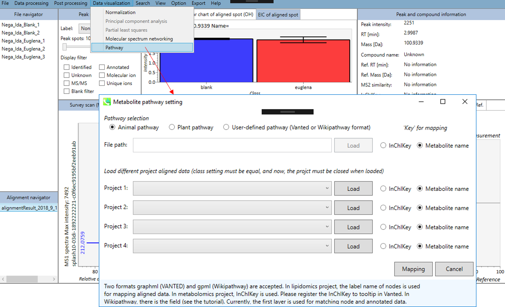

*	３タイプのパスウェイ（動物、植物、ユーザー定義のパスウェイ）のうち一つを選択できます(graphml (VANTED)とgpml (Wikipathway)の２つのフォーマットが利用できます)。リピドミクスのプロジェクトでは、ノードのラベル名が、アライメントデータのマッピングに使用されます。。 メタボロミクスのプロジェクトでは、InChIKeyが使用されます。 InChIKeyをVantedのツールチップに登録してください。 Wikipathwayには、フィールドがあります（チュートリアルを参照）。 現在、最初のレイヤーが、ノードとアノテートされたデータのマッチングに使用されています。
*	最大4つの異なるプロジェクトのアライメントされたデータを読み込むことができます（クラス設定は同じでなければならず、現在の仕様では、読み込む時にプロジェクトを閉じる必要があります）。
*	最後に、"Mapping"ボタンをクリックします。

2\. パスウェイマップが表示されます。

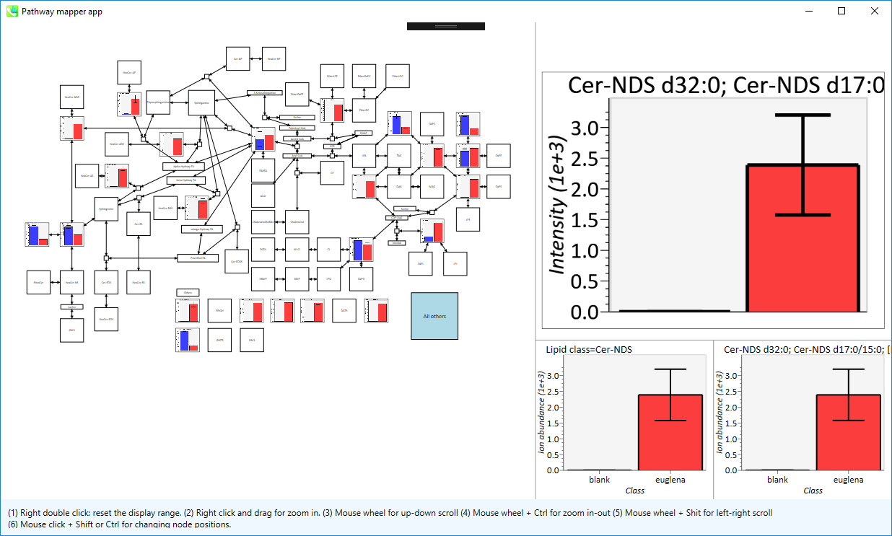
*	マウス右ダブルクリックは、表示範囲をリセットします
*	マウス右クリックでドラッグすると、ズームインします
*	マウスのホイールで、上下にスクロールします
*	マウスのホイール + Ctrlで、ズームイン・アウトします
*	マウスのホイール + Shiftで、左右にスクロールします
*	マウスの左クリック + Shift あるいは Ctrlで、ノードの位置が変えられます

## 第6章
## MS-DIALの他のユーティリティ  
### セクション6-1
### MS-FINDERへのリンク：アノテートできなかった化合物の探索  
MS-FINDERは、1）式の予測、2）フラグメントのアノテーション、3）未知化合物のMSおよびMS/MSスペクトルのスキャンによる構造解明が可能です。 MS-FINDERの詳細は<http://prime.psc.riken.jp/Metabolomics_Software/MS-FINDER/index.html>に書かれています. **MS-FINDERは、上記HPよりダウンロードして下さい**   
現在のMS-DIALプログラムでは、未知のクエリをMS-FINDERに投げることができます。 初めてMS-FINDERにクエリを投げようとすると、ポップアップウィンドウが表示されますので、ダイアログボックスから"MSFINDER.exe"を選択します。 さらに、MS-DIALはすべてのピークスポットまたはアライメントスポットを"MAT"フォーマットのファイルとしてエクスポートし、MS-FINDERにインポートすることができます（**検索リストにコンポーネントを追加する**）。

### セクション6-2
### MRMPROBSの紹介：DIA-MS あるいは GC/MSのデータセット
このセクションの目的は、SWATH-MSまたは他のDIA-MSデータを扱うときに、MS-DIALの代わりに"MRMPROBS"を利用することの利便性を紹介することです。もともとMRMPROBSは、トリプル四重極MSデータ（MRM（多重反応モニタリング）、SRM（選択反応モニタリング））を使用したターゲットメタボロミクス用に開発されました。MS-DIALと同様に、データのインポートから統計解析までのワークフロー全体をサポートします。 MS-DIALプログラムと比較して、MRMPROBSはターゲットメタボロミクス用に最適化されています：1）ユーザーはクロマトグラムのピークの左端と右端を手動でキュレートできます、2）ユーザーはターゲット化合物ごとに全サンプルのピークを同時に確認できます、3）ユーザーは同定結果を簡単にキュレーションできます。<http://prime.psc.riken.jp/Metabolomics_Software/MRMPROBS/index.html>  

&emsp;&emsp;&emsp;&emsp;MRMPROBSは現在、QqQ-MSデータだけでなくDIA-MSデータやGC/MSデータを扱うためのユニバーサルプログラムとして公開されています。 現在のMS-DIALプログラムは、常にサーベイスキャンMS1データによって化合物のピーク強度（高さ）とピーク面積を計算しますが、MRMPROBSは代謝物の定量にMS/MSのクロマトグラムを利用することができます。さらに、MS-DIALのようなノンターゲット解析のためのツールは、ピークピッキング、デコンボリューション、およびピークアラインメントのプロセスにおいて、どうしても偽陽性が出てきます。対照的にMRMPROBSでは、ユーザーはユーザーフレンドリーなグラフィカルユーザーインターフェースを使ってターゲット化合物を簡単に解析することができます。次の図では、MS-DIALからMRMPROBSへの"橋渡し"について説明しました。このワークフローはGC/MSデータにも利用できます。 MRMPROBSの仕様は、MRMPROBSプログラムのチュートリアルで詳しく解説されています。  
<http://prime.psc.riken.jp/Metabolomics_Software/MRMPROBS/index.html>  

MS-DIALからMRMPROBSへの"橋渡し"のワークフロー   

 

### セクション6-3
### 代謝物のアノテーションのための分子スペクトルネットワークの形成  
分子スペクトルネットワーキングは、GNPSおよびMS2LDAプロジェクトで使用されているように、未知の代謝物構造についての洞察を得るための有用なテクニックです。 これは、マススペクトルは代謝物サブファミリー（クラス）間で類似している（そして部分的に同じである）ということを前提としてます。さらに、アライメントしたイオンスポット間の代謝プロファイルの類似性も、サンプル間の生合成制御を知るための有用な情報です。 MS-DIALで分子スペクトルネットワーク解析を実行する方法はいくつかあります。検索結果をすばやく閲覧するには、FireFoxをデフォルトのHTMLビューアとして設定してください。  

A.	まず"Data visualization" -> "Molecular spectrum networking"に進んでください。次に、以下の設定を行ってください。"Alignment spots"を選択した場合、"alignment spot viewer"に表示されているアライメントスポットに対して解析が実行されます。 質量許容誤差[Da]は、MS/MSスペクトルの質量精度と同じにして下さい。 GC-MSプロジェクトでは、許容誤差は0.25 Daに設定する必要があります。類似性カットオフは、"Bonanza spectral clustering algorithm"のスコアに対して適用されます[Falkner、 J. A.、 Falkner、 J. W.、 Yocum、 A. K. & Andrews、 P. C. J. Proteome Res. 7、 4614–4622 (2008)]:アルゴリズムは、元のものから少し修正されたものであり、詳細は新しい論文が発表された後に解説されるでしょう。MS-DIALでは、スポット・ビュウアーで設定した保持時間のトレランスも提供している。  

B.	ネットワーク解析を実行する2番目の方法は、下図のように、MS-DIALの右パネルにあるネットワークボタンをクリックする方法になります。この方法は、注目したスポットにアライメントされたサンプルで、似たMS/MSスペクトルやメタボリック・プロファイルを持つその他のスポットを探すために実行されます。  

C.	 AおよびBで使用されているcytoscape.jsの制限により、MS-DIALではネットワーク解析で使用されるすべてのノードおよびエッジが表示されません。 フレキシブルグラフィカルユーザーインターフェースですべての情報を使用したい場合は、エクスポートオプションからノードファイルとエッジファイルをエクスポートしてください。エクスポートされた結果はcytoscapeプログラムによってインポートすることができます (<http://www.cytoscape.org/cy3.html>)。   

  
 

## 第7章
## MS-DIALの同位体追跡機能  

安定同位体を考慮したメタボロミクスは、栄養源の代謝回転を明らかにし、フラックスバランスを計算し、未知の分子の分子要素（CNOS）を決定するための優れたアプローチです。ここでは、植物に特化した代謝産物の包括的なアノテーション付けのために、非標識および完全13C標識シロイヌナズナサンプルのLC-MS/MSデータセットを使用したプロジェクトを示します。 本研究の目的は13C標識植物組織を用いて分子式の炭素元素数を決定することであった。 このデモに使用されるファイルは、<http://prime.psc.riken.jp/Metabolomics_Software/MS-DIAL/index.html>からダウンロードできます。   

  
 

### セクション7-1
### プロジェクトの立ち上げ  

1. File -> new project  
2. ABFファイルのあるディレクトリへのパスをセットして下さい  
3. "ionization type"は"soft ionization"を選択して下さい  
4. "data type"は"centroid data"を選択して下さい  
5. "ion mode"は"negative ion mode"を選択して下さい

   
### セクション7-2
### ABFファイルのインポート
1.	インポートするABFファイルを選んで下さい  
2.	"Class ID"は、このデモンストレーションでは"Non-labeled"と"Uniform-labeled"を選択して下さい  

注意: ここでファイル名を確定してください。後で変更することは出来ません。  

   
### セクション7-3
### パラメーターの設定  
#### セクション7-3-1
#### Data collectionタブ  

&#042; クイックスタートとその説明のため、上図のように"Param.med"をロードして下さい。  

*Data collection parameters*: 解析する範囲(RTとMS1軸)を設定できます。ここでは、それぞれ1.5-10.5と50-1500 Daと設定して下さい。  

*Centroid parameters*: ピーク検出アルゴリズムが非常に低い域値でMS軸に適用された後、ファイルがプロファイルデータである場合、MS-DIALはスペクトルセントロイドを実行します。 デフォルトでは、各ピークトップから±0.01と±0.025 Daの範囲のスペクトルが、それぞれMS1とMS2として統合されます。   

*Isotope recognition*: 小さい分子（2000 Da未満）の研究に限り、最大荷電数は2に設定できます。一方、プロテオームまたはsnRNA研究データを処理するためには、パラメータを8以上に変更することができます。

*Multithreading*: 使用するスレッド数を設定してください。 最大スレッド数はリソースモニターで確認できます。（タスクマネージャー->リソースモニター）。  
   
#### セクション7-3-2
#### Peak detectionタブとMS2Decタブ  

詳細は2章と3章で説明しています。 WatersとBruker QTOFでは、私が確認した限り、"minimum peak height"は300-500に設定することができます。 デモンストレーションフのァイルはWaters Xevo QTOFによって取得されたため、ここでは"minimum peak height"として300が設定されています。

#### セクション7-3-3
#### Identificationタブ  

*MSP file*: MSPファイルをここで指定して下さい (チュートリアルのデータ: **MSMS-AllPublic-Curated-Neg.msp**)   

*Parameters*: 通常、LC-MSプロジェクトではGC-MSとは異なり、保持時間に互換性はありません。 そのため、"Use retention information for scoring"というチェックボックスが最近用意されました。 チェックボックスがチェックされていない場合、保持時間のスコアは、同定のカットオフに使用される合計スコアの計算には使用されません。   

同位体追跡プロジェクトでは、"reference file"として設定されているラベルなしサンプルの同定結果が、アライメント結果に反映されていることを確認してください。   

#### セクション7-3-4
#### Adductタブ  

考慮すべきアダクトイオンと電荷値にチェックを入れることができます。植物に特有の代謝物のメタボローム解析を行う際は、ヘキソシル代謝物で検出されるイオン中に多くのインソースフラグメントイオンが見られるため、C6H10O4、 C6H10O5およびC6H8O6などのロスを追加しても良いでしょう。  

   
#### セクション7-3-5
#### Alignmentタブ

*Parameters*: 第2章と3章で詳しく説明しています。   

**Note:** 同位体追跡機能を使用する場合は、"non-labeled"の生物学的サンプルのうち一つを"reference file"として設定してください。
   
#### セクション7-3-6
#### Isotope trackingタブ　　  

同位体追跡機能を使用する場合は、"tracking of isotope labels"にチェックを入れてください。ラベルの付いた元素を選択します（このプロジェクトでは"13C"を選択します）。 現在のMS-DIALでは、どのピークをベースラインと見なすべきかを知るために、少なくとも1つの"non-labeled"なサンプルデータが必要です。   
&emsp;&emsp;&emsp;上記（右上）のようなターゲットの化学式のリストがある場合は、化学式（1列目）、*m/z*（2列目）、保持時間（3列目）、および付加タイプ（最後の列；オプション）を含むタブ区切りテキストファイルを作成します。 MS-DIALはまずライブラリを用いてnon-labeledの参照ファイルの代謝物を同定し、次に同位体の同定が行われます。   
&emsp;&emsp;&emsp;完全にラベルされたサンプルデータがある場合は、"set fully-labeled reference file"にチェックを入れて、完全にラベルされたサンプルデータのいずれかを選択します。 このデモでは、上記の設定に従ってください（ターゲットの化学式リストは用意されていません）。   

   
### セクション7-4
### 同位体追跡結果のキュレーション  
結果は以下で説明しているように確認できます。実用的には、同位体標識メタボロミクスのデータ解析には以下の手順をお勧めします。

1. データ解析の初回実行時には、ピークアラインメントを実行しない方が良いです。つまり、ピークスポッティングのみを行ってください。  
2. 次に、"non-labeled"のリファレンスファイルの同定結果をキュレーションしてく下さい。これは、同定結果がアライメント結果に反映されているためです。  
3. キュレーションが終了したら、"isotope tracking"を設定してピークアライメント機能を実行して下さい。   
4. 下記で説明されているように、アライメント結果のエクスポートで"Filtering by the result of isotope labeled tracking"をチェックしてください。もちろん、あなたがプログラマーで自分でフィルタリングを実行できるのであれば、チェックする必要はありません。  
5. さらに、アライメントスポットビューアのパネルを右クリックして、 "Search formula and structure" -> "Add components to search list"の順に進むと、決定された炭素元素数の情報を含むマットファイルが得られ、MS-FINDERで利用できます。  

  

  
 

## 第8章
## マルチプルコリジョン・エネルギーによる全イオンフラグメンテーションプロジェクト   
私たちは最近、複数のコリジョンエネルギー（0V、10V、40Vのシーケンシャルループなど）を使って全イオンアプローチ（MSE、全イオン、全イオンフラグメンテーションなど）から得られた、データに依存しないMS/MS取得データのための開発を始めました。ここでは、すでに発表されている酵母株からのLC/MS/MSデータセットを用いて、デモンストレーションを行います (Ohashi et al.、 2017、 DOI:10.1038/s41598-017-12392-6)。 このデモに使用されるabfファイルは、以下のリンクからダウンロードできます。   
<http://prime.psc.riken.jp/Metabolomics_Software/MS-DIAL/index.html>  

この章では合計7つのファイルを使用し、MSPファイルはこのデモの同じフォルダにあります。また、クイックスタート用にMS-DIALで使用されるパラメータファイル（Param.med）もこのフォルダに入っています。   

**Experiment summary:**  
**Samples:** このデモでは合計7つのファイルを使います:  
Blank2 - ブランク用のサンプル  
QC1、 QC2 - 酵母の複数の系統のサンプルを統合した品質管理用サンプル  
Sc1、 Sc2、 Sc3 - 酵母の野生系統のサンプル  
Sc4 -　酵母 *bna2* 系統

Naz et al 2017 (DOI: 10.1021/acs.analchem.7b00925)で書かれているようにデータは、dual AJS electrospray ionization sourceを備えた6550 iFunnel quadrupole time-of-flight (Q-TOF)質量分析装置を搭載した1290 Infinity II ultrahigh performance liquid chromatography (UHPLC)システム(Agilent Technologies)を使って得られた。  

**液体クロマトグラフィー:** ガードカラム(2.1 × 2 mm、 3.5 μm粒径)とインラインフィルターに連結されたHILIC SeQuant ZIC-HILIC (Merck、 Darmstadt、 ドイツ)カラム 100 Å (100 × 2.1 mm、 3.5 μm粒径) を用いて極性代謝物が分離されます。
陽イオン化モードでの試料分析では、0.1％ギ酸を含む水（溶媒Ａ）および0.1％ギ酸を含むアセトニトリル（溶媒Ｂ）を用いて行われました。使用した溶出勾配は以下の通りです：1.5分間95％Ｂ、12分間95〜40％Ｂ、2分間40％Ｂに維持し、次いで14.2分に25％Ｂまで減少させ、2.8分間維持し、その後、１分間かけて初期条件に戻し、次いでカラムを初期条件で７分間平衡化した。流速は0.3 mL/分であった。注入量は２μLであり、カラムオーブンは２５℃に維持した。  

**質量分析装置:** 窒素（純度>99.999%）をシースガスおよび乾燥ガスとして、それぞれ8および15L/分の流速で使用しています。乾燥およびシースガス温度は、ネブライザー圧力35 psigおよび電圧3000 Vで250 °Cに設定しています。フラグメンターの電圧は、380 Vに設定しています。高分解能フルスキャンが１回取得されるAIFモードで、質量範囲40−1200 *m/z* でデータが取得されています。これには、3回の交互衝突エネルギーでの3回の連続実験（0eVでの1回のフルスキャン、その後の10eVでの1回のMS/MSスキャン、その後の30eVでの1回のMS/MSスキャン）が含まれています。データ取得速度は６スキャン／秒でした。データはセントロイドモードで取得されています。		  

内部ロックマス混合物(Agilent Technologies)を、アセトニトリル：水 (19:1、 v/v)中に、最終濃度2μMプリン (C5H4N4) および2.5μM HP-0921 (C18H18O6N3P3F24)を加えて調製した。定質量補正のために内部ロックマス混合物を、アイソクラティックポンプを使いLC溶離液と共に、1 mL/分の流速(split 1:100)で絶えず注入した[陽イオンモード：プリン(*m/z* 121.0509)、 HP-0921 (*m/z* 922.0098)]。観察される質量精度は、分解能、潜在的な代謝物の共溶出、および同重体化合物に依存しますが、5 ppm未満の質量精度が期待されました。

   
### セクション8-1
### プロジェクトの立ち上げ  

1. File -> new project  
2. ABFファイルのあるディレクトリまでのパスをセットして下さい
3. "method type"として"All-ions with multiple CEs"を選択して下さい  
4. experiment fileを選択して下さい: **Experimental_Information_ForAIF.txt** (下図参照)  
5. "data type"として MS1 および MS/MSともに、"centroid data"を選択して下さい  
6. "positive ion mode"を選択して下さい  
7. "target omics"として"metabolomics"を選択して下さい  
   

  
Experimental_Information_ForAIF.txt (**タブ区切り** のファイル)  

**&#042; マルチプル衝突エネルギーデータを扱う場合は、以下の項目を含むディクショナリーファイル形式を使って下さい。** 最初の４列は、もともとのディクショナリーファイル（セクション1-4参照）と同じですが、以下の赤字で示した項目を5-7列目に追加して下さい;   
**ID:** 0から始まる実験ID  
**MS Type:** MS1のスキャンの場合"SCAN"として下さい  
**Start m/z:** *m/z* の最小値  
**End m/z:** *m/z* の最大値  
<b>Name:</b> ヴューアを表示する時のサイクル名  
<b>Collision Energy:</b> 衝突エネルギー  
<b>DecTarget:</b> 0あるいは1が入ります。デコンボリューションされたスペクトルを取得したいサイクルは、1と設定して下さい。少なくとも1サイクルで1と設定して下さい。

ディクショナリーファイルの一例  

### セクション8-2
### ABFファイルのインポート  

1. インポートするABFファイルを選択して下さい  
2. 適宜サンプル名を変えて、サンプルのタイプと"class ID"を設定して下さい  

**注意:** ここでファイル名を確定してください。後で変えることは出来ません。  

   
### セクション8-3
### パラメーターの設定  
#### セクション8-3-1
#### Data collectionタブ  

&#042; クイックスタートと以下の説明のために"Param.med"をロードして下さい	  

*Data collection parameters*: 分析範囲（RTおよびMS1軸）を設定できます。 このデモでは、予想されるデータ範囲は1.5〜15分と40〜1200 Daです。  
注意: クロマトグラムのピークは、このLC-MSデータの最初、つまり0〜1.5分間で非常に共溶出しています。 したがって、このデモでは、AIFデータのデコンボリューションが1.5〜15分間に適用されています。  

*Centroid parameters*: 非常に低い域値でMS軸に沿ってピーク検出アルゴリズムが適用された後、MS-DIALはスペクトルのセントロイド化を実行します。デフォルトでは、各ピークトップから±0.01および±0.01 Daの範囲の質量スペクトルがMS1およびMS2にそれぞれ統合されます。重要なことは、このMS2許容値が、特定の *m/z* トレースのMS/MSクロマトグラムを作成するためにも使用されます。MS/MSクロマトグラムは、MS2Decデコンボリューションプログラム専用です。  

#### セクション8-3-2
#### Peak detectionタブ  

*Peak detection parameters*: デフォルトでは、ピーク検出に線形加重移動平均が使用され、ピークの左端と右端が正確に決定されます。推奨される平滑化レベルは3です（以下の注を参照）。MS-DIALでは、ピークの幅と高さの最小値という2つのシンプルな域値を設定できます。これらの域値を下回るピークは無視されます（MS-DIALのアルゴリズムも参照してください<http://prime.psc.riken.jp/Metabolomics_Software/MS-DIAL/MS-DIAL%20FAQ-vs2.pdf>）。FT-ICRあるいはOrbitrapデータの場合、ピークの高さの最小値は50、000以上でしょう。  
**注:** 生データで平滑化のレベルを確認して下さい  
**注:** ピークの高さの最小値をノイズレベルより少なくとも2〜5倍高く設定することをお勧めします。そうしないと、データ分析に非常に長い時間がかかります。ノイズレベルを確認するには、たとえば、質量スペクトルのノンビジー領域で複数のスキャンを確認します。スキャン全体で一貫して検出されない小さなピークは、ノイズと見なすことができます。   

*Peak spotting parameters*: 質量スライスの幅はここで設定できます。経験から、Agilent Q-TOF、AB Sciex TripleTOF、およびThermo Q-Exactiveには0.1または0.05が適しています。カラムまたは溶媒から不要な *m/z* のピークが既にわかっている場合は、"Exclusion mass list"でそれらを指定できます。  

このデモでは、キャリブレーションに使った化合物、プリンとHP-921の *m/z* が、このリストにセットされています。   
Purine 121.0509 [M+H]+  
HP-921 922.0098 [M+H]+ and 923.0129 [M+H]+ isotope with 0.01 tolerance  

#### セクション8-3-3
#### MS2Decタブ  

"sigma window value"は、デコンボリューションの解像度に大きく影響されます。値を大きくすると（0.7-1.0）、ピークトップ分解能が低下します。つまり、分離されたピークの数が減少します。一方、低い値（0.1〜0.3）では、多くのノイズのクロマトグラムピークが認識される場合があります。  
さらに、MSノイズを減らすためにカットオフ値を設定してもよいです（第3章のセクション3-3を参照）。最後に、フォーカスされたプリカーサーイオンよりも高い *m/z* のプロダクトイオンを削除する場合は（メタボロミクスおよびリピドミクスで推奨）、"Exclude after precursor ion"にチェックを入れます。  

#### セクション8-3-4
#### Identificationタブ  

*MSP file*: MSPファイルをセットして下さい (このデモ: **AIF_tutorial_library.msp**). "lipidomics"プロジェクトを選択している場合、脂質プロファイリングのためにデータの中からどんな化合物を見つけたいのか選んで下さい。  

*MSP libary contains*  
トリプトファン、キヌレニン、キヌレン酸、3-ヒドロキシアントラニル酸、3-ヒドロキシキヌレニン、内部標準（MES、CHES、PIPES、HEPES）   
*Parameters*: MSPファイルに保持時間（RT）情報を入れる場合は、"Retention time tolerance"（デフォルトは0.5）を設定します。化合物検索にはMS1とMS2の2つの"mass tolerance"が必要であり、これらは使用した機器の性能に依存します。  
"identification score cut off"は、0.6または0.7より大きくする必要があります。  

*Text file*: "post identification"を実行したい場合は、テキストファイルをここに設定して下さい。   

*Parameters*: パラメーターの内容は、MSPに基づいた同定と同じです。  

#### セクション8-3-5
#### Adductタブ  
  

*Adduct ion setting*: 考慮したいアダクトイオンと、電荷の値にチェックを入れて下さい  
&#042; アダクトイオンを決める方法については、第３章のセクション3-5の説明を参照して下さい  

#### セクション8-3-6
#### Alignmentタブ  
  

*Parameters*: 適切なQCデータ（通常は混合サンプルデータ）が既にある場合は、"Reference file"でQCファイルを指定します。すべてのサンプルデータは、このQCファイルにアライメントされます。ピークアラインメントのRTおよびMS1の許容値は、クロマトグラフィー条件によって異なります（詳細については、MS-DIAL mathematicsを参照してください）。アライメントで確実に検出されない特定のピークを削除する場合は、"peak count filter"で指定します。多数のQCサンプルデータを準備できる場合は、"QC at least filter"ボックスにチェックマークを付けます。そうすると、QCサンプルのいずれかで検出されなければ、そのピークは削除されます。  

**注意:** 化合物の同定を実行すると、代表するスペクトルは、インポートされたファイルのうち、最も高い同定スコアを持つファイルから自動的に決定されます。 アライメントスポットがどのサンプルでも特定されない場合、インポートされたファイルで最もイオン量が多いサンプルのMS/MSスペクトルが、代表スペクトルとして割り当てられます。
 

### セクション8-4
### 結果のチェック  
  

MS-DIALは、保持時間、プリカーサー *m/z* 、同位体比、およびリファレンス・データベースとのMS/MSスペクトルの類似度計算により、代謝物ピークを自動的に識別することができます。 結果は，アライメントイオンスポットテーブルから簡単に確認できます。  

  

トリプトファンのイオン強度は、サンプル全体で安定しています。一方で、トリプトファンから合成されるキヌレニンの強度は、変異体サンプル（Bna2）では非常に低くなっています。詳細については、原著論文を参照してください(Ohashi et al.、 2017、 DOI:10.1038/s41598-017-12392-6)。MS-DIALのGUIの詳細については、第5章と第9章を参照してください。  
 

## 第9章
## AIFモードでのGUI  
  

プロジェクトのmethod typeとして，"All-ions with multiple CEs"を選択した場合，プロジェクトを開くと **AIF Viewer Controller** が起動します。コントローラーには現在、追加のビュウアーを立ち上げるための6つのボタンがついています。   

   
### セクション9-1
### Mass spectrum viewers（peak spot viewerとalignment viewer）  
  

これらのビューアは、異なるコリジョン・エネルギーを持つマススペクトルを並べて表示します。 peak viewerの **Mass Spectrum Viewer** には2つのタブがあります。 **Exp. vs. Ref.** タブのウィンドウ（**A**）には、デコンボリューションされたMS/MSスペクトル（青、上部）とリファレンスのMS/MSスペクトル（赤、下部）が表示されます。 **Raw. vs Dec.** タブのウィンドウ（**B**）では、上パネルと下パネルにそれぞれ生およびデコンボリューションされたMS/MSスペクトルが表示されます。 alignment viewerの **Mass Spectrum Viewer** では，デコンボリューションされたMS/MSスペクトル（青、上）とリファレンス（赤、下）が表示されます。

### セクション9-2
### peak viewerのMS/MSクロマトグラムヴューア  
  

ディコンボリューションの詳細は， **MS2 chromatogram** ヴューアに示されます。ウィンドウの上部および下部パネルには、それぞれ未処理およびデコンボリューションされたMS/MSクロマトグラムが表示されます。このビューアを使って，デコンボリューションのクオリティを確認してください。  

### セクション9-3
### ピーク同定結果のキュレーションのための化合物サーチ  
  

この機能は、メインビューアでの化合物サーチとほぼ同じです。第5章のセクション5-4を参照してください。"Import new Library"ボタンをクリックして、化合物ライブラリーを変更することができます。ライブラリファイルを変更した後、"confidence/unsettled"ボタンをクリックすることはできません。その場合は、ionテーブルを直接使用してアノテーションを変更してください。  
別のリファレンススペクトルを選択すると、マススペクトルビューアが変更されます（スコアとリファレンスMS/MSスペクトル）。この機能を使用するときは，その後で，"Mass Spectrum Viewer"も起動してください。

### セクション9-4
### 各サンプルをチェックするための"Aligned sample table"ビューア  
  

このビューアは、アライメントスポットのクロマトグラムピーク形状を含む各サンプルのピーク情報を表示します。"Peak ID"列の"-2"の値は、ピークピッキングプロセスでピークが検出されていないことを意味します。（ただし、ギャップフィリング法で計算されます）。ギャップが埋められたピークの場合、"Peak Int."および"Peak Area"列の色が明るい青になります。通常、色（赤）の違いはピーク強度またはピーク面積のレベルを反映しています。   
   
## 第10章
## LC-イオンモビリティ・プロジェクト

LC-イオンモビリティのプロジェクトについてのデモンストレーションです。  

このデモでは，下記リンクよりダウンロードできる"LC-Ion mobility tandem MS (PASEF) data set" を使用しています。   
<http://prime.psc.riken.jp/Metabolomics_Software/MS-DIAL/index.html>  

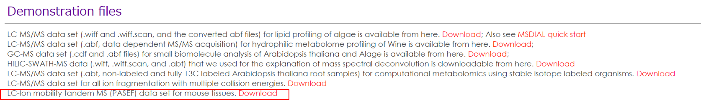  

**実験の概要:**  
液体クロマトグラフィー: 各サンプルにつき計30分間走らせる。Waters Acquity UPLC BEH peptide C18 column (50×2.1 mm; 1.7 μm)を使用。  
イオンモビリティー：データ依存性MS/MS解析（DDA）でイオンモビリティー（IM）の分離を行った（Bruker PASEF acquisition）
データ: 合計で10サンプルのLC-ESI(-)-IM-DDA-MS dataを使用しています（ブランク、 マウスの肝臓 (n=3)、 マウスの腎臓 (n=3)、 マウスの骨格筋 (n=3)）。

### セクション10-1
### IBFファイルへの変換

まず始めに、ベンダーごとのファイル形式を、IBFフォーマットに変換します。ファイルコンバーターは、MS-DIALのパッケージに含まれています。   

* Bruker: フィアルはそのままIBFフォーマットに変換できます。
* Waters: フィアルはそのままIBFフォーマットに変換できます。  
* Agilent: まずファイルを"ProteoWizard msconvert"で.mzMLフォーマットに変換してから、IBFフォーマットに変換して下さい。

1.	"IbfConverter.exe"を実行します   
2.	生データファイルをドラッグ＆ドロップで移します。  
3.	"Convert"をクリックして下さい。  
4.	IBFファイルは、生データファイルと同じフォルダに生成されます。 (**下図参照**)  

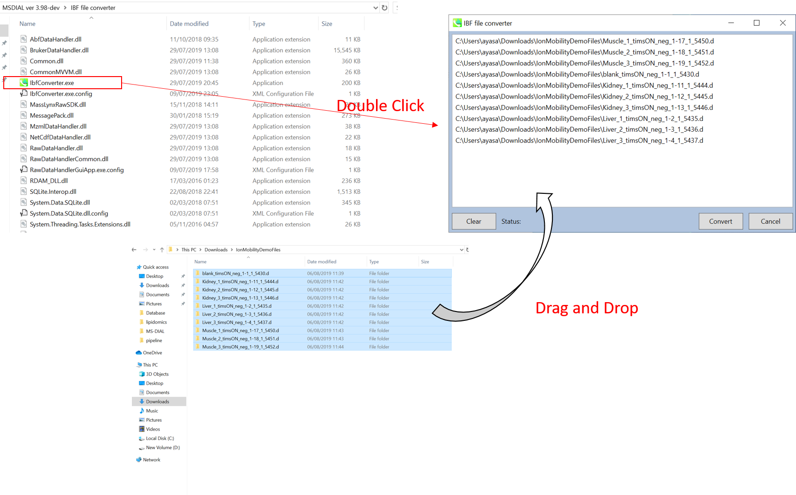   

### セクション10-2
### プロジェクトの立ち上げ  

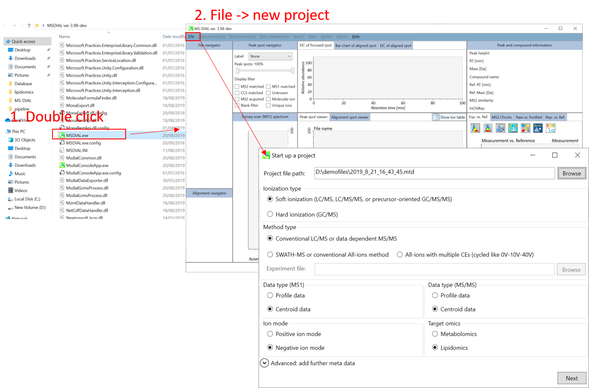

1. File -> new project  
2. "project file path"にIBFファイルの入っているフォルダまでの絶対パスを設定して下さい    
3. "data type"として"centroid data"を選択して下さい（MS1とMS/MSとも）  
4. "negative ion mode"を選んで下さい  
5. "target omics"として"lipidomics"を選択して下さい  

### セクション10-3
### IBFファイルのインポート  

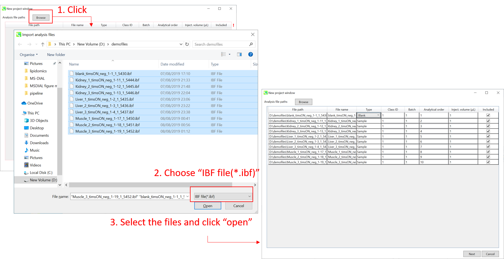  

1.	選択するファイル形式として"IBF file(&lowast;.ibf)'を選択してから、解析するファイルを開いて下さい  
2.	もしファイルが"blank"か"quality control (QC)"サンプルであるのなら、そのように"type"のプルダウンメニューで指定して下さい。(このデモでは、QCサンプルはありません)  

注意: ファイル名は、後で変更することはできないため、ここで名前を確定してください。  

### セクション10-4
### パラメーターの設定  

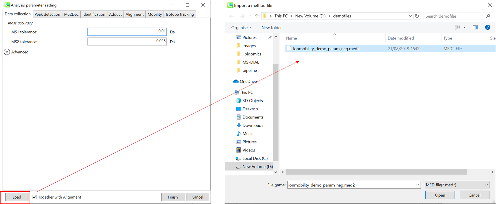  

&lowast; すぐに解析が始められるように，"ionmobility_demo_param_neg.med2"をロードして下さい（下記の説明においても使用しています）。  

#### セクション10-4-1
#### Data collectionタブ  

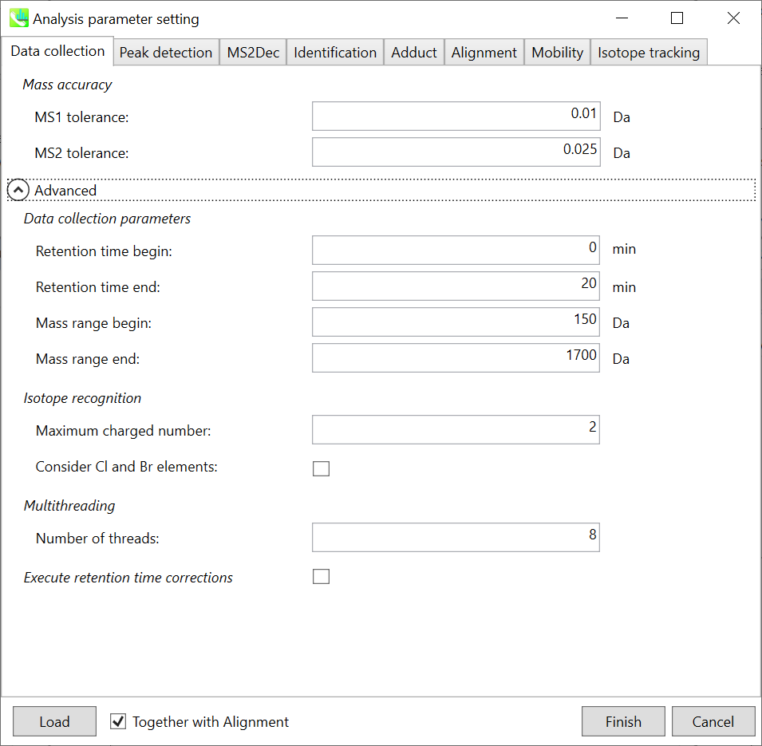   

*Data collection parameters*: 解析幅を設定できます(RT軸とMS1軸). ここでは0-20分と150-1700 Daと設定します。  

*Isotope recognition*: 小さな分子（2000 Da未満）に焦点を合わせている限り、最大荷電数は2に設定できます。一方、プロテオームまたはsnRNAデータを処理する場合は、パラメータを8以上に変更することができます。

*Multithreading*: 使用するスレッド数を設定してください。 最大スレッド数はリソースモニタで確認できます。（タスクマネージャ->リソースモニタ）。  

#### セクション10-4-2
#### Peak detectionタブとMS2Decタブ  

   

詳細については、第2章と第3章で説明しています。 WatersとBruker QTOFでは、確認した限り、"minimum peak height"の値は300〜500に設定できます。 ここでは、デモファイルがWaters Xevo QTOFによって取得されたため、"minimum peak height"として500が設定されています。  
MS2Decタブは主にデータ非依存性MS/MS解析（DIA）のために使用します。詳細についてはセクション2-3-3を見て下さい。  

#### セクション10-4-3
#### Identificationタブ  

   

*MSP file*: "lipidomics"を解析している場合，どの脂質を同定したいのか選択してください。ここでは全ての脂質にチェックを入れます。

*Parameters*: MSPファイルに保持時間（RT）情報を含める場合は、RT許容値（retention time tolerance）を設定して下さい（デフォルトは0.5）。化合物の同定には、MS1とMS2の2つの"accurate mass tolerance"の指定が必要です。偽陽性を避けるために、"identification score cut off"値は0.7または0.8より大きくなければなりません。  
"Use retention information for scoring"にチェックを入れると、トータルスコアの計算にRTスコアがつかわれてます。"Use retention information for filtering"にチェックを入れると、化合物の同定はRT許容値内で行われます。

*Text file*: "post identification"処理を行いたい場合は、ここでテキストファイルを指定して下さい。

#### セクション10-4-4
#### Adductタブ  

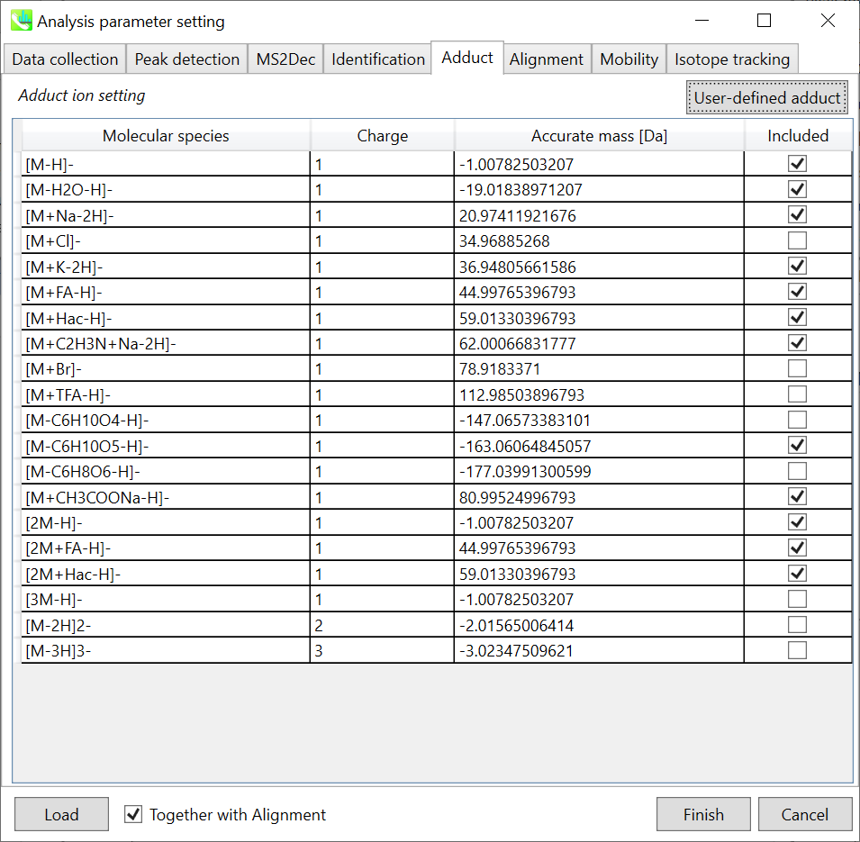   

*Adduct ion setting*: 考慮したいアダクトイオンと電荷値を選択できます  
&#042; どのようにして付加イオンを決定すれば良いかの説明は、セクション3-3-5見て下さい。  

#### セクション10-4-5
#### Alignmentタブ  

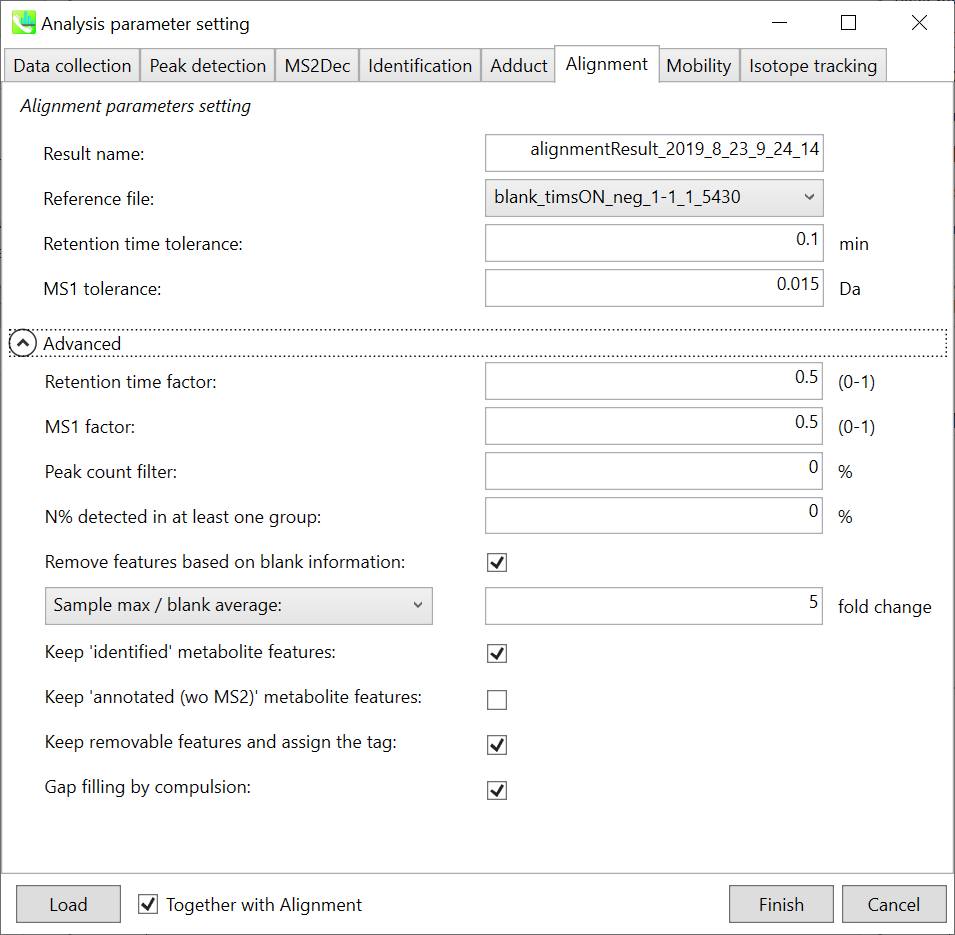   

*Parameters*: 適切なQCデータ（通常は混合サンプルデータ）が既にある場合は、"Reference file"でQCファイルを指定します。すべてのサンプルデータは、このQCファイルにアライメントされます。ピークアラインメントのRTおよびMS1の許容値は、クロマトグラフィー条件によって異なります（詳細については、MS-DIAL mathematicsを参照してください）。アライメントで確実に検出されない特定のピークを削除する場合は、"peak count filter"で指定します。

#### セクション10-4-6
#### Mobilityタブ  

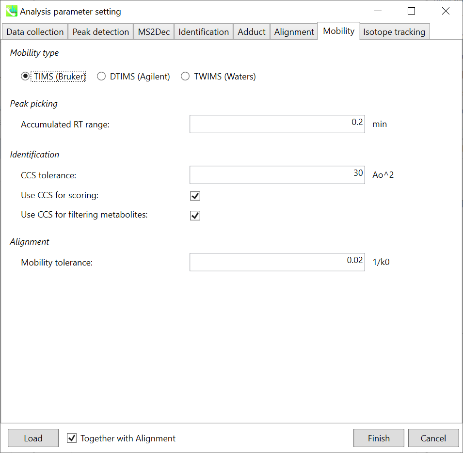   

*Mobility type*: 使用した機器を選択して下さい。機器によって、"mobility tolerance"の単位が違ってきます。

*Peak picking*: "Accumulated RT range"パラメーターは、モビリティ軸スペクトルを累積するために使用されます。RT軸でピークピッキングが実行された後、プログラムはイオンをモビリティ軸に拡張します。RT軸のピークトップが5.0分で、0.2分が "Accumulated RT range"として設定されている場合、4.8分から5.2分までのモビリティースキャンデータが蓄積されます。 次に、抽出されたイオンモビログラム（extracted ion mobilogram; EIM）は、累積されたモビリティスペクトルと、それに続くモビリティ軸でのピッキングピークによって構築されます。  

*Identification*: "Use CCS for scoring"のチェックボックスがオンの場合、CCSのスコアがトータルスコアの計算に使用されます。"Use CCS for filtering metabolites"のチェックボックスがオンの場合、化合物の同定はCCS許容値内で行われます。

### セクション10-5
### 結果のチェック  

MS-DIALは、保持時間、プリカーサーの *m/z* 、同位体比、およびリファレンスデータベースとのMS/MSスペクトルの類似度計算により、代謝物ピークを自動的に同定できます。アライメントイオンスポットテーブルから簡単に結果を確認できます。   

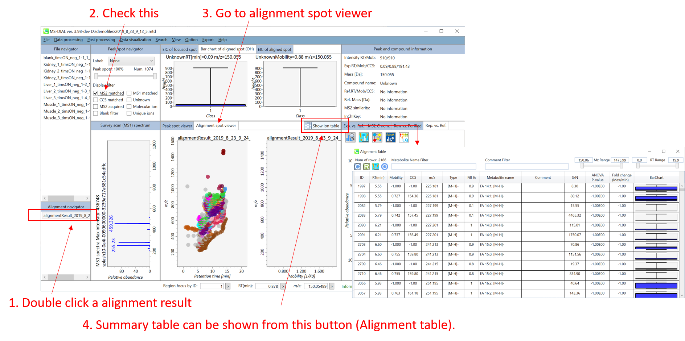

中央のウィンドウ (**Peak spot viewer**): 保持時間とモビリティの両方の次元で代謝物のピークを確認できます。ここでは、RT軸とモビリティ軸のピークをそれぞれ"RTピーク"と"IMピーク"と呼びます。 イオンモビリティーデータでは、MS/MSスペクトルが常にIMピークに割り当てられていることに注意してください。したがって、IMピークのプロパティに対してアノテーションがつきます。つまり、1つのRTピークにはいくつかのIMピークがあり、RTピークのアノテーション結果は、アノテーションのスコアが最も高い代表的なIMピークの結果によって決まります。   

**Alignment table**: IMピークの行には、モビリティとCCSプロパティの情報が含まれていますが、RTピークのプロパティは"-1"となっています。
