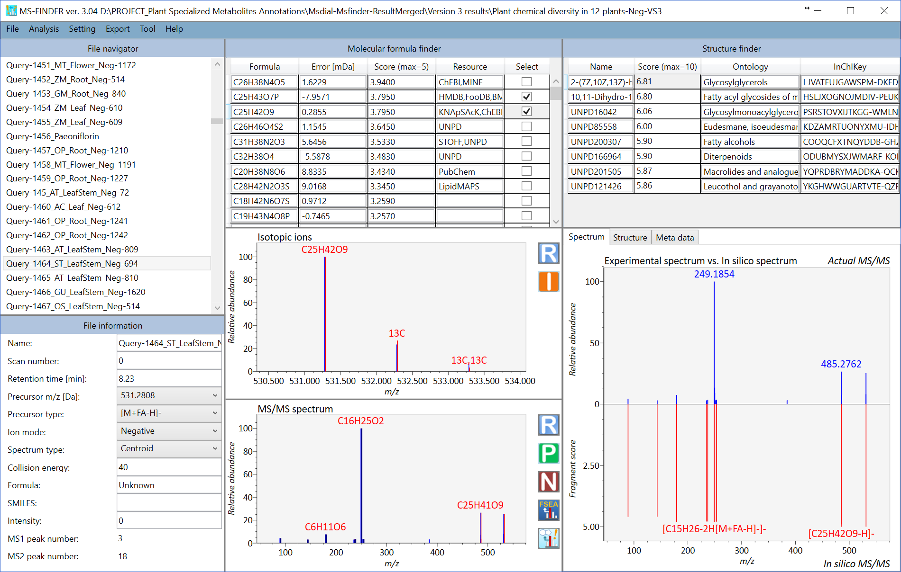

<link rel="stylesheet" href="/css/style.css">

# MS-FINDER tutorial  

Last edited in Sep. 10, 2018  

## Abstract  
The purpose of metabolomics is to perform the ‘comprehensive’ analysis for small biomolecules of living organisms. Gas chromatography coupled with electron ionization mass spectrometer (GC/MS) and liquid chromatography coupled with electrospray ionization- (ESI-) tandem mass spectrometer (LC/MS/MS) are the preferred tools for untargeted metabolomics. Currently, the main bottleneck of GC/MS- and LC/MS/MS based untargeted analysis is compound identification due to the limitation of EI-MS and MS/MS records of authentic standard.   
&emsp;&emsp;&emsp;&emsp;MS-FINDER was launched as a universal program for compound ‘annotation’ that supports EI-MS (GC/MS) and MS/MS spectral mining. First, MS-FINDER aims to provide solutions for 1) formula predictions, 2) fragment annotations, and 3) structure elucidations by means of unknown spectra. In addition, the program can annotate your unknowns by the public spectral databases such as MassBank, LipidBlast, and GNPS. MS-FINDER has been developed as the collaborative work between Prof. Masanori Arita team (RIKEN, Reifycs Inc.) and Prof. Oliver Fiehn team (UC Davis) supported by the JST/NSF SICORP ‘Metabolomics for the low carbon society’ project.  

Hiroshi Tsugawa  
RIKEN Center for Sustainable Resource Science 
hiroshi.tsugawa@riken.jp  

 

MS-FINDER screenshot  
 

## Table of contents  
[Section 1: Software environments](#section-1)  
[Section 2: Required programs](#section-2)  
[Section 3: Acceptable ASCII formats](#section-3)  
&emsp;[Section 3-1: MSP format for MS/MS](#section-3-1)  
&emsp;[Section 3-2: MSP format for EI-MS](#section-3-2)  
&emsp;[Section 3-3: MAT format](#section-3-3)  
&emsp;[Section 3-4: Adduct ion format: [M+Na]+, [M+2H]2+, [M-2H2O+H]+, [2M+FA-H]-, etc.](#section-3-4)  
User defined structure database format&emsp;&emsp;&emsp;&emsp;11  
Specific field to fix the formula element count&emsp;&emsp;&emsp;&emsp;12  
Import queries&emsp;&emsp;&emsp;&emsp;13  
A. From a folder which includes MSP or MAT format files&emsp;&emsp;&emsp;&emsp;13  
B. From the graphical user interface of the MS-FINDER program&emsp;&emsp;&emsp;&emsp;14  
C. From the MS-DIAL program&emsp;&emsp;&emsp;&emsp;15  
Parameter setting&emsp;&emsp;&emsp;&emsp;16  
Method tab&emsp;&emsp;&emsp;&emsp;16  
Mass spectrum tab&emsp;&emsp;&emsp;&emsp;17  
Formula finder tab&emsp;&emsp;&emsp;&emsp;18  
Structure finder tab&emsp;&emsp;&emsp;&emsp;19  
Data source tab&emsp;&emsp;&emsp;&emsp;21  
Compound annotation by in silico fragmenter&emsp;&emsp;&emsp;&emsp;22  
Compound annotation by searching spectral databases&emsp;&emsp;&emsp;&emsp;24  
FSEA: fragment set enrichment analysis&emsp;&emsp;&emsp;&emsp;25  
Compound annotation (batch analysis)&emsp;&emsp;&emsp;&emsp;28  
Peak assignment (single)&emsp;&emsp;&emsp;&emsp;29  
Peak assignment (batch job)&emsp;&emsp;&emsp;&emsp;30  
Molecular spectrum networking&emsp;&emsp;&emsp;&emsp;31  
Mouse function&emsp;&emsp;&emsp;&emsp;33  
Export&emsp;&emsp;&emsp;&emsp;34  
Help&emsp;&emsp;&emsp;&emsp;35  

   
Software environments  
&emsp;&emsp;&emsp;&emsp;Windows OS (.NET Framework 4.5 or later): Windows 7 or later  
&emsp;&emsp;&emsp;&emsp;RAM: 8.0 GB or more  

   
Required programs  
&emsp;&emsp;&emsp;&emsp;MS-FINDER  
Download link: http://prime.psc.riken.jp/Metabolomics_Software/MS-FINDER/index.html  

&emsp;&emsp;&emsp;&emsp;MS-FINDER can be used as the local software program in Windows PC. The program can import ASCII format files including MSP (EI-MS and MS/MS) or improved MSP (both MS and MS/MS, the file extension must be MAT.). In addition, the users can directly make the query in the MS-FINDER graphical user interface. Moreover, this program can be called from the MS-DIAL program which is downloadable at http://prime.psc.riken.jp/Metabolomics_Software/MS-DIAL/index.html.  

   
Acceptable ASCII formats  
This program accepts two file extensions, i.e. MSP or MAT formatted by the following explanations. Unknown queries should be separately stored in the ASCII file: the MSP or MAP file ‘CANNOT’ store multi compound records in the single file.   

The format of MSP basically follows the NIST MS search manual.   
Link: http://www.nist.gov/srd/upload/NIST1a11Ver2-0Man.pdf  

   
MSP format for MS/MS  
Required fields  
&emsp;&emsp;&emsp;&emsp;NAME:  
&emsp;&emsp;&emsp;&emsp;PRECURSORMZ:  
&emsp;&emsp;&emsp;&emsp;PRECURSORTYPE:  
&emsp;&emsp;&emsp;&emsp;IONMODE: (Positive or Negative)  
&emsp;&emsp;&emsp;&emsp;Num Peaks:  
&emsp;&emsp;&emsp;&emsp;*m/z* intensity pair (tab, comma, space can be used as the delimiter.)  

&emsp;&emsp;&emsp;&emsp;Mass spectrum is supposed to be imported as MS/MS.  
&emsp;&emsp;&emsp;&emsp;If you want to perform the MS/MS peak annotation with the known structure, prepare two fields including FORMULA and SMILES. Please note that the formula and SMILES of the neutralized structure should be prepared.  

MSP example  

   
MSP format for EI-MS  
Required fields  
&emsp;&emsp;&emsp;&emsp;NAME:  
&emsp;&emsp;&emsp;&emsp;IONMODE: (Positive or Negative)  
&emsp;&emsp;&emsp;&emsp;Num Peaks:  
&emsp;&emsp;&emsp;&emsp;*m/z* intensity pair (tab, comma, space can be used as the delimiter.)  

The fields are the minimum requirement for searching spectral databases. In the case that you want to perform formula predictions and structure elucidations in EI-MS data, two files ‘PRECURSORMZ:’ and ‘PRECURSORTYPE:’ must be required.   

   
MAT format  
The MAT format was defined as the improved version of MSP in the MS-FIDNER program to store both MS1 and MS/MS spectra in the same file. The survey scan MS data should be required to calculate ‘isotopic ion score’ for formula predictions. Importantly, for EI-MS spectra, put your spectra into both MS1- and MS2 fields for the calculation of isotopic ratio and fragment ion similarities, respectively.  

Required fields  
&emsp;&emsp;&emsp;&emsp;NAME:  
&emsp;&emsp;&emsp;&emsp;PRECURSORMZ:  
&emsp;&emsp;&emsp;&emsp;PRECURSORTYPE:  
&emsp;&emsp;&emsp;&emsp;IONMODE:  
&emsp;&emsp;&emsp;&emsp;MSTYPE:  
&emsp;&emsp;&emsp;&emsp;Num Peaks:  
&emsp;&emsp;&emsp;&emsp;*m/z* intensity pair (tab, comma, space can be used as the delimiter.)  

&emsp;&emsp;&emsp;&emsp;Three fields including MSTYPE, Num Peaks, and *m/z* intensity pair should be SERIALLY stored.  

&emsp;&emsp;&emsp;&emsp;If you type ‘MSTYPE: MS1’, the spectrum written from next field should be recognized as the survey scan MS (MS1). If you type ‘MSTYPE: MS2’, next spectrum should be recognized as the MS/MS spectrum.   

&emsp;&emsp;&emsp;&emsp;EI-MS spectra must be stored in both MS1 and MS2, which is the requirement of MS-FINDER.  

&emsp;&emsp;&emsp;&emsp;Both field (MSTYPE: MS1 and MSTYPE: MS2) is not necessary for this program, i.e. the users can import the ASCII file as only MS1 spectrum or as only MS/MS spectrum record.   

&emsp;&emsp;&emsp;&emsp;Users may prepare the MAT or MSP files without any spectrum record. In such case, the formula prediction will be performed by means of mass accuracy and database criteria.  

&emsp;&emsp;&emsp;&emsp;If you want to perform the MS/MS peak annotation with the known structure, prepare two fields including FORMULA and SMILES. The formula and SMILES of the neutralized structure should be made.  

   
MAT example  

### Section 3-4   
### Adduct ion format: [M+Na]+, [M+2H]2+, [M-2H2O+H]+, [2M+FA-H]-, etc.  
1.&emsp;&emsp;&emsp;&emsp;The parentheses ‘[’ and ‘]’ must be used to bracket the ion information.  
2.&emsp;&emsp;&emsp;&emsp;The char + and - must be required after ']' and the number must be written before + or -.  
3.&emsp;&emsp;&emsp;&emsp;When you want to define the organic formula like C6H12O5, you have to write it without any replicate elements or parentheses. For example, the descriptions like [M+C2H5COOH-H]- or [M+H+(CH3)3SiOH]+ are not accepted.  
4.&emsp;&emsp;&emsp;&emsp;The beginning figure of organic formula like '2'H2O is recognized as the H2O × 2. Again, never use 2(H2O) for that.  
5.&emsp;&emsp;&emsp;&emsp;Sequential equations are acceptable: [2M+H-C6H12O5+Na]2+ (very apt.)  
6.&emsp;&emsp;&emsp;&emsp;Radical ion can be described by ‘.(dot)’ after + or – like [M]+. And [M-CH3]+. as adduct format.  
7.&emsp;&emsp;&emsp;&emsp;MS-FINDER accepts some abbreviations or common organic formulas for adduct types as follows.  
For Acetonitrile: ACN, CH3CN  
For Methanol: CH3OH  
For Isopropanol: IsoProp, C3H7OH  
For Dimethyl sulfoxide: DMSO  
For Formic acid: FA, HCOOH  
For Acetic acid: Hac, CH3COOH  
For Trifluoroacetic acid: TFA, CFCOOH  
   
User defined structure database format  
MS-FINDER supports the structure elucidations from the candidates that users provide. The following format file should be prepared as tab-delimited text file. The identifiers of InChIKey, short InChIKey, and database ID are not required, but the values must be filled by some mimic values. The files of exact mass, formula, and SMILES must be prepared.   

   
Specific field to fix the formula element count  
MS-FINDER recently accepts the filtering field for molecular formula prediction. For example, if you can perform fully labeled stable isotope experiment, the element count for CHNOS can be determined by checking the mass shift between non-labeled and labeled sample data. The fields described in the below figure can be written in MSP and MAT files.  

   
Import queries  
There are two ways to import unknown queries.   

A. From a folder which includes MSP or MAT format files  
1. File -> import  
2. Select a folder containing MSP or MAT files.  

   
B. From the graphical user interface of the MS-FINDER program  
1. File -> Create a query  
2. Fill in the form to make a query.  

Required files  
&emsp;&emsp;&emsp;&emsp;Folder path  
&emsp;&emsp;&emsp;&emsp;File name  
&emsp;&emsp;&emsp;&emsp;Precursor *m/z*  

   
C. From the MS-DIAL program  
The MS-DIAL program which has been reported as software for data processing of LC/MS/MS can call the MS-FINDER program directly. On the first time when you call the MS-FINDER program at MS-DIAL, please select the file path of MS-FINDER via GUI.  
    
Parameter setting  
Method tab  

MS-FINDER provides two options for compound annotation: one is by spectral databases, and the other is by formula- and structure finder programs using in silico fragmenter. You can simultaneously check both ‘spectral database search’ and ‘formula prediction and structure elucidation by in silico fragmenter’ options, and the result of spectral database search has priority for ranking structures.  
&emsp;&emsp;&emsp;&emsp;The ‘internal experimental library’ is stored in ‘EIMS-DBs-vs&#042;.egm’ and ‘MSMS-DBs-vs&#042;.etm’ of Resources folder as NIST MSP format. If ‘Formula finder > TMS-MeOX derivative compound’ is checked, EIMS database will be used; otherwise, MSMS database is used. The ‘in silico library for lipids (LipidBlast)’ is stored in ‘MSDIAL-LipidDBs-vs&#042;.lbm’ of Resources folder. Select the appropriate solvent condition for searching your unknowns. The user-defined spectral database must be formatted by NIST MSP.  
&emsp;&emsp;&emsp;&emsp;If ‘Precursor oriented spectral search’ is checked, the structure candidates will be filtered out by the precursor *m/z* of spectral records in combination with MS1 tolerance value; otherwise, all of spectral records will be used. Uncheck this option if you want to search EI spectral databases.  
   
Mass spectrum tab  

Mass tolerance (MS1): the mass tolerance to generate formula candidates.  

Mass tolerance (MS/MS): the mass tolerance for matching experimental- and reference fragments.  

Relative abundance cut off: The product ions more than this parameter on the basis of base peak ion are utilized for the product ion matching.   

&#042;For EI-MS spectra, set the same tolerance into MS1 and MS2.  

   
Formula finder tab  

Formula calculation setting: You can set the parameters for formula calculation.   

LOWIS and SENIOR check: to generate formula candidates that match the valence rules of formula elements. The valences of hetero atoms, i.e. N, O, S, and P are currently set to 3, 2, 6, and 5, respectively.   

Isotopic ratio tolerance: to calculate the isotopic score. The tolerance should be utilized as the sigma value for the Gaussian scoring as described in the MS-FINDER paper.   

Element ratio check: to generate formula candidates that satisfy every element ratios (ex. H/C ratio should be between 0 and 3.33 for ‘Common range (99.7%)’ restriction. ) as described in the MS-FINDER paper.   

Element probability check: to generate formula candidates that satisfy the heuristic rules as described in the Seven Golden Rules paper. For example, if a formula candidate contains the following element counts, i.e. NOPS all > 1, the element counts of N, O, P, and S should be less than 9, 19, 3, and 2, respectively.   

Element selection: to generate formula candidates that just contain the elements selected by the users. Check ‘TMS-MEOX derivative compound’ if you want to annotate EI-MS spectra.  

Result cut off: formula candidates ranked by the MS-FINDER program will be reported within up to this number.  
Structure finder tab  

Here is the parameter setting for in silico fragmenter.   

Tree depth: the limitation of in silico cleavages, i.e. if the user sets ‘2’, the MS-FINDER program generates the fragments until product ions of a product ion.  

The current MS-FINDER program can utilize the fragment ion library for EI-MS spectral mining which is stored in ‘&#042;.eif’ (recommended to use).   

Result cut off: structure candidates ranked by the MS-FINDER program will be reported within up to this number.  

XLogP based RT prediction and cut off setting for structure elucidation  
Recently, MS-FINDER provides a simple RT prediction function using XLogP calculated by CDK. If you prepare the tab-delimited text format file containing (first column) metabolite name, (second column) retention time (min), and (third column) SMILES code as described below, the predicted retention time is calculated for searching structure candidates.  

Retention time setting for spectral searching  
This function is for spectral searching. If your MSP or MAT files contain the retention time or retention index information, you can use the RT or RI filtering by means of this checkbox.   

   
Data source tab  

Local databases: currently, total 14 metabolome databases are prepared in the MS-FINDER program which is stored in ‘&#042;.esd’. The local databases selected by users will be used to retrieve the structure data. Please see ‘user defined database format’ section for searching your own structure candidates.  

MINEs (Metabolic In silico Network Expansions) and PubChem online settings:  
&emsp;&emsp;&emsp;&emsp;If the user selects ‘Never use it’, the structure candidates will be picked up just from the local databases.   
&emsp;&emsp;&emsp;&emsp;If ‘only use when there is no query in the below DBs’ is selected, the structure data of MINE and PubChem compound databases will be retrieved when no structures can be found in the local databases.   
&emsp;&emsp;&emsp;&emsp;If ‘always use it.’ is selected, the MS-FINDER program always retrieve the structure data from MINE and PubChem databases in addition to local databases.   
   
Compound annotation by in silico fragmenter  
The general workflow of MS-FINDER is described here. (Batch analysis is shown below)  
1.&emsp;&emsp;&emsp;&emsp;The formula prediction is executed by double click at the title name of ‘File navigator’. The detail of formula calculations is described in our paper. &#042;The point of formula prediction is to correctly select the precursor type (adduct ion) and to set parameters for picking up the correct formulas.   

A)&emsp;&emsp;&emsp;&emsp;The formula candidate checked in ‘Select’ column is supposed to be examined at structure finder program.  
B)&emsp;&emsp;&emsp;&emsp;The isotopic ions will be displayed by ‘I’ button at the upper mass spectrum window.  
C)&emsp;&emsp;&emsp;&emsp;The result of formula assignment in product ions will be displayed by ‘P’ button at the bottom spectrum window.  
D)&emsp;&emsp;&emsp;&emsp;The annotation result of neutral losses will be displayed by ‘N’ button at bottom window.  
2.&emsp;&emsp;&emsp;&emsp;The structure finder will be executed by right click at the formula result table followed by clicking ‘Search the structure’.  

A)&emsp;&emsp;&emsp;&emsp;The formula candidate checked in ‘Select’ column is supposed to be examined at structure finder program.  
B)&emsp;&emsp;&emsp;&emsp;Total score of structure finder is the total of formula- and structure scores. Therefore, even if a formula score is greater than the others, the other structure from another formula candidate may become the top candidate in the structure finder program.   
C)&emsp;&emsp;&emsp;&emsp;The MS-FINDER program integrates the structures having the same molecular skeleton by its InChIKey (first 14 characters). Its representative structure will be determined by the number of synonymous in PubChem repository.   
Compound annotation by searching spectral databases  
It’s very simple. Double click the unknown record that you want to annotate. The below is the examples for searching EI-MS spectral database and LipidBlast database.  

   
FSEA: fragment set enrichment analysis  
This function recommends the ‘metabolite class’ for unknown MS/MS spectrum. The classification is performed in formula prediction process. Therefore, you can see the result once the formula candidates are generated. To check the result of FSEA (for example, for C20H18O10 as shown below), please click ‘FSEA’ button after the row of formula finder results is activated. Because the correct structure is ‘Kaempferol-3-O-arabinoside’, the second hit of recommended metabolite classes, i.e. Flavonol O-glycosides, is the correct metabolite class for this query: this is actually the current ‘accuracy’ of metabolite class recommendation, i.e. several candidates will be suggested with the information of estimated p-values. The p-value estimation can be executed by three different ‘decoy’ criteria.  

The challenging issue to use over-representation analysis (ORA) for metabolite class recommendation is how to determine the ‘non-significant’ peaks in the MS/MS spectrum set. Currently, there are three options to define the non-significant peaks. You can change the setting at ‘Setting’ -> ‘FSEA parameter setting’. If you choose ‘Low abundance ions’ with 5% relative abundance cut off, the ions having less than 5% relative abundances are recognized as ‘non-significant’ peaks. The result of FSEA is shown below: 29 metabolite classes are recommended with less than 1% estimated p-value.    

Moreover, if you choose the ‘reverse spectrum’, all of ‘significant’ peaks in the reverse spectrum is defined as ‘non-significant’ peaks. The reversed spectrum is created by mirroring the *m/z* nominal places with a 5-mass shift. For example, the *m/z* sequence [101.023, 305.035, 421.098, 634.201, 754.235] is changed to [106.023, 226.035, 439.098, 555.201, 759.235]. The FSEA result is shown below: 4 classes are recommended with 1% p-value cut off.  

As the third option (default), the non-significant peak is automatically calculated by undetected ontologies in the FSEA set (n = 459), i.e. the current knowledge-space of fragment ontologies. The FSEA result is shown below: 29 candidates are recommended.   
&emsp;&emsp;&emsp;&emsp;Generally, the option of ‘reverse spectrum’ is the most conservative method to reduce false positive recommendation for metabolite classes although the false negatives are increased in this option. In order to improve the accuracy of metabolite class recommendation, the program will be further updated in future.   

   
Compound annotation (batch analysis)  
1.&emsp;&emsp;&emsp;&emsp;Analysis -> Compound annotation (batch job)  

A)&emsp;&emsp;&emsp;&emsp;If you want to perform the batch job for both formula predictions and structure elucidations, please check ‘Both processes. Also, add the number in ‘Top N hits’ textbox where the formula candidates generated by the formula finder program are supposed to be searched.  

B)&emsp;&emsp;&emsp;&emsp;If you want to perform the batch job for formula predictions, please just check ‘molecular formula finder’.  

C)&emsp;&emsp;&emsp;&emsp;If you want to perform the structure finder program, please just check ‘structure finder’. Here, the formula candidates checked by the users are supposed to be examined. Also, if the formula finder is not executed before this analysis, the queries will be passed.   

   
Peak assignment (single)  
The MS-FINDER program can be used as the peak assignment tool to assign substructures in the MS/MS spectrum from user-defined structure.  

1.&emsp;&emsp;&emsp;&emsp;Analysis -> Peak assignment (single)  
2.&emsp;&emsp;&emsp;&emsp;Select the query file that you want to analyze.  
3.&emsp;&emsp;&emsp;&emsp;Add both formula and SMILES into the textboxes as the neutralized form.  
4.&emsp;&emsp;&emsp;&emsp;The result will be generated as shown below.  

   
Peak assignment (batch job)  
Analysis-> Peak assignment (batch job)  

&emsp;&emsp;&emsp;&emsp;To use this program, please make sure that the record in MSP or MAT files should contains the respective FORMULA and SMILES fields. Otherwise, the program will be passed for records not having their fields. The SMILES or FORMULA records can be added in ‘File information’ textboxes of MS-FINDER GUI.  

   
Molecular spectrum networking  
The integrated networking method using MS/MS similarity, ontology similarity, and formula based bioreaction program can be executed. The requirement to fully use this function is that   
1.&emsp;&emsp;&emsp;&emsp;Import the queries where you obtained with the same analytical condition.  
2.&emsp;&emsp;&emsp;&emsp;Execute ‘batch job’ from ‘Analysis’ -> ‘Compound annotation (batch job)’.  
3.&emsp;&emsp;&emsp;&emsp;You may modify the biotransformation rule at the ‘Resource’ folder -> ‘Biotransformation-VS1.fbt’ (this file can be opened by a text editor like notepad++).  
To execute the network analysis, please follow as ‘Analysis’ -> ‘Molecular spectrum networking’. Each query will be linked with others by using MS/MS similarity (red), ontology similarity (blue), and formula oriented bioreaction (yellow). The top hit result is used for the network analysis. Due to the limitation of cytoscape.js (to be used in a local browser), not all of nodes and edges are shown in the network. Therefore, you can export all of nodes- and edges by ‘Export’ -> ‘Export nodes and edges for molecular spectrum network’ as a tab delimited file to be used in locally available cytoscape program (http://www.cytoscape.org/cy3.html).  

   
Mouse function  

A)&emsp;&emsp;&emsp;&emsp;Mouse right click (or hold) and move: zoom in and out  
B)&emsp;&emsp;&emsp;&emsp;Mouse left click (or hold) and move: select and scroll  
C)&emsp;&emsp;&emsp;&emsp;Mouse left double click: reset range and select files in the file navigator  
D)&emsp;&emsp;&emsp;&emsp;Mouse wheel: zoom in and out  
E)&emsp;&emsp;&emsp;&emsp;Right click: popup context menu  

   
Export  
The result of formula and structure finders can be exported from this option. Currently, the top 10 candidates will be automatically exported. However, you can also check the details of result as the ASCII file. It means that the MS-FINDER program is supposed to generate the FGT file containing formula results in the same directory as the project folder. Also, the program generates the respective folder containing the SFD file (per formula candidate) which stores the result of structure finder program.   

   
Help  
You can check the version of MS-FINDER.  
